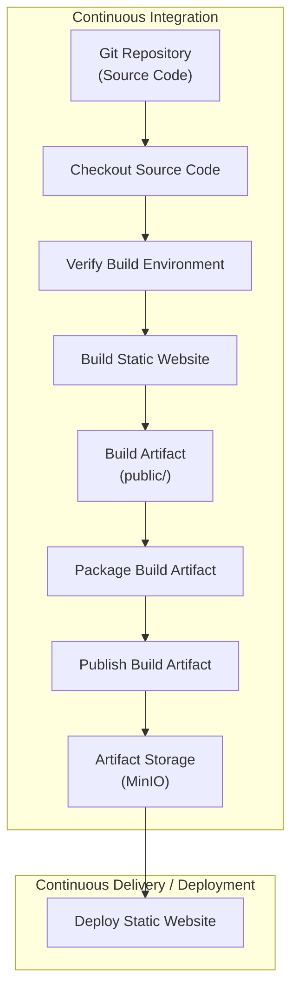

# PS-ADR-0008

| Property | Value |
|----------|-------|
| **ADR ID** | PS-ADR-0008 |
| **Title** | Adopt Stage-Based CI Pipeline |
| **Project** | Personal Site |
| **Section** | CI/CD |
| **Status** | Accepted |
| **Date** | 2026-08-04 |

---

## 🔍 Overview

Project **Personal Site** menghasilkan **Build Artifact** melalui **CI Pipeline**. Build Artifact menjadi output utama dari proses build dan digunakan kembali pada tahapan pipeline berikutnya.

Build Artifact tidak disimpan pada Git Repository, tetapi selalu dihasilkan kembali dari source code pada setiap proses build.

Pendekatan ini mengikuti prinsip **Build Once, Deploy Many**, yaitu artifact dibangun satu kali, diverifikasi, dipublikasikan ke **Artifact Storage**, kemudian digunakan kembali tanpa melakukan proses build ulang terhadap source code.

---

## 🌍 Context

Repository **Personal Site** hanya menyimpan source code yang diperlukan untuk membangun website.

Contoh struktur repository:

```text
personal-site
│
├── archetypes/
├── content/
├── layouts/
├── static/
├── themes/
├── hugo.toml
└── Jenkinsfile
```

Direktori hasil build (`public/`) tidak disimpan pada Git Repository.

Setiap perubahan source code harus menghasilkan Build Artifact baru yang merepresentasikan kondisi repository pada commit yang sedang diproses.

Build Artifact tersebut kemudian dipaketkan (*package*), dipublikasikan ke **Artifact Storage**, dan digunakan kembali pada proses deployment.

---

## ⚖️ Decision

Project **Personal Site** menerapkan arsitektur **Stage-Based CI Pipeline** dengan tanggung jawab yang jelas pada setiap stage.

Pipeline dibangun menggunakan tahapan berikut.

1. **Checkout Source Code**
   - Mengambil source code dari Git Repository.

2. **Verify Build Environment**
   - Memastikan Build Environment siap digunakan sebelum proses build dimulai.

3. **Build Static Website**
   - Membangun source code Hugo menjadi static website (`public/`).

4. **Package Build Artifact**
   - Mengemas hasil build menjadi artifact yang siap dipublikasikan.

5. **Publish Build Artifact**
   - Mempublikasikan Build Artifact ke **Artifact Storage**.

Pipeline hanya melakukan proses build satu kali untuk setiap commit.

Build Artifact menjadi output resmi dari CI Pipeline dan digunakan kembali pada tahapan deployment tanpa melakukan proses build ulang terhadap source code.

---

## 🏛️ Architecture



Pipeline menghasilkan **Build Artifact**, kemudian dipaketkan dan dipublikasikan ke **Artifact Storage**. Deployment hanya menggunakan artifact yang telah dipublikasikan sehingga tidak memerlukan proses build ulang.

---

## 🧩 Pipeline Design

Pipeline dibangun menggunakan beberapa stage yang memiliki tanggung jawab yang berbeda.

| Stage | Responsibility | Output |
|--------|----------------|--------|
| Checkout Source Code | Mengambil source code dari Git Repository | Jenkins Workspace |
| Verify Build Environment | Memastikan Build Environment siap digunakan | Build Environment |
| Build Static Website | Menghasilkan static website | `public/` |
| Package Build Artifact | Mengemas hasil build | Build Package |
| Publish Build Artifact | Mempublikasikan Build Artifact | MinIO |

Setiap stage dapat diverifikasi secara independen sehingga memudahkan proses troubleshooting dan pengembangan pipeline secara bertahap.

---

## 💡 Rationale

Pipeline dirancang dengan memisahkan setiap aktivitas berdasarkan tanggung jawabnya sehingga setiap stage memiliki tujuan yang jelas dan dapat diverifikasi secara independen.

Pendekatan ini dipilih karena:

- Memisahkan proses Checkout, Build, Packaging, Publish, dan Deployment.
- Memisahkan source code dan hasil build.
- Menjamin Build Artifact selalu dihasilkan dari commit yang sedang diproses.
- Build Artifact menjadi batas (*boundary*) antara proses Build dan Deployment.
- Build Artifact dapat diverifikasi sebelum dipublikasikan.
- Mendukung prinsip **Build Once, Deploy Many**.
- Mempermudah proses audit dan troubleshooting.
- Mengurangi risiko perbedaan hasil build antar environment.
- Memungkinkan deployment menggunakan Build Artifact yang telah diverifikasi.
- Memungkinkan pipeline dikembangkan secara bertahap tanpa mengubah struktur utama pipeline.

---

## ⚠️ Consequences

### Positive

- Repository tetap hanya berisi source code.
- Build dapat direproduksi dari commit yang sama.
- Build Artifact dapat diverifikasi sebelum dipublikasikan.
- Artifact disimpan secara terpusat pada Artifact Storage.
- Deployment selalu menggunakan Build Artifact yang sama dengan hasil proses build.
- Setiap stage dapat divalidasi secara independen.

### Trade-offs

- Membutuhkan Artifact Storage.
- Membutuhkan proses packaging sebelum artifact dipublikasikan.
- Waktu pipeline sedikit bertambah karena proses packaging dan publikasi artifact.
- Pipeline menjadi lebih panjang karena setiap proses dipisahkan berdasarkan tanggung jawabnya.

---

## 📌 Status

**Accepted**

---

## 📅 Date

**2026-08-04**