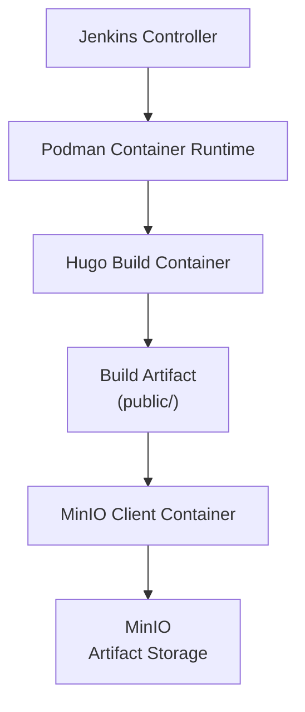

# PS-ADR-0009

| Property | Value |
|----------|-------|
| **ADR ID** | PS-ADR-0009 |
| **Title** | Use Containerized Pipeline Environment |
| **Project** | Personal Site |
| **Section** | CI/CD |
| **Status** | Accepted |
| **Date** | 2026-08-04 |

---

## 🔍 Overview

Project **Personal Site** menjalankan seluruh tool yang dibutuhkan selama proses **CI Pipeline** menggunakan **Container Runtime**.

Setiap tool dijalankan sebagai **ephemeral container** yang hanya dibuat selama pipeline berlangsung kemudian dihapus secara otomatis setelah proses selesai.

Pendekatan ini menjaga Jenkins Controller tetap ringan, memisahkan dependency antar tool, serta memastikan Build Environment selalu konsisten pada setiap eksekusi pipeline.

---

## 🌍 Context

CI Pipeline membutuhkan beberapa tool untuk menjalankan proses build dan publikasi Build Artifact.

Pendekatan tradisional menginstal seluruh tool secara langsung pada Jenkins Controller.

Contohnya:

- Hugo
- MinIO Client
- Helm
- Terraform
- OpenShift CLI

Semakin banyak tool yang diinstal, Jenkins Controller menjadi semakin kompleks karena harus mengelola dependency, versi software, dan proses upgrade.

Selain meningkatkan kompleksitas operasional, pendekatan tersebut juga menyebabkan Jenkins Controller menjadi bergantung pada tool tertentu sehingga lebih sulit dipelihara.

---

## ⚖️ Decision

Project **Personal Site** menjalankan seluruh tool pipeline menggunakan **Container Runtime (Podman)**.

Jenkins Controller hanya bertindak sebagai **Pipeline Orchestrator** yang menjalankan setiap tool sesuai kebutuhan pipeline.

Pada implementasi project **Personal Site**, pendekatan ini diterapkan sebagai berikut.

| Pipeline Function | Container Image |
|-------------------|-----------------|
| Build Static Website | `klakegg/hugo:ext-alpine` |
| Publish Build Artifact | `quay.io/minio/mc` |

Setiap tool dijalankan sebagai container dengan karakteristik berikut.

- Dibuat hanya ketika pipeline membutuhkannya.
- Menggunakan parameter `--rm`.
- Menggunakan Jenkins Workspace sebagai direktori kerja.
- Tidak menyimpan state setelah proses selesai.

Jenkins Controller tidak menginstal Hugo maupun MinIO Client secara langsung.

---

## 🏛️ Architecture

Pipeline dijalankan oleh Jenkins Controller, sedangkan seluruh tool pipeline dieksekusi sebagai container menggunakan Podman.

Pendekatan ini memastikan Jenkins Controller hanya bertanggung jawab mengorkestrasi pipeline tanpa mengelola dependency tool build.

---

## 🧩 Pipeline Design

Tool pipeline dijalankan menggunakan container yang berbeda sesuai tanggung jawab masing-masing.

| Pipeline Function | Container | Responsibility |
|-------------------|-----------|----------------|
| Build Static Website | Hugo Container | Menghasilkan static website (`public/`) |
| Publish Build Artifact | MinIO Client Container | Mengunggah Build Artifact ke MinIO |

Setiap container dibuat hanya selama proses pipeline berlangsung kemudian dihapus secara otomatis setelah selesai digunakan.

---

## 💡 Rationale

Pendekatan ini dipilih karena:

- Memisahkan Jenkins Controller dari tool pipeline.
- Menjaga Build Environment selalu konsisten.
- Mengurangi kompleksitas Jenkins Controller.
- Dependency setiap tool tidak saling memengaruhi.
- Upgrade tool dapat dilakukan secara independen.
- Mendukung Build Environment yang bersifat ephemeral.
- Mempermudah penambahan tool pipeline baru.
- Mengurangi risiko perbedaan environment antar build.

---

## ⚠️ Consequences

### Positive

- Jenkins Controller tetap ringan.
- Tool pipeline saling terisolasi.
- Upgrade tool dapat dilakukan secara independen.
- Build Environment konsisten pada setiap pipeline.
- Dependency tidak saling memengaruhi.
- Tool baru dapat ditambahkan tanpa mengubah Jenkins Controller.

### Trade-offs

- Membutuhkan Container Runtime.
- Membutuhkan Container Image untuk setiap tool pipeline.
- Pipeline bergantung pada Container Registry.
- Versi setiap Container Image perlu dikelola secara terpisah.

---

## 📌 Status

**Accepted**

---

## 📅 Date

**2026-08-04**