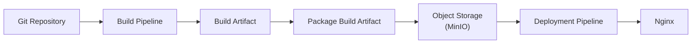

# PS-ADR-0010

| Property | Value |
|----------|-------|
| **ADR ID** | PS-ADR-0010 |
| **Title** | Use Object Storage for Build Artifact |
| **Project** | Personal Site |
| **Section** | CI/CD |
| **Status** | Superseded by PS-ADR-0003 |
| **Date** | 2026-08-04 |

---

## 🔍 Overview

Keputusan ini telah digabungkan ke **PS-ADR-0003 — Externalized Static Content Storage** agar keputusan mengenai penyimpanan static content dan build artifact dikelola dalam satu Architecture Decision Record.

Dokumen ini dipertahankan untuk menjaga riwayat keputusan dan tidak lagi menjadi referensi aktif.

Project **Personal Site** menyimpan **Build Artifact** pada **Object Storage** setelah proses build selesai.

Artifact menjadi output resmi dari proses **Continuous Integration (CI)** dan digunakan kembali pada proses deployment tanpa melakukan build ulang terhadap source code.

Pada implementasi project **Personal Site**, Object Storage diimplementasikan menggunakan **MinIO**.

---

## 🌍 Context

Build Artifact merupakan hasil proses build yang akan digunakan kembali pada tahapan deployment.

Menyimpan Build Artifact hanya pada Jenkins Workspace memiliki beberapa keterbatasan.

- Bergantung pada Jenkins Workspace.
- Sulit digunakan kembali oleh pipeline lain.
- Sulit dikelola untuk kebutuhan retensi.
- Tidak dirancang sebagai repositori artifact jangka panjang.

Diperlukan media penyimpanan yang terpisah dari Jenkins sehingga Build Artifact dapat digunakan kembali secara independen.

---

## ⚖️ Decision

Project **Personal Site** menggunakan **Object Storage** sebagai **Artifact Storage**.

Setelah proses build selesai, Build Artifact akan:

1. Dipaketkan menjadi satu file artifact.
2. Dipublikasikan ke Object Storage.
3. Digunakan kembali oleh proses deployment.

Pada implementasi project **Personal Site**, Object Storage menggunakan **MinIO** yang menyediakan API kompatibel dengan Amazon S3.

Build Artifact tidak lagi bergantung pada Jenkins Workspace setelah berhasil dipublikasikan.

---

## 🏛️ Architecture

Build Artifact dipublikasikan ke Object Storage sebagai output resmi dari proses CI.

Deployment hanya menggunakan Build Artifact yang telah dipublikasikan tanpa melakukan proses build ulang.

---

## 🧩 Artifact Lifecycle

Build Artifact mengikuti siklus hidup berikut.

| Stage | Description |
|--------|-------------|
| Build | Hugo menghasilkan static website (`public/`). |
| Package | Build Artifact dikemas menjadi satu file. |
| Publish | Artifact dipublikasikan ke Object Storage. |
| Deploy | Deployment mengambil artifact dari Object Storage. |

Pendekatan ini mendukung prinsip **Build Once, Deploy Many**.

---

## 💡 Rationale

Pendekatan ini dipilih karena:

- Memisahkan Build Pipeline dari Deployment Pipeline.
- Build Artifact tersedia secara independen dari Jenkins Workspace.
- Mendukung prinsip **Build Once, Deploy Many**.
- Mempermudah rollback ke Build Artifact sebelumnya.
- Mendukung proses audit.
- Mendukung retensi Build Artifact.
- Memungkinkan deployment ke beberapa environment menggunakan artifact yang sama.
- Mengurangi ketergantungan terhadap Jenkins.

---

## ⚠️ Consequences

### Positive

- Build Artifact tersimpan secara terpusat.
- Deployment tidak bergantung pada Jenkins Workspace.
- Build Artifact dapat digunakan kembali.
- Rollback menjadi lebih mudah.
- Mendukung deployment ke beberapa environment.
- Artifact dapat dikelola menggunakan kebijakan retensi.

### Trade-offs

- Membutuhkan Object Storage.
- Membutuhkan proses publish setelah build selesai.
- Membutuhkan pengelolaan kapasitas penyimpanan.
- Membutuhkan mekanisme autentikasi untuk mengakses Object Storage.

---

## 📌 Status

**Superseded by PS-ADR-0003 — Externalized Static Content Storage**

---

## 📅 Date

**2026-08-04**
