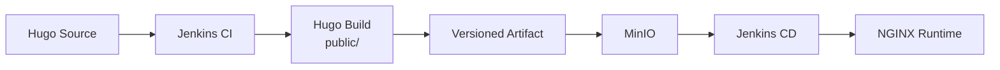

# PS-ADR-0011

| Property | Value |
|----------|-------|
| **ADR ID** | PS-ADR-0011 |
| **Title** | Deploy Immutable CI Artifact |
| **Project** | Personal Site |
| **Section** | Continuous Deployment |
| **Status** | Accepted |
| **Date** | 2026-08-08 |

---

## 🔍 Overview

Project **Personal Site** menggunakan artefak static website yang telah dihasilkan dan dipublikasikan oleh pipeline CI sebagai input resmi pipeline CD.

Artefak yang dipilih di-deploy tanpa menjalankan ulang proses build Hugo.

## 🌍 Context

Pipeline CI menghasilkan direktori `public/`, mengemasnya sebagai `personal-site-<BUILD_NUMBER>.tar.gz`, dan mengunggahnya ke bucket `personal-site` pada MinIO.

Melakukan build ulang pada pipeline CD dapat menghasilkan output yang berbeda karena perubahan source code, dependency, image builder, atau konfigurasi. Deployment juga menjadi sulit ditelusuri jika pipeline tidak menggunakan identitas artefak yang eksplisit.

## ⚖️ Decision

Pipeline CD harus:

1. menerima nama artefak atau nomor build CI secara eksplisit;
2. mengambil artefak tersebut dari MinIO;
3. memverifikasi struktur dan isi artefak;
4. men-deploy artefak tanpa menjalankan build Hugo ulang; dan
5. mencatat identitas artefak pada hasil deployment.

Pemilihan artefak hanya berdasarkan waktu modifikasi atau objek terbaru tidak digunakan sebagai mekanisme utama deployment.

## 🏛️ Architecture

Pipeline CI menjadi satu-satunya proses yang membangun Hugo. Pipeline CD memindahkan artefak yang sama dari artifact storage ke runtime environment sesuai prinsip **Build Once, Deploy Many**.

## 💡 Rationale

- Menjamin hasil build yang dipublikasikan sama dengan hasil yang di-deploy.
- Memisahkan tanggung jawab CI dan CD.
- Mendukung traceability berdasarkan nomor build.
- Memudahkan deployment ulang dan rollback ke artefak sebelumnya.
- Menghindari dependency Hugo pada deployment environment.

## ⚠️ Consequences

### Positive

- Deployment bersifat repeatable.
- Artefak dapat dipromosikan ke environment lain tanpa build ulang.
- Audit dan troubleshooting lebih mudah dilakukan.
- Rollback dapat memilih versi artefak sebelumnya.

### Trade-offs

- Pipeline membutuhkan pengelolaan versi dan retensi artefak.
- Identitas artefak harus diteruskan dari CI atau diberikan sebagai parameter CD.
- Integritas dan struktur artefak harus diverifikasi sebelum deployment.

## 🔗 Related Decisions

- **PS-ADR-0003 — Externalized Static Content Storage**
- **PS-ADR-0005 — Separate Source Code and Deployment Artifacts**
- **PS-ADR-0010 — Use Object Storage for Build Artifact** (superseded by PS-ADR-0003)

## 📌 Status

**Accepted**

## 📅 Date

**2026-08-08**
