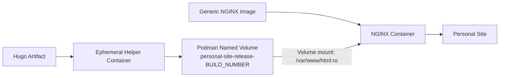

# PS-ADR-0012

| Property | Value |
|----------|-------|
| **ADR ID** | PS-ADR-0012 |
| **Title** | Store Static Content in Podman Named Volume |
| **Project** | Personal Site |
| **Section** | Continuous Deployment |
| **Status** | Accepted |
| **Date** | 2026-08-08 |

---

## 🔍 Overview

Project **Personal Site** memisahkan static content hasil build Hugo dari image runtime NGINX.

Pipeline CD menyimpan static content pada Podman named volume berversi, kemudian memasang volume tersebut secara read-only ke `/var/www/html` pada container NGINX.

## 🌍 Context

Repository `nginx-image` menyediakan generic NGINX runtime. Konfigurasi saat ini menggunakan `/var/www/html` sebagai document root dan menyertakan placeholder `index.html` di dalam image.

Jika setiap perubahan website dimasukkan dengan membangun ulang image NGINX, lifecycle runtime dan lifecycle konten aplikasi menjadi saling terikat. Pendekatan tersebut juga menambahkan image build ke proses CD meskipun artefak Hugo sudah tersedia di MinIO.

## ⚖️ Decision

Static content tidak dimasukkan ke image NGINX pada setiap deployment.

Pipeline CD akan:

1. membuat Podman named volume dengan pola `personal-site-release-<BUILD_NUMBER>`;
2. mengisi volume tersebut dengan konten dari direktori `public/` melalui ephemeral helper container;
3. menjalankan NGINX menggunakan generic image dari repository `nginx-image`;
4. memasang volume release ke `/var/www/html` sebagai read-only; dan
5. mempertahankan volume release sebelumnya hingga release baru berhasil divalidasi.

## 🏛️ Architecture

Image menyediakan NGINX dan konfigurasi web server. Podman volume release menyediakan static content aplikasi. Keduanya digabungkan hanya pada saat container dijalankan.

## 💡 Rationale

- Memisahkan lifecycle runtime NGINX dan static content.
- Menghindari pembangunan ulang image untuk setiap versi website.
- Mempercepat deployment artefak baru.
- Memungkinkan pergantian release dan rollback berdasarkan volume versi.
- Membatasi akses container terhadap konten melalui mount read-only.

## ⚠️ Consequences

### Positive

- Generic NGINX image dapat digunakan kembali.
- Deployment konten tidak memerlukan image build.
- Release sebelumnya dapat dipertahankan untuk rollback.
- Static content tidak dapat ditulis oleh container.

### Trade-offs

- Target runtime harus mengelola Podman volume release dan kebijakan retensinya.
- Script runtime harus mendukung Podman named volume pada `/var/www/html`.
- Pergantian release memerlukan penggantian atau restart container.
- Proses pengisian volume membutuhkan ephemeral helper container.

## 🔗 Related Decisions

- **PS-ADR-0003 — Externalized Static Content Storage**
- **PS-ADR-0004 — Generic Runtime Container**
- **PS-ADR-0005 — Separate Source Code and Deployment Artifacts**
- **PS-ADR-0011 — Deploy Immutable CI Artifact**

## 📌 Status

**Accepted**

## 📅 Date

**2026-08-08**
