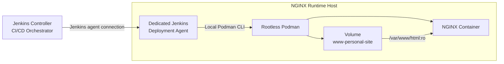

# PS-ADR-0013

| Property | Value |
|----------|-------|
| **ADR ID** | PS-ADR-0013 |
| **Title** | Execute Deployment through Dedicated Jenkins Agent |
| **Project** | Personal Site |
| **Section** | Continuous Deployment |
| **Status** | Accepted |
| **Date** | 2026-08-08 |

---

## 🔍 Overview

Project **Personal Site** menggunakan dedicated Jenkins deployment agent pada host runtime NGINX untuk menjalankan pipeline CD dan perintah Podman secara lokal.

## 🌍 Context

Jenkins controller dan container NGINX berada pada segmen Podman network yang berbeda. Runtime NGINX menggunakan rootless Podman dan menyimpan static content pada volume `www-personal-site`.

Pipeline CD membutuhkan akses ke Podman image, container, network, dan volume milik user runtime. Mengekspos Podman socket melalui network akan memperbesar permukaan akses dan menambah kompleksitas pengamanan.

## ⚖️ Decision

Pipeline CD dijalankan pada dedicated Jenkins deployment agent yang memenuhi ketentuan berikut:

1. agent ditempatkan pada host runtime NGINX;
2. agent berjalan sebagai user yang sama dengan pemilik rootless Podman runtime;
3. job deployment menggunakan label agent khusus;
4. Podman CLI dijalankan secara lokal oleh agent; dan
5. Podman socket tidak diekspos melalui network untuk kebutuhan deployment.

## 🏛️ Architecture

Jenkins controller hanya mengorkestrasi job. Seluruh operasi yang mengubah runtime dilakukan oleh deployment agent pada host NGINX dalam rootless Podman user context yang sama.

## 💡 Rationale

- Memberikan akses lokal ke Podman runtime tanpa mengekspos Podman socket.
- Memastikan agent melihat container, image, network, dan volume rootless yang benar.
- Memisahkan workload build dan deployment melalui label agent.
- Mengurangi ketergantungan pada akses SSH per stage pipeline.
- Tetap bekerja meskipun Jenkins dan NGINX berada pada segmen Podman network berbeda.

## ⚠️ Consequences

### Positive

- Perintah deployment dieksekusi dekat dengan target runtime.
- Podman API tidak perlu dipublikasikan melalui network.
- Rootless Podman isolation tetap dipertahankan.
- Pipeline dapat menggunakan Podman CLI secara langsung.

### Trade-offs

- Jenkins agent harus dipasang dan dipelihara pada host runtime.
- Agent memperoleh kemampuan untuk mengelola workload Podman milik user runtime.
- Hak akses job dan label agent harus dibatasi untuk pipeline deployment.
- Ketersediaan deployment bergantung pada status agent dan koneksinya ke controller.

## 🔗 Related Decisions

- **PS-ADR-0001 — Use Jenkins as Automation Server**
- **PS-ADR-0002 — Containerized Ephemeral Build Environment**
- **PS-ADR-0012 — Store Static Content in Podman Named Volume**

## 📌 Status

**Accepted**

## 📅 Date

**2026-08-08**
