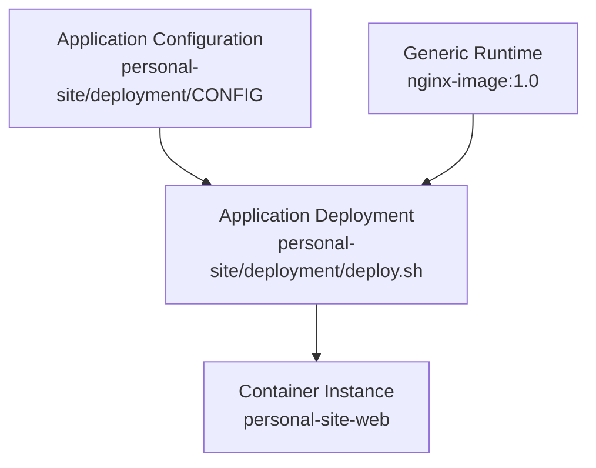

# PS-ADR-0014

| Property | Value |
|----------|-------|
| **ADR ID** | PS-ADR-0014 |
| **Title** | Keep Application Deployment Configuration Outside Generic Runtime Image |
| **Project** | Personal Site |
| **Section** | Continuous Deployment |
| **Status** | Accepted |
| **Date** | 2026-08-08 |

---

## 🔍 Overview

Konfigurasi deployment khusus **Personal Site** disimpan pada repository `personal-site`, bukan dijadikan dependency terhadap konfigurasi runtime pada repository generic `nginx-image`.

## 🌍 Context

Image `localhost/nginx-image:1.0` dirancang sebagai generic NGINX runtime yang dapat digunakan oleh beberapa aplikasi. Nama container, volume, network, dan published port merupakan kebutuhan instance aplikasi dan dapat berbeda untuk setiap deployment.

Menempatkan `www-personal-site` atau konfigurasi aplikasi lain sebagai kontrak wajib `nginx-image` akan mengikat generic runtime pada satu project.

## ⚖️ Decision

Project `personal-site` memiliki konfigurasi deployment sendiri:

```text
personal-site/
└── deployment/
    ├── CONFIG
    └── deploy.sh
```

Ketentuannya:

1. `deployment/CONFIG` menjadi sumber konfigurasi instance Personal Site.
2. `deployment/deploy.sh` menjalankan generic NGINX image dengan parameter aplikasi.
3. `Jenkinsfile.cd` mengorkestrasi deployment dan memanggil `deployment/deploy.sh`.
4. Pipeline CD tidak bergantung pada `CONFIG` atau `scripts/run.sh` di repository `nginx-image`.
5. Repository `nginx-image` tetap dipertahankan dan dapat memiliki helper runtime sendiri, tetapi helper tersebut bukan application deployment contract.

## 🏛️ Architecture



## 💡 Rationale

- Menjaga image NGINX tetap reusable.
- Menempatkan konfigurasi pada repository pemilik aplikasi.
- Menghindari nama volume dan port aplikasi pada generic runtime contract.
- Memudahkan aplikasi lain menggunakan image yang sama.
- Menjaga `Jenkinsfile.cd` ringkas dengan deployment script yang dapat diuji terpisah.

## ⚠️ Consequences

### Positive

- Ownership konfigurasi deployment menjadi jelas.
- Perubahan Personal Site tidak mengharuskan perubahan generic image.
- Container instance memiliki nama sesuai aplikasi.
- Deployment script dapat dijalankan manual maupun melalui Jenkins.

### Trade-offs

- Repository aplikasi memiliki deployment files tambahan.
- Versi generic image tetap harus dikelola pada konfigurasi aplikasi.
- Helper script pada `nginx-image` dan deployment script aplikasi harus dibedakan secara jelas.

## 🔗 Related Decisions

- **PS-ADR-0004 — Generic Runtime Container**
- **PS-ADR-0005 — Separate Source Code and Deployment Artifacts**
- **PS-ADR-0012 — Store Static Content in Podman Named Volume**
- **PS-ADR-0013 — Execute Deployment through Dedicated Jenkins Agent**

## 📌 Status

**Accepted**

## 📅 Date

**2026-08-08**
