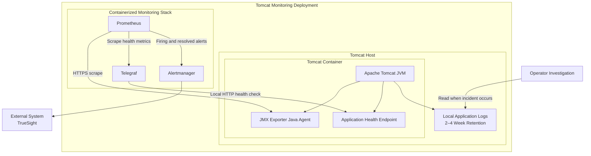

# TM-ADR-0001

| Property | Value |
| --- | --- |
| **ADR ID** | TM-ADR-0001 |
| **Title** | Adopt Embedded Monitoring Instrumentation for Apache Tomcat |
| **Project** | Tomcat Monitoring |
| **Section** | Architecture |
| **Status** | Accepted |
| **Date** | 2026-08-18 |

---

## 🔍 Overview

Tomcat Monitoring menggunakan embedded runtime instrumentation dan local
application health check sebagai sumber monitoring utama. Prometheus, Telegraf,
dan Alertmanager menjadi containerized monitoring stack yang dikelola sebagai
bagian dari project. TrueSight menjadi sistem eksternal yang menerima event,
sedangkan full external observability platform tidak diadopsi untuk kemampuan
yang belum diperlukan.

## 🌍 Context

Project membutuhkan visibility terhadap JVM, runtime Tomcat, application
health, historical metrics, dan alert state. Implementasi sebelumnya tidak
seluruhnya berbasis container serta masih bergantung pada full external
monitoring and observability tools yang menambah biaya dan beban administrasi.
Penggunaan remote JMX juga membutuhkan port, akun, dan credential untuk setiap
instance Tomcat.

Kebutuhan saat ini belum mencakup distributed tracing, transaction monitoring,
atau korelasi end-to-end. TrueSight telah digunakan sebagai event management
system sehingga project hanya perlu menghasilkan alert yang terukur dan
meneruskan status firing serta resolved melalui integration layer.

Analisis log juga tidak dilakukan secara terus-menerus. Log digunakan ketika
terjadi masalah dan kebutuhan investigasi umumnya berada dalam rentang dua
sampai empat minggu. Karena itu, centralized log analytics belum memberikan
manfaat yang sebanding dengan biaya storage dan administrasinya. Log dapat
diperiksa langsung pada host, dengan ketentuan log yang berkaitan dengan
incident dipertahankan apabila investigasi melewati masa retensi normal.

Host Tomcat umumnya masih memiliki kapasitas CPU dan memory yang dapat
dimanfaatkan untuk monitoring ringan. Pemanfaatan tersebut harus tetap diukur
dan dibatasi agar application runtime menjadi prioritas utama.

## ⚖️ Decision

Project mengadopsi **Apache Tomcat Containerization with Embedded Monitoring
Instrumentation** dengan ketentuan berikut:

1. JMX Exporter dijalankan sebagai Java Agent di dalam JVM Tomcat untuk membaca
   JVM dan Tomcat MBean secara lokal tanpa remote JMX.
2. Telegraf menjalankan HTTP health check melalui local container network untuk
   membedakan JVM yang aktif dari aplikasi yang tidak sehat atau tidak dapat
   merespons.
3. Prometheus dijalankan sebagai bagian dari containerized monitoring stack
   project untuk mengumpulkan dan menyimpan metrics bagi dashboard, historical
   data, dan alert evaluation.
4. Alertmanager meneruskan firing dan resolved alert ke notification channel
   atau event management system. TrueSight merupakan integrasi yang digunakan
   pada implementasi saat ini.
5. Log aplikasi dipertahankan secara lokal dengan target retensi dua sampai
   empat minggu dan diperiksa langsung pada host ketika investigasi diperlukan.
6. Full external observability platform, distributed tracing, dan centralized
   log analytics tidak menjadi bagian implementasi saat ini.
7. Penggunaan CPU, memory, dan storage oleh komponen monitoring harus diukur
   dan dibatasi agar tidak mengganggu Tomcat application runtime.

## 🏛️ Architecture

## 💡 Rationale

### Options Evaluated

| Option | Evaluation |
| --- | --- |
| Full external observability platform | Menyediakan tracing, centralized logs, dan korelasi end-to-end, tetapi menambah biaya, storage, agent administration, dan integration maintenance yang belum diperlukan. |
| Remote JMX and centralized log collection | Memisahkan monitoring dari runtime, tetapi membutuhkan port, akun, credential, serta administrasi collector untuk setiap instance. |
| Embedded instrumentation with containerized monitoring stack | Memenuhi kebutuhan runtime metrics, local application health, historical dashboard, dan alerting dengan komponen yang dikelola sebagai bagian dari project. Dipilih. |

Pendekatan yang dipilih bersifat proporsional terhadap kebutuhan saat ini:

- Monitoring berfokus pada signal yang benar-benar digunakan oleh operasi.
- Remote JMX, akun, dan credential per instance tidak diperlukan.
- Analisis log insidental tetap dapat dilakukan tanpa centralized log platform.
- Kapasitas host yang tersedia dapat dimanfaatkan dengan resource control.
- Prometheus menjadi bagian dari monitoring stack project, sedangkan TrueSight
  hanya menerima event melalui external integration boundary.
- Biaya pengadaan serta administrasi full observability platform dapat
  dihindari sampai terdapat kebutuhan yang membenarkannya.

## ⚠️ Consequences

### Positive

- Monitoring JVM dan Tomcat dapat diterapkan bersama application runtime.
- Administrasi remote JMX per instance dihilangkan.
- Dashboard, historical metrics, health check, dan alerting tetap tersedia.
- Integrasi event tidak terkunci pada satu platform karena routing dilakukan
  melalui Alertmanager dan Integration Bridge.
- Biaya dan kompleksitas operasional sesuai dengan cakupan monitoring saat ini.

### Trade-offs

- Project belum menyediakan distributed tracing dan korelasi transaksi
  end-to-end.
- Investigasi log membutuhkan akses yang terkontrol ke host dan pengetahuan
  lokasi log setiap instance.
- Log dapat hilang karena rotasi jika evidence incident tidak dipertahankan
  sebelum masa retensi berakhir.
- Komponen monitoring berbagi resource host dengan application runtime sehingga
  membutuhkan capacity measurement dan resource limit.
- Perubahan kebutuhan dapat mengharuskan integrasi centralized log management
  atau observability platform pada masa mendatang.

Keputusan harus dievaluasi kembali apabila analisis log menjadi aktivitas
rutin, jumlah instance meningkat secara signifikan, retensi jangka panjang
menjadi kewajiban, akses langsung ke host tidak diperbolehkan, atau distributed
tracing dan korelasi lintas aplikasi mulai dibutuhkan.

## 📌 Status

**Accepted**

## 📅 Date

**2026-08-18**
