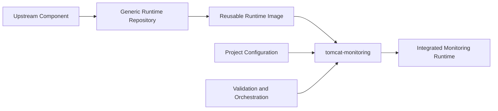

# TM-ADR-0002

| Property | Value |
| --- | --- |
| **ADR ID** | TM-ADR-0002 |
| **Title** | Separate Generic Runtime Images from Monitoring Integration Configuration |
| **Project** | Tomcat Monitoring |
| **Section** | Development Architecture |
| **Status** | Accepted |
| **Date** | 2026-08-26 |

---

## 🔍 Overview

Setiap komponen monitoring yang memiliki image dan lifecycle reusable sendiri
dikelola pada repository runtime terpisah. Repository `tomcat-monitoring`
memiliki konfigurasi, validator, orchestration, dan pengujian integrasi yang
khusus untuk project.

## 🌍 Context

Tomcat Monitoring menggunakan Tomcat, JMX Exporter, Telegraf, Prometheus, dan
Alertmanager. Image komponen tersebut dapat digunakan kembali oleh project
lain, sedangkan target scrape, alert rule, receiver, volume, dan deployment
berbeda untuk setiap project.

Menyimpan seluruh source pada satu repository akan mencampur dua lifecycle:
rilis image generik dan perubahan konfigurasi integrasi. Menggunakan image
upstream secara langsung untuk semua komponen juga menghilangkan interface
build, test, run, dan cleanup yang dikendalikan project.

## ⚖️ Decision

Project menetapkan pembagian berikut:

1. Repository runtime generik memiliki upstream version pin, image metadata,
   build, smoke test, run, dan cleanup interface.
2. Repository `tomcat-monitoring` memiliki konfigurasi komponen, validator,
   alert rule, secret reference, volume initialization, deployment
   orchestration, dan integration verification.
3. Runtime generik tidak menyimpan target, credential, atau konfigurasi yang
   hanya berlaku pada satu environment.
4. Penggunaan image upstream secara langsung memerlukan pengecualian yang
   menyebutkan tujuan, immutable identity, lifecycle, dan batas penggunaannya.

## 🏛️ Architecture

Repository runtime menghasilkan image reusable. Repository integrasi
menggabungkan image tersebut dengan konfigurasi dan kebutuhan environment.

## 💡 Rationale

| Alternative | Evaluation |
| --- | --- |
| Simpan seluruh image dan konfigurasi di `tomcat-monitoring` | Ditolak karena mencampur lifecycle reusable dengan konfigurasi project. |
| Gunakan seluruh image upstream secara langsung | Ditolak sebagai default karena project kehilangan source interface dan pengujian runtime yang konsisten. |
| Pisahkan repository runtime dan integration | Dipilih karena ownership, perubahan, dan evidence setiap artifact dapat ditelusuri secara terpisah. |

## ⚠️ Consequences

### Positive

- Image generik dapat digunakan kembali tanpa membawa konfigurasi project.
- Perubahan upstream dapat diverifikasi secara terpisah dari deployment.
- Secret dan target environment tetap berada di integration boundary.
- Ownership source dan troubleshooting menjadi lebih jelas.

### Trade-offs

- Project harus memelihara beberapa repository dan version relationship.
- Integration test harus memastikan image dan konfigurasi tetap kompatibel.
- Pengecualian direct-upstream memerlukan Decision Gate tersendiri.

## 📌 Status

**Accepted**

## 📅 Date

**2026-08-26**
