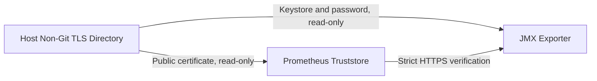

# TM-ADR-0003

| Property | Value |
| --- | --- |
| **ADR ID** | TM-ADR-0003 |
| **Title** | Use Host-Managed Non-Git TLS Material for the Persistent Lab |
| **Project** | Tomcat Monitoring |
| **Section** | Infrastructure Security |
| **Status** | Accepted |
| **Date** | 2026-08-25 |

---

## 🔍 Overview

Persistent lab menggunakan certificate self-signed yang disimpan pada
directory data pengguna di luar Git dan di luar image. Certificate, private
key, keystore, serta password dipasang read-only ke container sesuai kebutuhan.

## 🌍 Context

Prometheus harus memverifikasi endpoint HTTPS JMX Exporter tanpa menonaktifkan
certificate verification. Lab belum memiliki production Certificate Authority
(CA), tetapi tetap membutuhkan identity, permission, renewal, rotation, dan
rollback yang dapat dikelola dengan aman.

Directory sementara tidak cocok untuk runtime persistent. Menyimpan material
TLS di repository berisiko memasukkan private key atau password ke Git dan
build context.

## ⚖️ Decision

1. Material TLS persistent lab disimpan di directory non-Git milik pengguna
   rootless Podman.
2. Directory menggunakan mode `0700`; private key, password file, dan PKCS12
   menggunakan `0600`; public certificate menggunakan `0444`.
3. Certificate memakai SAN `DNS:tomcat-jmx-exporter`, berlaku 365 hari, dan
   diperbarui ketika sisa masa berlaku mencapai 30 hari.
4. Keystore serta password dipasang read-only pada container Tomcat/JMX.
   Public certificate dipasang sebagai trust material Prometheus.
5. Material sebelumnya dipertahankan sampai target baru terbukti `up=1`.
6. Penghapusan material lama memerlukan pemeriksaan exact path dan izin
   destructive action terpisah.
7. Production CA dan lifecycle production tetap menjadi keputusan terpisah.

## 🏛️ Architecture

Private material hanya dikonsumsi JMX Exporter. Prometheus menerima public
certificate yang diperlukan untuk memverifikasi server.

## 💡 Rationale

| Alternative | Evaluation |
| --- | --- |
| Temporary directory | Ditolak karena material dapat hilang dan tidak memiliki lifecycle persistent. |
| Repository directory | Ditolak karena berisiko memasukkan secret ke Git atau image. |
| Host-managed non-Git directory | Dipilih karena sesuai dengan rootless ownership dan memisahkan secret dari source. |
| Production CA | Ditunda karena infrastructure dan PKI production belum tersedia. |

## ⚠️ Consequences

### Positive

- Private key dan password tidak masuk Git atau image.
- TLS hostname verification tetap aktif.
- Rotation dan rollback memiliki batas yang jelas.
- Permission dapat diperiksa langsung pada host.

### Trade-offs

- Lab owner harus memantau masa berlaku certificate.
- Self-signed certificate tidak menggunakan CRL atau OCSP.
- Backup dan pemulihan material host belum otomatis.
- Keputusan ini tidak dapat dianggap sebagai production certificate policy.

## 📌 Status

**Accepted**

## 📅 Date

**2026-08-25**
