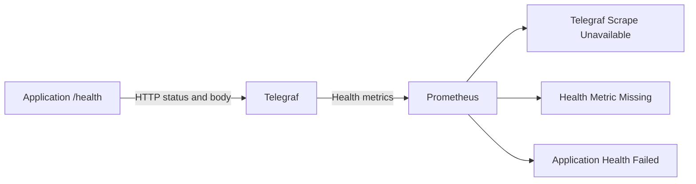

# TM-ADR-0004

| Property | Value |
| --- | --- |
| **ADR ID** | TM-ADR-0004 |
| **Title** | Separate Application Failure from Monitoring Signal Loss |
| **Project** | Tomcat Monitoring |
| **Section** | Monitoring Architecture |
| **Status** | Accepted |
| **Date** | 2026-08-25 |

---

## 🔍 Overview

Application health diperlakukan sebagai signal yang dimiliki aplikasi dan
diperiksa Telegraf. Alert dibagi menjadi tiga kondisi agar kegagalan aplikasi
tidak tercampur dengan kegagalan jalur monitoring.

## 🌍 Context

JVM yang aktif tidak selalu berarti aplikasi sehat. Sebaliknya, metric health
yang hilang juga tidak selalu berarti aplikasi gagal; Telegraf atau jalur scrape
dapat bermasalah. Jika seluruh kondisi menggunakan satu alert, operator tidak
dapat menentukan komponen mana yang harus diperiksa terlebih dahulu.

Generic Tomcat dan JMX Exporter juga tidak boleh memiliki endpoint health yang
khusus untuk satu aplikasi. Endpoint tersebut harus disediakan application
owner atau deployment owner.

## ⚖️ Decision

1. Application owner atau deployment owner menyediakan endpoint `/health`.
2. URL diberikan kepada Telegraf saat deployment dan tidak di-hardcode pada
   generic runtime repository.
3. Telegraf memeriksa HTTP status serta response body aplikasi dan menyajikan
   hasilnya sebagai metric.
4. Prometheus membedakan tiga alert:
   - Telegraf tidak dapat di-scrape;
   - scrape Telegraf berhasil tetapi metric health hilang; dan
   - metric tersedia tetapi aplikasi melaporkan kondisi tidak sehat.
5. Ketiga alert menggunakan label yang stabil agar firing dan resolved dapat
   dikelompokkan serta dikorelasikan.
6. Timing dan severity production ditentukan melalui SLO production terpisah.

## 🏛️ Architecture

Setiap alert menunjukkan batas kegagalan yang berbeda sehingga operator dapat
memilih pemeriksaan pertama dengan lebih tepat.

## 💡 Rationale

| Alternative | Evaluation |
| --- | --- |
| Gunakan root page atau container health generic Tomcat | Ditolak karena tidak membuktikan kesehatan aplikasi. |
| Tambahkan `/health` khusus aplikasi ke generic image | Ditolak karena melanggar generic image boundary. |
| Gunakan satu alert untuk seluruh kegagalan | Ditolak karena kehilangan perbedaan antara application failure dan monitoring failure. |
| Pisahkan provider health dan tiga signal alert | Dipilih karena ownership dan failure boundary dapat dipahami secara langsung. |

## ⚠️ Consequences

### Positive

- Operator dapat membedakan aplikasi gagal dari jalur monitoring yang gagal.
- Generic runtime tetap tidak terikat pada satu aplikasi.
- Alert identity tetap stabil selama firing dan resolved.
- Production application dapat menyediakan semantics health sendiri.

### Trade-offs

- Deployment harus memberikan URL health yang benar.
- Jumlah rule dan test bertambah.
- SLO, duration, dan severity production tetap memerlukan keputusan owner.
- Pemeriksaan lokal tidak membuktikan jalur akses pengguna eksternal.

## 📌 Status

**Accepted**

## 📅 Date

**2026-08-25**
