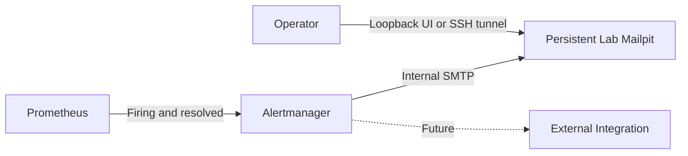

# TM-ADR-0005

| Property | Value |
| --- | --- |
| **ADR ID** | TM-ADR-0005 |
| **Title** | Use Mailpit as the Persistent Lab Notification Verification Target |
| **Project** | Tomcat Monitoring |
| **Section** | Notification Architecture |
| **Status** | Accepted |
| **Date** | 2026-08-27 |

---

## 🔍 Overview

Lab menggunakan Mailpit lokal sebagai tujuan pengiriman email Alertmanager.
Mailpit membuktikan email firing dan resolved tanpa credential pribadi atau
pengiriman ke layanan eksternal. Integrasi external tetap menjadi pekerjaan
terpisah.

## 🌍 Context

Gmail SMTP dengan App Password sempat dipilih untuk pengujian lab. Pendekatan
tersebut memerlukan akun pribadi, credential reusable, dan koneksi eksternal,
padahal tujuan lab hanya memastikan Alertmanager membentuk serta mengirim email
dengan benar.

Mailpit dapat menerima SMTP di container network dan menyediakan API/UI lokal.
Setelah pengujian disposable berhasil, persistent Alertmanager membutuhkan
receiver yang tetap tersedia agar tidak terus melakukan retry ke target yang
sudah dibersihkan.

## ⚖️ Decision

1. Mailpit menggantikan Gmail sebagai baseline notification verification lab.
2. Lab memakai immutable upstream Mailpit image yang telah diverifikasi;
   project tidak membangun atau memublikasikan ulang image tersebut.
3. Persistent Mailpit berjalan pada network `devops-lab` agar receiver aktif
   Alertmanager selalu memiliki tujuan SMTP.
4. SMTP hanya tersedia di dalam container network melalui `mailpit:1025`.
5. API/UI dipublikasikan hanya pada host loopback `127.0.0.1:8025`.
6. Mailpit tidak menggunakan named volume. Message merupakan evidence
   sementara dan dapat hilang ketika container diganti.
7. Sender dan recipient lab menggunakan identitas `.invalid`; tidak ada
   credential, personal recipient, external relay, atau inbox delivery.
8. External SMTP, Integration Bridge, dan TrueSight tetap memerlukan keputusan
   serta verifikasi terpisah.

## 🏛️ Architecture

Mailpit menjadi target verifikasi lab, bukan pengganti external notification
architecture.

## 💡 Rationale

| Alternative | Evaluation |
| --- | --- |
| Gmail SMTP dengan App Password | Digantikan karena membutuhkan credential pribadi dan external delivery. |
| Disposable Mailpit saja | Ditolak untuk active persistent receiver karena target hilang setelah test. |
| Persistent Mailpit dengan named volume | Tidak dipilih karena message history bukan source of truth. |
| Persistent Mailpit tanpa named volume | Dipilih karena receiver tetap tersedia dengan storage responsibility yang terbatas. |

## ⚠️ Consequences

### Positive

- Email dapat diuji tanpa akun atau credential eksternal.
- Operator dapat memeriksa email melalui UI lokal.
- Firing dan resolved dapat diverifikasi sebelum external integration tersedia.
- SMTP tidak dipublikasikan pada host atau jaringan eksternal.

### Trade-offs

- Keberhasilan Mailpit tidak membuktikan external inbox delivery.
- Message dapat hilang ketika container diganti.
- Direct-upstream image memerlukan immutable pin dan upgrade review.
- Host-reboot recovery dan production availability belum ditetapkan.

## 📌 Status

**Accepted**

## 📅 Date

**2026-08-27**
