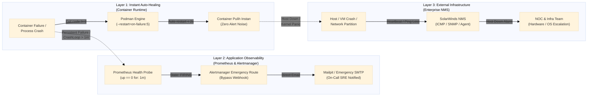

# TM-ADR-0021

| Property | Value |
| --- | --- |
| **ADR ID** | TM-ADR-0021 |
| **Title** | Adopt Layered Failure Resilience, Container Auto-Healing, and Monitoring Domain Separation |
| **Project** | Tomcat Monitoring |
| **Section** | Infrastructure Resilience and Fault-Tolerance Architecture |
| **Status** | Accepted |
| **Date** | 2026-09-08 |

---

## 🔍 Overview

Platform monitoring mengadopsi arsitektur ketahanan sistem berlapis (*Layered Defense-in-Depth Resilience*), pemisahan tegas domain pemantauan (*Monitoring Domain Separation*) antara infrastruktur host (SolarWinds/NOC) dan observabilitas aplikasi (Prometheus/SRE), standarisasi kebijakan pemulihan otomatis container (*Container Auto-Healing* via `--restart=on-failure:5`), serta panduan mitigasi pencegahan siklus kegagalan startup (*CrashLoop Guardrails*).

## 🌍 Context

Dalam perancangan platform observabilitas enterprise, terdapat sejumlah tantangan arsitektur terkait penanganan kegagalan:

1. **Titik Buta Platform Monitoring (*Who Monitors the Monitor*):** Jika daemon pemantau (Prometheus atau Diagnostic Service) mengalami crash atau terhenti, sistem tidak dapat memancarkan sinyal peringatan aktif sehingga terjadi risiko kegagalan tak terdeteksi (*silent failure*).
2. **Keterbatasan Auto-Healing Tanpa Observabilitas:** Restart container secara otomatis efektif mengatasi kegagalan sesaat (*transient crash*), namun tidak dapat menyelesaikan kegagalan logis seperti database terkunci (*stale lock*), media penyimpanan penuh (*storage depletion*), atau port yang masih tertahan di sistem operasi. Tanpa batas percobaan, container berisiko terjebak dalam siklus restart berulang (*CrashLoopBackOff*).
3. **Pemisahan Batas Tanggung Jawab Operasional:** Tanpa pemisahan yang jelas antara pemantauan fisik/host (hardware, hypervisor, OS, jaringan) dan pemantauan aplikasi (JVM, thread pool, servlet, evaluasi diagnostik), tim operasional dapat menerima notifikasi ganda yang saling bertentangan saat terjadi gangguan server menyeluruh.

## ⚖️ Decision

Ditetapkan keputusan arsitektur ketahanan dan pemulihan sistem sebagai berikut:

1. **Pemisahan Domain Pemantauan (*Separation of Monitoring Concerns*):**
    - **Layer Host & Network (Infrastruktur Fisik/VM):** Dikelola secara terpusat oleh Network Management System (NMS) enterprise eksternal (seperti SolarWinds). Bertanggung jawab atas ketersediaan server melalui ICMP Ping, SNMP, dan sensor hardware OS. Jika host mati total, SolarWinds menjadi otoritas tunggal yang mengirim eskalasi ke tim NOC.
    - **Layer Workload & Application (JVM & Observabilitas):** Dikelola oleh Prometheus, Alertmanager, dan Diagnostic Service. Bertanggung jawab mendeteksi degradasi performa aplikasi Tomcat (kehabisan thread, lonjakan heap memory, latensi tinggi) serta menjalankan triage forensik otomatis.
2. **Model Ketahanan Berlapis 3 Tingkat (*3-Layer Defense-in-Depth Model*):**
    - **Layer 1 (Instant Auto-Healing):** Container runtime (Podman) merestart container secara mandiri saat terjadi crash proses tanpa memicu alarm palsu (*zero alert fatigue*).
    - **Layer 2 (Application Observability & Emergency Alerting):** Prometheus memantau ketersediaan fungsional melalui probe endpoint `/health`. Jika service gagal pulih lebih dari 1 menit (`for: 1m`), Alertmanager mengirimkan email peringatan darurat langsung via SMTP ke operator dengan mem-bypass webhook Diagnostic Service.
    - **Layer 3 (External Watchdog / NMS):** Heartbeat eksternal dan NMS memantau ketersediaan Prometheus dan server host dari luar jaringan internal.
3. **Standarisasi Kebijakan Restart Container:**
    - Seluruh container runtime (`prometheus`, `alertmanager`, `diagnostic-service`, `tomcat-jmx-exporter`) dikonfigurasi menggunakan batas restart terkontrol: `--restart=on-failure:5`.
4. **Mitigasi 5 Vektor Kegagalan Startup (*CrashLoop Guardrails*):**
    - Menerapkan isolasi volume data persisten, retensi TSDB ketat (`15d`), mode SQLite Write-Ahead Logging (WAL), standarisasi izin volume non-root (`nobody:nobody` / UID terdefinisi), alokasi memori container dengan *headroom* aman, dan network bridge terisolasi (`devops-lab`).

## 🏛️ Architecture

## 💡 Rationale

- **Kombinasi Pemulihan Cepat dan Ketertelusuran:** Auto-healing memberikan pemulihan instan dalam hitungan detik untuk kegagalan sesaat tanpa mengganggu operator, sedangkan alerting memastikan kegagalan logis persisten tetap dieskalasikan.
- **Eliminasi Alarm Palsu:** Jeda waktu toleransi 1 menit (`for: 1m`) pada alert rule memastikan bahwa restart singkat yang berhasil tidak menimbulkan kepanikan operasional.
- **Batas Tanggung Jawab yang Jelas:** Tim NOC fokus pada keandalan infrastruktur fisik/VM via SolarWinds, sementara tim SRE/DevOps fokus pada kestabilan aplikasi dan logika diagnostik.

## ⚠️ Consequences

- **Kelebihan:**
    - Platform observabilitas memiliki ketahanan mandiri yang tinggi (*high self-resilience*).
    - Meniadakan skenario *silent failure* pada seluruh siklus hidup monitoring.
    - Menghindari siklus restart tanpa batas (*infinite crashloop*) yang dapat membebani CPU dan media penyimpanan.
- **Keterbatasan:**
    - Memerlukan standarisasi parameter `--restart` pada seluruh skrip deployment container.
    - Kegagalan sistemik akibat disk 100% penuh tetap memerlukan tindakan manual tim SRE untuk pembersihan media penyimpanan.

## 📌 Status

**Accepted — implemented and verified in devops-lab.**

## 📅 Date

**2026-09-08**
