# TM-ADR-0022

| Property | Value |
| --- | --- |
| **ADR ID** | TM-ADR-0022 |
| **Title** | Adopt JVM Garbage Collection and Concurrency Saturation Signals over Static Raw Thresholds |
| **Project** | Tomcat Monitoring |
| **Section** | Observability, Alerting Strategy, and Workload Health Architecture |
| **Status** | Accepted |
| **Date** | 2026-09-08 |

---

## 🔍 Overview

Platform monitoring menetapkan kebijakan evaluasi kesehatan beban kerja JVM (*Workload Health Strategy*) dengan mengadopsi **Sinyal Emas Garbage Collection (*GC Golden Signals*)** dan **Indikator Kejenuhan Konkurensi (*Concurrency Saturation Indicators*)** sebagai dasar perancangan alert rules, serta secara eksplisit **menolak penggunaan ambang batas statis mentah (*static raw thresholds*)** seperti `Heap Usage > 80%` atau `Active Threads > 80%`.

---

## 🌍 Context

Dalam perancangan pemantauan Apache Tomcat dan Java Virtual Machine (JVM), penetapan metrik dan ambang batas peringatan (*alerting thresholds*) sering kali menghadapi masalah *alert fatigue* (kebisingan peringatan palsu / *false positives*):

1. **Siklus Alokasi Memori Generasional JVM (*Generational Heap Behavior*):**
   * JVM mengalokasikan objek pada memori bertahap (*Eden* $\rightarrow$ *Survivor* $\rightarrow$ *Old Generation*).
   * Dalam kondisi operasional normal di bawah beban kerja riil, penggunaan heap memory wajar melonjak hingga 85%–95% sesaat sebelum siklus Garbage Collection (GC) dieksekusi.
   * Begitu GC selesai (dalam durasi puluhan milidetik), penggunaan heap langsung turun drastis ke level baseline (misal 30%–40%).
   * Peringatan statis pada ambang batas mentah (seperti `Heap > 80%`) menghasilkan alarm palsu yang sangat bising (*false alarms*), meskipun JVM dalam kondisi prima dan sehat.

2. **Elastisitas Alami Thread Pool Tomcat (*Burst Traffic Elasticity*):**
   * Thread pool Tomcat dirancang untuk menyerap lonjakan lalu lintas (*traffic burst*).
   * Ketika ratusan request masuk serentak, jumlah *active/busy threads* akan melonjak hingga 80%–90% untuk memproses request, dan segera kembali *idle* setelah selesai.
   * Lonjakan thread sesaat adalah perilaku sistem yang diharapkan (*expected behavior*), bukan indikasi degradasi atau kegagalan sistem.

3. **Pemisahan Domain Pemeriksaan Kesehatan Aplikasi (*Application Health Ownership*):**
   * Pemeriksaan apakah servlet/konteks aplikasi dapat melayani request HTTP telah ditangani secara penuh dan deterministik oleh **Telegraf Health Probe** (`inputs.http_response` ke `:8080/health`), sehingga metrik JMX harus difokuskan pada degradasi internal JVM dan eksekusi konkurensi, bukan duplikasi status ketersediaan aplikasi.

---

## ⚖️ Decision

Ditetapkan keputusan arsitektur pemantauan JVM dan Thread Pool sebagai berikut:

1. **Penolakan Ambang Batas Statis Mentah (*Rejection of Raw Static Thresholds*):**
   * Sistem secara resmi menolak pembuatan alert rules berbasis persentase heap mentah (misal: `jvm_memory_used_bytes / jvm_memory_max_bytes > 0.8`) dan jumlah thread aktif sesaat (misal: `tomcat_threads_busy / tomcat_threads_current > 0.8`).

2. **Adopsi Sinyal Emas Garbage Collection (*GC Golden Signals*):**
   * Kesehatan memori JVM wajib diukur melalui indikator perilaku GC:
     * **GC Pause Duration (Stop-The-World Latency):** Memantau durasi pembekuan aplikasi akibat GC (misal: jeda STW $> 1.5\text{s}$ atau $> 2.0\text{s}$).
     * **GC Overhead / CPU Thrashing (% Waktu CPU untuk GC):** Memantau persentase waktu CPU yang habis terbuang hanya untuk membersihkan memori (misal: GC menghabiskan $> 15\%$ waktu komputasi dalam jendela 5 menit).
     * **Old Gen Post-GC Retention (Deteksi Memory Leak):** Memantau retensi memori di *Old Generation* yang tetap tinggi ($> 90\%$) secara persisten *setelah* siklus Full GC selesai dieksekusi.
     * **Major / Full GC Frequency Rate:** Memantau peningkatan frekuensi Full GC yang tidak wajar per satuan waktu.

3. **Adopsi Indikator Kejenuhan Konkurensi (*Concurrency Saturation Indicators*):**
   * Kesehatan thread pool Tomcat wajib diukur melalui indikator kejenuhan dan kebuntuan:
     * **Task Rejection Rate:** Terjadinya penolakan request baru akibat antrean penuh (`RejectedExecutionException` / `rejections > 0`).
     * **Sustained 100% Saturation:** Thread pool mencapai 100% kapasitas maksimum dan bertahan lama secara terus-menerus (`for: 5m` atau `for: 10m`), bukan lonjakan sesaat (*instant spike*).
     * **Thread Starvation & Deadlock:** Peningkatan jumlah thread yang tertahan pada status `BLOCKED` atau `WAITING` pada lock yang sama.

4. **Pemisahan Tanggung Jawab Komponen Observabilitas:**
   * **Telegraf (`inputs.http_response`):** Otoritas tunggal pemeriksaan *HTTP Application Health* (`TomcatApplicationHealthFailed`, response time, status code 200).
   * **JMX Exporter (Java Agent):** Otoritas tunggal penyedia telemetri *Internal JVM Memory, GC Behavior, dan Tomcat Thread Execution*.

---

## 📊 Matriks Perbandingan Metrik: Sinyal Naif vs. Sinyal Emas SRE

| Aspek Observabilitas | Metrik Naif (*Anti-Pattern / Ditolak*) | Alasan Penolakan | Sinyal Emas SRE (*Diadopsi*) | Keunggulan Sinyal Emas |
| :--- | :--- | :--- | :--- | :--- |
| **Memori JVM** | `jvm_memory_bytes_used / max > 80%` | Heap wajar naik hingga 90% sebelum siklus GC normal; menghasilkan *false positive*. | **1. GC Pause Duration ($> 1.5\text{s}$)**<br/>**2. GC Overhead ($> 15\%$ CPU)**<br/>**3. Old Gen Post-GC ($> 90\%$)** | Mengukur dampak nyata pada latensi pengguna, inefisiensi CPU (*thrashing*), dan kebocoran memori riil (*true leak*). |
| **Thread Pool Tomcat** | `tomcat_threads_busy / max > 80%` | Lonjakan sesaat adalah elastisitas wajar saat burst request; cepat kembali idle. | **1. Sustained Saturation (100% selama 5m)**<br/>**2. Task Rejection Rate ($> 0$)**<br/>**3. Deadlock / Blocked Threads** | Membedakan antara burst request yang sehat vs kondisi *thread starvation* atau *deadlock* total. |
| **Kesehatan Aplikasi** | Scrape JMX untuk status HTTP | Duplikasi metrik dan tidak menguji application context path HTTP secara riil. | **Telegraf Probe HTTP `:8080/health`** | Menguji HTTP status `200`, payload matching `{"status":"UP"}`, dan response latency secara independen. |

---

## 🏛️ Architecture

```mermaid
%%{init: {
  'theme': 'base',
  'themeVariables': {
    'edgeLabelBackground': 'transparent',
    'fontSize': '12px'
  }
}}%%
flowchart LR
    %% Subgraph Anti-Pattern
    subgraph REJECTED["⚠️ Sinyal Naif (Ditolak / Anti-Pattern)"]
        direction TB
        R1["Raw Heap Usage > 80%<br/>(Noise sebelum GC normal)"]
        R2["Active Threads > 80%<br/>(Noise saat traffic burst)"]
    end

    %% Subgraph Golden Signals
    subgraph ADOPTED["🎯 Sinyal Emas Diadopsi (High Signal-to-Noise Ratio)"]
        direction TB
        G1["<b>GC Pause Duration (STW)</b><br/>Freeze aplikasi > 1.5s"]
        G2["<b>GC Overhead / Thrashing</b><br/>> 15% waktu CPU dihabiskan untuk GC"]
        G3["<b>Old Gen Post-GC Retention</b><br/>Memori tidak turun pasca Full GC (Leak)"]
        G4["<b>Sustained Thread Saturation</b><br/>100% pool terpakai selama > 5m"]
        G5["<b>Task Rejection Rate</b><br/>RejectedExecutionException > 0"]
    end

    %% Subgraph Layer Ownership
    subgraph OWNERSHIP["🛡️ Pemisahan Domain Pemeriksaan"]
        direction TB
        TEL["<b>Telegraf Health Probe</b><br/>Lapisan HTTP Application Health<br/>(:8080/health, Status 200)"]
        JMX["<b>JMX Exporter Java Agent</b><br/>Lapisan Internal JVM & Concurrency<br/>(GC Metrics & Thread Pools)"]
    end

    REJECTED -.->|"Digantikan oleh"| ADOPTED
    ADOPTED --> JMX
```



---

## 👍 Pros and Cons

### Pros
* **Zero Alert Fatigue:** Menghilangkan alarm palsu saat heap terisi normal atau saat terjadi lonjakan traffic sesaat.
* **High Actionability:** Setiap alert yang terpicu (seperti GC Pause > 1.5s atau Rejection > 0) merepresentasikan degradasi performa atau insiden kritis yang membutuhkan tindakan segera.
* **Deteksi Proaktif Kebocoran Memori:** Pemantauan retensi Old Generation pasca-GC mampu mendeteksi *memory leak* jauh sebelum terjadinya crash OOM (*Out Of Memory*).
* **Pemisahan Tanggung Jawab Jelas:** Menghindari tumpang tindih antara pemeriksaan aplikasi Telegraf dan telemetri JVM JMX Exporter.

### Cons
* **Perumusan PromQL Lebih Kompleks:** Memerlukan fungsi agregasi laju perubahan (*rate*), *over-time windows*, dan korelasi metrik antar-pool alih-alih perbandingan skalar sederhana.

---

## 🛠️ Implementation Notes

1. **PromQL untuk GC Overhead / Thrashing:**
   ```promql
   (rate(jvm_gc_pause_seconds_sum[5m]) / 5) * 100 > 15
   ```
2. **PromQL untuk Sustained Thread Pool Saturation:**
   ```promql
   (tomcat_threads_busy_threads / tomcat_threads_current_threads == 1)
   ```
   Dikonfigurasi dengan klausa durasi `for: 5m` untuk mengabaikan lonjakan transien.
3. **Penyelarasan Rulepack Test:** Setiap rule Prometheus baru wajib dilengkapi berkas unit test `.test.yml` dan divalidasi via `promtool`.

---

## 🔗 Related Decisions

* [**TM-ADR-0001**](TM-ADR-0001.md) — *Adopt Embedded Monitoring Instrumentation for Apache Tomcat*
* [**TM-ADR-0004**](TM-ADR-0004.md) — *Separate Application Failure from Monitoring Signal Loss*
* [**TM-ADR-0007**](TM-ADR-0007.md) — *Treat TomcatDown as a Composite Diagnostic Trigger*
* [**TM-ADR-0016**](TM-ADR-0016.md) — *Designate Diagnostic Service as Canonical Incident Notification Authority*
* [**TM-ADR-0021**](TM-ADR-0021.md) — *Adopt Layered Failure Resilience, Container Auto-Healing, and Monitoring Domain Separation*
