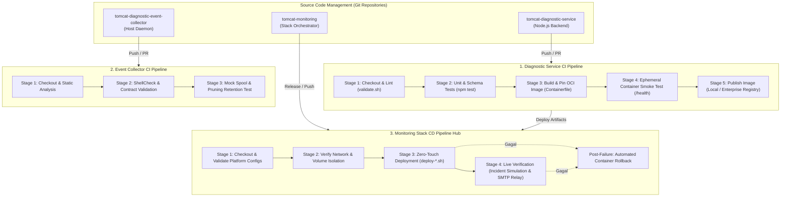

# TM-ADR-0024

| Property | Value |
| --- | --- |
| **ADR ID** | TM-ADR-0024 |
| **Title** | Adopt Decoupled Component CI and Orchestrated Stack CD Pipeline Architecture |
| **Project** | Tomcat Monitoring |
| **Section** | Continuous Integration and Deployment Architecture |
| **Status** | Accepted |
| **Date** | 2026-09-12 |

---

## 🔍 Overview

Platform Tomcat Monitoring mengadopsi arsitektur otomasi pengiriman perangkat lunak berbasis **Decoupled Component CI and Orchestrated Stack CD Pipeline Hub** menggunakan Jenkins Pipeline as Code. Keputusan ini memisahkan siklus integrasi berkelanjutan (*Continuous Integration*) pada masing-masing repositori komponen mikro dan memusatkan orkestrasi rilis berkelanjutan (*Continuous Deployment*) pada repositori orkestrator platform, serta menegakkan standar 6 Pilar Kesiapan Produksi Enterprise.

---

## 🌍 Context

Platform Tomcat Monitoring terdiri atas tiga repositori terpisah dengan siklus rilis dan kebutuhan toolchain yang berbeda:
1. **`tomcat-diagnostic-service`:** Layanan backend analitik insiden (Node.js 24 ESM, SQLite, Nodemailer, OCI Buildah).
2. **`tomcat-diagnostic-event-collector`:** Daemon pemantau lifecycle container host (Bash script, `systemd --user`).
3. **`tomcat-monitoring`:** Orkestrator platform multi-kontainer (Prometheus, Alertmanager, Postfix relay, JMX Exporter, live test suites).

Sebelumnya, pengujian kode, validasi skema JSON, pembangunan OCI image, dan deployment layanan dilakukan secara manual menggunakan skrip ad-hoc pada terminal pengembang. Untuk mengoperasikan platform pada skala enterprise dan memastikan implementasi di lingkungan kerja/kantor dapat langsung digunakan secara *plug-and-play*, diperlukan standarisasi pipeline CI/CD yang menyelesaikan tantangan:
- **Keterikatan Jalur Host Statis:** Skrip lokal sebelumnya mengasumsikan path lokal tertentu dan tag `localhost/...`.
- **Kepatuhan Keamanan & Tata Kelola Rahasia (*Zero Secret Leakage*):** Larangan penyimpanan kredensial dalam Git dan kebutuhan eksekusi non-root.
- **Ketiadaan Gerbang Kualitas Bertingkat & Rollback Otomatis:** Kebutuhan verifikasi *fail-fast* sebelum deployment dan pemulihan otomatis jika deployment gagal.

---

## 🔄 Evaluasi Pilihan Alternatif

### Alternatif 1: Monolithic Single Pipeline di `tomcat-monitoring`
Seluruh proses build dan pengujian ketiga repositori digabungkan ke dalam satu berkas `Jenkinsfile` tunggal di repositori orkestrator.
- **Kelebihan:** Hanya memerlukan pengelolaan satu job Jenkins tunggal.
- **Kekurangan:** Menciptakan kopling erat (*tight coupling*) antar repositori, memperlambat siklus umpan balik bagi developer mikrokomponen (harus menjalankan seluruh rangkaian build untuk perubahan 1 baris kode), dan melanggar prinsip *Single Responsibility*.
- **Status:** Ditolak ❌

### Alternatif 2: Decoupled Component CI + Orchestrated Stack CD Hub (Terpilih ⭐)
Memisahkan pipeline CI pada masing-masing repositori komponen untuk pengujian unit, linting, build OCI, dan smoke test, serta memusatkan pipeline CD pada repositori orkestrator stack untuk pengujian integrasi platform multi-kontainer dan automated rollback.
- **Kelebihan:** Memisahkan batas tanggung jawab secara bersih, memberikan umpan balik cepat (*fast feedback loop*) dalam hitungan detik, dan mendukung pengujian integrasi multi-kontainer menyeluruh secara independen.
- **Kekurangan:** Memerlukan konfigurasi terstruktur untuk masing-masing job Jenkinsfile.
- **Status:** Diterima ✅

### Alternatif 3: Direct In-Host Controller Execution tanpa Dedicated Agent
Eksekusi seluruh proses build dan uji langsung di dalam kontainer Jenkins Controller.
- **Kelebihan:** Tidak memerlukan dedicated build agent node.
- **Kekurangan:** Membebani master controller (*noisy neighbor problem*), memperbesar risiko stabilitas controller saat build intensif, dan melanggar *best practice* Jenkins enterprise.
- **Status:** Ditolak ❌

### Alternatif 4: Docker-in-Docker (DinD) via Privileged Container
Eksekusi kontainer di dalam build agent menggunakan mode DinD dengan flag `--privileged`.
- **Kelebihan:** Isolasi filesystem docker di dalam kontainer agent.
- **Kekurangan:** Membuka celah keamanan kritis pada server host karena mode privileged memberikan hak akses penuh setara root ke kernel host.
- **Status:** Ditolak ❌

---

## ⚖️ Decision

Ditetapkan keputusan arsitektur CI/CD sebagai berikut:

1. **Penerapan Model Decoupled Component CI + Orchestrated Stack CD Hub:**
   - **Component CI (`tomcat-diagnostic-service`):** Bertanggung jawab atas static linting, unit & schema testing (62 tests), OCI container packaging, ephemeral container smoke test (`/health`), dan publikasi image ke registry.
   - **Component CI (`tomcat-diagnostic-event-collector`):** Bertanggung jawab atas static analysis (ShellCheck), contract validation, dan mock spool retention test.
   - **Stack CD Hub (`tomcat-monitoring`):** Bertanggung jawab atas validasi konfigurasi platform, verifikasi isolasi network/volume, deployment multi-kontainer atomik, live incident verification, dan automated rollback.

2. **Pembakuan 6 Pilar Kesiapan Produksi Enterprise (*Production-Ready Baseline*):**
   - **Parameterized Portability:** Mendukung lokal Podman maupun Enterprise Container Registry (Harbor/Nexus) via parameter deklaratif `REGISTRY_HOST`, `IMAGE_TAG`, dan `PUSH_IMAGE`.
   - **Zero Secret Leakage Governance:** Injeksi rahasia terisolasi saat runtime melalui Jenkins Credentials Store (`withCredentials`); tidak ada kredensial disimpan dalam Git atau file teks statis.
   - **Isolasi Keamanan Non-Root:** Eksekusi build agent (`builder-01`) menggunakan DooD berbasis Rootless Podman via Unix socket tanpa hak akses `sudo` atau eskalasi privilese.
   - **Multi-Stage Quality Gates:** Rangkaian gerbang pengujian berlapis secara *fail-fast*.
   - **Atomic Deployment & Automated Rollback:** Snapshot kontainer sebelum deploy dan pemulihan otomatis pada blok `post.failure`.
   - **Self-Documenting SRE Runbook:** Dokumentasi Pipeline as Code terstruktur di engineering handbook.

3. **Pola Eksekusi DooD via Rootless Podman Socket:**
   - Dedicated Jenkins Agent (`builder-01`) menjalankan CLI Podman yang terhubung ke socket Rootless Podman host (`unix:///run/user/$UID/podman/podman.sock`) di bawah akun pengguna non-root (`eddywiyatno`).

---

## 🏛️ Architecture

---

## 💡 Rationale

- **Kemandirian Komponen:** Developer mikrokomponen mendapatkan feedback pengujian unit dalam hitungan detik tanpa harus memicu deployment seluruh stack monitoring.
- **Keamanan Skala Enterprise:** Menghilangkan seluruh potensi kebocoran rahasia dan risiko keamanan rootless pada dedicated build agent.
- **Portabilitas Plug-and-Play:** Parameterisasi pipeline memastikan artefak dan skrip deployment dapat langsung diadaptasi di lingkungan enterprise kantor dengan konfigurasi registry internal.

---

## ⚠️ Consequences

- **Kelebihan:**
  - Pemisahan siklus rilis yang bersih dan modular antar repositori.
  - Penegakan standar keamanan enterprise yang ketat (*Zero Secret Leakage* dan *Non-Root Execution*).
  - Ketahanan layanan pemantauan terjamin melalui mekanisme *automated rollback*.
- **Keterbatasan:**
  - Memerlukan pengelolaan beberapa berkas `Jenkinsfile` deklaratif dan registrasi job terpisah di Jenkins Controller.

---

## 📌 Status

**Accepted — defined in TN-001 and ready for phased implementation (TN-002 through TN-005).**

---

## 📅 Date

**2026-09-12**
