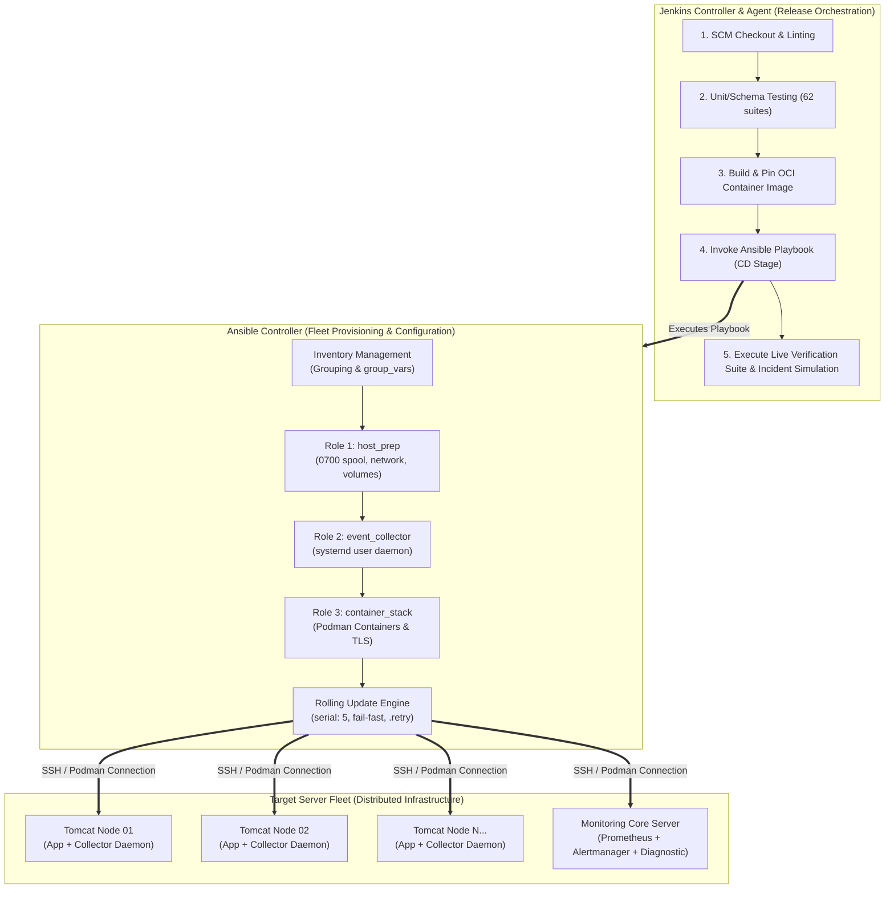

# TM-ADR-0025

| Property | Value |
| --- | --- |
| **ADR ID** | TM-ADR-0025 |
| **Title** | Delineate Responsibilities Between Jenkins Release Orchestration and Ansible Configuration Provisioning |
| **Project** | Tomcat Monitoring |
| **Section** | Deployment, Configuration Management, and Fleet Orchestration Architecture |
| **Status** | Accepted |
| **Date** | 2026-09-12 |

---

## 🔍 Overview

Dokumen ini membakukan pemisahan batas tanggung jawab (*Separation of Concerns*) antara **Jenkins** sebagai *Release Orchestrator* (alur *Continuous Integration* dan *Continuous Deployment* — CI/CD) dan **Ansible** sebagai *Configuration Management & Multi-Node Provisioning Engine* (pengelolaan konfigurasi dan penyediaan armada server terdistribusi) untuk seluruh platform Tomcat Monitoring di lingkungan *enterprise*.

---

## 🌍 Context

Pada fase awal implementasi dan pengujian laboratorium (*single-node runtime*), eksekusi deployment multi-kontainer dijalankan menggunakan skrip shell modular (`deploy-*.sh`) yang dipanggil langsung oleh Jenkinsfile (`tomcat-monitoring/Jenkinsfile`). Pola ini berhasil membuktikan *zero-touch deployment* dan *live verification suite* di atas satu host Podman terisolasi ([TN-006](../../../../projects/tomcat-monitoring/engineering-journal/continuous-integration-and-deployment/TN-006-implement-stack-orchestration-cd-pipeline-for-tomcat-monitoring.md), [TN-007](../../../../projects/tomcat-monitoring/engineering-journal/continuous-integration-and-deployment/TN-007-execute-and-verify-end-to-end-cicd-pipelines-in-jenkins-controller.md)).

Namun, ketika sistem ini diterapkan pada skala **perusahaan enterprise (skala produksi nyata)**, arsitektur menghadapi tantangan operasional:
1. **Target Terdistribusi (*Multi-Node Fleet Scale*):** Beban kerja Apache Tomcat tersebar di puluhan hingga ratusan server (VM / *bare-metal*). Setiap node target membutuhkan instalasi Java agent JMX Exporter, pendaftaran daemon `systemd --user` Event Collector, pembuatan direktori berizin ketat `0700`, dan distribusi sertifikat TLS (*Keystore* & *CA certs*).
2. **Keterbatasan Skrip Imperatif (*Bash/SSH Loops Limitations*):** Menggunakan perulangan (*loop*) SSH murni di dalam Jenkinsfile untuk mengonfigurasi puluhan server menimbulkan risiko tinggi:
   - *Kegagalan Parsial (*Partial Failure*):* Jika server ke-23 dari 50 server gagal, skrip berhenti dan meninggalkan 22 server pada versi baru sementara 28 server pada versi lama (*split-brain*).
   - *Ketiadaan Idempotensi Bawaan:* Skrip shell imperatif memerlukan puluhan baris logika pengecekan `if-else` manual agar tidak merusak konfigurasi yang sudah ada.
   - *Risiko Downtime Massal:* Memperbarui seluruh server secara serentak tanpa *rolling update* terkendali dapat mengakibatkan pemadaman layanan total (*total outage*).
3. **Kepatuhan Audit & Manajemen Rahasia (*Security & Compliance*):** Penyimpanan dan distribusi sertifikat TLS serta kredensial rahasia memerlukan enkripsi berbasis *Ansible Vault* dengan riwayat audit (*audit trail*) yang terstandarisasi.

---

## 🔄 Evaluasi Pilihan Alternatif

### Alternatif 1 — Jenkins Murni dengan Imperative Bash/SSH Loops (Antipattern)
Mengelola deployment ke seluruh server target secara langsung dari Jenkinsfile menggunakan perintah `ssh` atau loop Bash.
- **Kelebihan:** Tidak memerlukan alat tambahan (tanpa Ansible).
- **Kekurangan:** Memaksa Jenkins bertindak sebagai *Configuration Manager*, tidak idempoten secara alami, sulit menangani kegagalan parsial (*partial failure*), memerlukan penulisan logika batching *rolling update* yang sangat rumit, dan ditolak oleh standar audit enterprise.
- **Status:** Ditolak ❌

### Alternatif 2 — Ansible Standalone tanpa Jenkins CI/CD
Menjalankan seluruh proses rilis secara manual atau terjadwal langsung dari CLI Ansible Controller tanpa integrasi Jenkins.
- **Kelebihan:** Konfigurasi host idempoten dan terkelola dengan baik.
- **Kekurangan:** Kehilangan otomatisasi pemicu Git (*SCM webhooks*), tidak ada gerbang mutu berlapis (*Multi-Stage Quality Gates* untuk linting, unit tests, dan OCI build), serta pelaporan status rilis terfragmentasi.
- **Status:** Ditolak ❌

### Alternatif 3 — Hybrid Enterprise Pattern: Jenkins as Release Orchestrator + Ansible as Configuration Provisioner (Terpilih ⭐)
Mengombinasikan kedua alat sesuai keunggulan alaminya: Jenkins mengorkestrasikan siklus rilis dan gerbang mutu CI/CD, sedangkan Ansible mengeksekusi penyediaan infrastruktur host dan deployment multi-node secara idempoten.
- **Kelebihan:** Memisahkan batas tanggung jawab secara bersih (*clean separation of concerns*), menjamin status idempoten (*desired state*), mendukung *rolling update* bebas downtime (`serial: N`), menyediakan penanganan *retry* otomatis via file `.retry`, dan memenuhi standar audit enterprise.
- **Kekurangan:** Memerlukan pemeliharaan repositori playbook Ansible (`ansible-controller`).
- **Status:** Diterima ✅

---

## ⚖️ Decision

Ditetapkan keputusan arsitektur pembagian tanggung jawab sebagai berikut:

1. **Batas Tanggung Jawab Jenkins (*Release Orchestration Layer*):**
   - **Continuous Integration (CI):** Menjalankan static linting, validasi skema JSON, 62 *unit/schema test suites*, pembangunan citra OCI, dan pengujian *ephemeral smoke test* pada Dedicated Agent (`builder-01`).
   - **Continuous Deployment (CD) Orchestration:** Menjadi gerbang utama pemicu rilis, mengevaluasi parameter lingkungan (`DEPLOY_ENV`), mengelola kredensial master di Jenkins Credentials Store, memanggil playbook Ansible pada Stage Deployment, dan menjalankan *Live Verification Suite* pasca-deploy.

2. **Batas Tanggung Jawab Ansible (*Configuration & Multi-Node Provisioning Layer*):**
   - **Host & Environment Provisioning:** Memastikan direktori persisten berizin ketat `0700` (`~/.local/share/tomcat-monitoring/spool`, TLS, secrets), jaringan bridge Podman (`devops-lab`), dan named volumes tersedia pada seluruh host target.
   - **Host Daemon Management:** Mendaftarkan, mengonfigurasi unit file, dan mengaktifkan layanan `systemd --user` Event Collector (`tomcat-diagnostic-event-collector.service`) di seluruh fleet host.
   - **Idempotent Container Deployment:** Mengelola *lifecycle* kontainer Podman (Prometheus, Alertmanager, Diagnostic Service, Postfix Relay, Mailpit, Tomcat JMX Exporter) menggunakan collection `containers.podman` dengan jaminan status *desired state*.
   - **Rolling Updates & Fault Isolation:** Menerapkan pembaharuan bertahap tanpa downtime menggunakan direktif `serial: N` dan pembatasan kegagalan `max_fail_percentage: 0`.

3. **Struktur Eksekusi Hibrida:**
   - Pada tahap CD Hub (`tomcat-monitoring`), Jenkinsfile mengeksekusi perintah rilis deklaratif:
     ```groovy
     stage('Deploy Platform via Ansible') {
         steps {
             sh '''
                 ansible-playbook -i inventories/${DEPLOY_ENV}.ini deploy-stack.yml
             '''
         }
     }
     ```

---

## 🏛️ Architecture



---

## 💡 Rationale

- **Pencegahan Human Error & Script Bloat:** Menghilangkan keharusan menulis ratusan baris skrip imperatif SSH di dalam pipeline Jenkins.
- **Kesiapan Skala Produksi Nyata (*Fleet Scalability*):** Menjamin platform siap dideploy ke puluhan host Tomcat terdistribusi secara paralel tanpa membebani Jenkins Agent.
- **Auditabilitas & Standar Enterprise:** Memisahkan kode aplikasi dari konfigurasi infrastruktur, memudahkan audit kepatuhan ISO 27001 dan SOC2.

---

## ⚠️ Consequences

- **Kelebihan:**
  - Jaminan status sistem yang konsisten (*Idempotent Desired State*).
  - Mekanisme pemulihan kegagalan parsial otomatis melalui file `.retry`.
  - Kemampuan *rolling update* bertahap tanpa pemadaman layanan (*Zero-Downtime Deployment*).
  - Pemisahan tanggung jawab yang jelas antara tim pengembang aplikasi dan tim perekayasa keandalan sistem (SRE).
- **Keterbatasan:**
  - Menambah kebutuhan pemeliharaan repositori terpisah [`ansible-controller`](file:///home/eddywiyatno/git/ansible-controller) untuk koleksi role dan playbook.
  - Memerlukan konfigurasi akses SSH berbasis kunci publik (*SSH keypair*) dari Ansible Controller ke seluruh node target.

---

## 📌 Status

**Accepted — registered as architectural baseline and planned for phased playbook implementation under TASK-TM-011.**

---

## 📅 Date

**2026-09-12**
