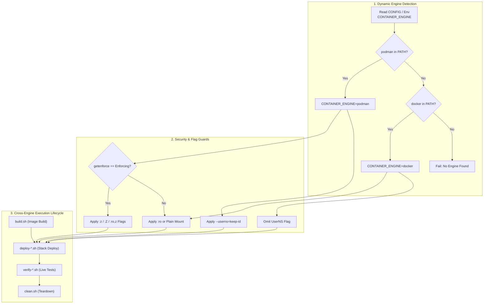

# TM-ADR-0026

| Property | Value |
| --- | --- |
| **ADR ID** | TM-ADR-0026 |
| **Title** | Adopt Adaptive Multi-Engine Container Runtime Portability for Podman and Docker Environments |
| **Project** | Tomcat Monitoring |
| **Section** | Container Runtime, Platform Portability, and Infrastructure Abstraction Architecture |
| **Status** | Accepted |
| **Date** | 2026-09-13 |

---

## 🔍 Overview

Dokumen keputusan arsitektur (*Architecture Decision Record* — ADR) ini menetapkan standarisasi abstraksi *container runtime* (lingkungan eksekusi kontainer) lintas mesin (*Multi-Engine Container Runtime Portability*) yang mendukung eksekusi adaptif pada **Podman** (*Rootless Container Engine*) maupun **Docker** (*Docker Community Edition / Enterprise Engine*) di seluruh repositori ekosistem Tomcat Monitoring ([`tomcat-monitoring`](file:///home/eddywiyatno/git/tomcat-monitoring), [`tomcat-diagnostic-service`](file:///home/eddywiyatno/git/tomcat-diagnostic-service), [`tomcat-diagnostic-event-collector`](file:///home/eddywiyatno/git/tomcat-diagnostic-event-collector), [`ansible-controller`](file:///home/eddywiyatno/git/ansible-controller), dan [`alertmanager`](file:///home/eddywiyatno/git/alertmanager)).

---

## 🌍 Context

Pada fase awal implementasi dan integrasi laboratorium, skrip operasional platform (mencakup pembangunan citra *build*, peluncuran kontainer *run*, orkestrasi tumpukan *stack deployment*, pembersihan *cleanup*, dan verifikasi insiden *verification suites*) dibangun dengan asumsi tunggal (*single-engine assumption*) berbasis perintah biner `podman`.

Pola keterikatan mesin tunggal (*monoculture coupling*) ini menimbulkan berbagai hambatan portabilitas di lingkungan *enterprise hybrid*:
1. **Perbedaan Mesin Kontainer Host (*Heterogeneous Enterprise Hosts*):** Sebagian kluster server enterprise mengadopsi Red Hat Enterprise Linux (RHEL)/Rocky Linux dengan Podman rootless bawaan, sementara kluster lain mengadopsi Ubuntu/Debian dengan Docker CE/EE daemon.
2. **Inkompatibilitas Flag Khusus Podman (*Podman-Specific Arguments*):** Opsi seperti `--userns=keep-id` (pemetaan ID pengguna *user namespace* tanpa root) hanya dikenali oleh Podman dan menyebabkan kegagalan fatal (*fatal parse error*) saat dieksekusi di Docker CLI.
3. **Konflik Relabeling Volume Keamanan (*SELinux vs Non-SELinux Volume Flags*):** Penambahan akhiran relabeling volume `:z`, `:Z`, `:ro,z`, atau `:ro,Z` diwajibkan pada distribusi berbasis SELinux (*Security-Enhanced Linux*) dalam mode Enforcing/Permissive. Namun, pada distribusi non-SELinux (seperti Ubuntu dengan AppArmor), beberapa varian runtime Docker menolak flag tersebut atau menghasilkan perilaku yang tidak terdefinisi.
4. **Variasi Sintaks Lifecycle (*Subcommand Inconsistencies*):** Pemeriksaan eksistensi objek (`podman container exists`, `podman image exists`, `podman volume exists`, `podman network exists`) adalah fitur bawaan Podman yang tidak memiliki padanan langsung satu kata pada Docker CLI (di mana Docker menggunakan `docker container inspect`, `docker image inspect`, dll).

---

## 🔄 Evaluasi Pilihan Alternatif

### Alternatif 1 — Engine Monoculture (Podman-Only Lock-in)
Mempertahankan eksekusi Podman secara eksklusif dan menolak dukungan terhadap host berbasis Docker.
- **Kelebihan:** Implementasi skrip sederhana tanpa logika percabangan.
- **Kekurangan:** Mengorbankan portabilitas enterprise; platform gagal dijalankan di server berbasis Docker tanpa migrasi menyeluruh.
- **Status:** Ditolak ❌

### Alternatif 2 — Heavyweight Container Orchestration Abstraction (Kubernetes / Docker Compose Only)
Memaksa seluruh runtime lokal dan pengujian komponen bermigrasi ke manifes Kubernetes atau Docker Compose.
- **Kelebihan:** Standarisasi deklaratif tingkat tinggi.
- **Kekurangan:** Menambah *overhead* dependensi yang sangat berat untuk pengujian unit lokal, skrip verifikasi *disposable*, dan agen pengumpul event host ringan (*lightweight host daemon*).
- **Status:** Ditolak ❌

### Alternatif 3 — Adaptive Multi-Engine Runtime Helper with SELinux Guard (Terpilih ⭐)
Membangun modul pembantu ringan berbasis Bash POSIX murni (`scripts/container-runtime-helper.sh`) pada setiap repositori yang mendeteksi mesin secara dinamis, mengabstraksikan perintah eksistensi objek, dan menyediakan *guard* adaptif untuk relabeling volume SELinux serta opsi *user namespace*.
- **Kelebihan:** *Zero overhead*, kompatibilitas 100% dengan instalasi Podman rootless yang sudah ada (*Zero Regression*), portabel ke Docker CLI, dan adaptif terhadap status penegakan SELinux/AppArmor pada kernel host.
- **Kekurangan:** Memerlukan pemeliharaan pustaka pembantu `container-runtime-helper.sh` yang konsisten di 5 repositori.
- **Status:** Diterima ✅

---

## ⚖️ Decision

Ditetapkan keputusan arsitektur standarisasi *container runtime portability* sebagai berikut:

1. **Implementasi Standard Helper (`scripts/container-runtime-helper.sh`):**
   Setiap repositori wajib memiliki pustaka pembantu runtime yang menyediakan fungsi-fungsi standar:
   - `detect_container_engine`: Mendeteksi variabel `CONTAINER_ENGINE` dari berkas `CONFIG` atau mendeteksi ketersediaan `podman` dan `docker` di `PATH`.
   - `container_exists <name>`: Pengecekan status keberadaan kontainer lintas mesin.
   - `image_exists <name>`: Pengecekan ketersediaan citra kontainer lokal.
   - `volume_exists <name>`: Pengecekan keberadaan named volume.
   - `network_exists <name>`: Pengecekan keberadaan bridge network.
   - `get_volume_flag <mode>`: Menghasilkan suffix flag volume adaptif berdasarkan kondisi aktual mesin kontainer dan status aktif SELinux (`getenforce`).
   - `get_userns_flag`: Menghasilkan `--userns=keep-id` hanya jika mesin kontainer aktif adalah Podman.

2. **Aturan SELinux & Volume Relabeling Guard:**
   - Jika `CONTAINER_ENGINE == "podman"` dan SELinux berstatus `Enforcing` atau `Permissive`:
     - `ro,z` / `ro_shared` $\rightarrow$ `:ro,z`
     - `ro,Z` / `ro_private` $\rightarrow$ `:ro,Z`
     - `z` / `shared` $\rightarrow$ `:z`
     - `Z` / `private` $\rightarrow$ `:Z`
     - `ro` $\rightarrow$ `:ro`
   - Jika `CONTAINER_ENGINE == "docker"` atau SELinux berstatus `Disabled` / tidak terpasang:
     - `ro,z` / `ro,Z` / `ro` $\rightarrow$ `:ro`
     - `z` / `Z` / lainnya $\rightarrow$ `""` (tanpa suffix relabeling)

3. **Deklarasi Variabel Konfigurasi (`CONFIG` SSOT):**
   Seluruh berkas `CONFIG` menambahkan parameter override opsional:
   ```bash
   CONTAINER_ENGINE="${CONTAINER_ENGINE:-}"
   ```

4. **Penyesuaian Skrip Operasional:**
   Seluruh skrip pembangunan (`build.sh`), peluncuran (`run.sh`), pembersihan (`clean.sh`), deployment (`deploy-*.sh`), penginisialisasi volume (`initialize-*.sh`), dan verifikasi insiden (`verify-*.sh` / `test-*.sh`) wajib memuat `source "${SCRIPT_DIR}/container-runtime-helper.sh"` dan menggunakan referensi `"${CONTAINER_ENGINE}"`.

---

## 🏛️ Architecture



---

## 📈 Consequences

### Positive Consequences
- **Portabilitas Penuh Enterprise:** Platform dapat dijalankan tanpa hambatan di lingkungan berbasis Podman (RHEL/Rocky/Fedora) maupun Docker (Ubuntu/Debian/Alpine).
- **Keamanan Adaptif:** Relabeling SELinux diaplikasikan secara otomatis hanya saat diperlukan, mencegah benturan permission (*SELinux denial*) pada Red Hat family sekaligus menghindari *syntax error* pada non-SELinux host.
- **Zero Regression:** Menjaga keandalan 100% pada ekosistem Rootless Podman yang sudah terpasang di lab pengujian.
- **Keterpaduan Tata Kelola (SSOT):** Seluruh logika abstraksi terpusat pada `container-runtime-helper.sh` dan berkas `CONFIG`.

### Negative Consequences / Trade-offs
- **Pemeliharaan Berkas Tambahan:** Diperlukan sinkronisasi berkas `scripts/container-runtime-helper.sh` di 5 repositori jika terdapat penambahan fitur abstraksi baru di masa depan.
