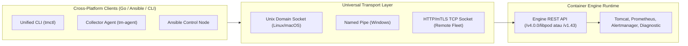
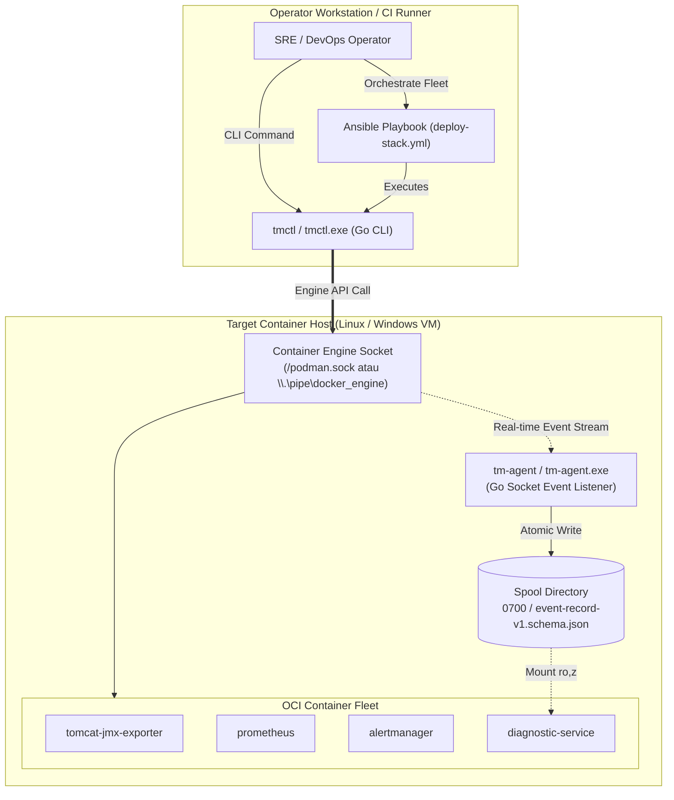

# TM-ADR-0027

| Property | Value |
| --- | --- |
| **ADR ID** | TM-ADR-0027 |
| **Title** | Adopt Container Engine Socket API and Unified Cross-Platform Tooling for Multi-OS Orchestration |
| **Project** | Tomcat Monitoring |
| **Section** | Platform Portability, Multi-OS Orchestration, and Tooling Architecture |
| **Status** | Accepted |
| **Date** | 2026-09-13 |

---

## 🔍 Overview

Dokumen keputusan arsitektur (*Architecture Decision Record* — ADR) ini menetapkan adopsi **Container Engine Socket API** (antarmuka soket Podman dan Docker) sebagai fondasi orkestrasi lintas sistem operasi (*Multi-OS Orchestration*) dan standardisasi kakas terpadu (*Unified Tooling*) berbasis **Go (Golang)** pada platform Tomcat Monitoring.

Keputusan ini memecahkan keterikatan platform pada primitif shell Linux (*Linux-Centric Bash Scripts and Systemd Daemon Lock-in*), memungkinkan instalasi manual dan otomatisasi armada (*fleet automation*) berjalan mulus di lingkungan **Linux maupun Windows** secara *Container-Native*.

---

## 🌍 Context

Platform Tomcat Monitoring telah sukses mengimplementasikan stack pemantauan berbasis kontainer OCI, mesin diagnosis otonom 20 cabang keputusan (*Decision Branches*), otomasi inventori Ansible ([TM-ADR-0025](TM-ADR-0025.md)), dan portabilitas multi-runtime Podman/Docker ([TM-ADR-0026](TM-ADR-0026.md)).

Namun, evaluasi terhadap kesiapan lingkungan multi-OS (*Multi-OS Readiness Audit*) mengidentifikasi kesenjangan struktural:

1. **Keterikatan Shell Imperatif (*Host Bash Script Lock-in*):**
   Seluruh skrip orkestrasi manual (`scripts/deploy-*.sh`, `scripts/validate.sh`, `scripts/ingest-rule.sh`, dll.) ditulis dalam format Bash shell (`.sh`). Skrip ini gagal dieksekusi secara *native* pada workstation/server Windows (PowerShell / Command Prompt) tanpa lapisan emulasi (WSL2 / Git Bash).
2. **Ketergantungan Modul Ansible pada Shell Linux (*Ansible Script Wrapper Antipattern*):**
   Pada role `role_container_stack`, Ansible masih memanggil skrip shell (`ansible.builtin.shell: bash scripts/deploy-*.sh`). Pola ini menggagalkan eksekusi pada target node berbasis Windows meskipun node tersebut menjalankan container runtime.
3. **Keterikatan Daemon Pengumpul Event pada Systemd Linux (*Systemd-Coupled Daemon*):**
   Daemon `tomcat-diagnostic-event-collector` diimplementasikan dengan skrip Bash (`src/collector.sh`) yang mendengarkan subshell `podman events` dan didaftarkan sebagai `systemd --user` unit. Primitif ini tidak tersedia di Windows.
4. **Fondasi 100% Container-Native:**
   Seluruh beban kerja Tomcat Monitoring adalah kontainer OCI (*Container-Native Workloads*). Tidak ada skenario instalasi *bare-metal non-container*. Oleh karena itu, antarmuka interaksi tidak boleh bergantung pada mekanisme host OS, melainkan harus berinteraksi langsung dengan **Container Engine API**.

---

## 💡 Keunggulan & Kekuatan Container Engine Socket API

Container Engine API (Podman Socket `/run/user/.../podman.sock` dan Docker Socket `/var/run/docker.sock` / Named Pipe Windows `\\.\pipe\docker_engine` / TCP Socket) menyediakan abstraksi universal yang melampaui batasan sistem operasi:

Keunggulan teknis Container Engine Socket API:
* **OS-Agnostic Transport:** Menyediakan antarmuka REST API yang identik di atas Unix Socket (Linux), Named Pipe (Windows), maupun TCP dengan enkripsi mTLS (Remote Cluster).
* **Streaming Protocol Asli (*HTTP Chunked Event Stream*):** Mengonsumsi event siklus hidup kontainer secara real-time (`GET /events` / `GET /libpod/events`) tanpa overhead subshell `podman events` atau perulangan proses Bash.
* **Payload JSON Terstruktur (*Structured Contract*):** Respon API berbentuk JSON valid yang mencegah kerapuhan *string parsing*, *regex text scraping*, atau ketergantungan pada utilitas POSIX (`awk`, `sed`, `grep`, `coreutils`).
* **Semantik Status Presisi (*Deterministic Lifecycle Semantics*):** Memberikan sinyal status kontainer yang akurat (`died`, `oom`, `exit_code: 137`, `restart`, `health_status`).
* **Isolasi Keamanan Rootless:** Dapat diakses secara aman oleh proses pengguna non-root tanpa memerlukan hak akses administratif *host root*.

---

## 🔄 Evaluasi Pilihan Alternatif

### Alternatif 1 — Mempertahankan Bash Scripts dan Mewajibkan WSL2 di Windows
Mempertahankan seluruh skrip `.sh` dan mewajibkan pengguna Windows memasang Windows Subsystem for Linux (WSL2).
- **Kelebihan:** Tidak memerlukan penulisan ulang kakas (*zero development effort*).
- **Kekurangan:** Menolak dukungan Windows native, mempersulit otomatisasi CI/CD pada agen non-WSL, dan menyalahi prinsip *Enterprise Plug-and-Play*.
- **Status:** Ditolak ❌

### Alternatif 2 — Menulis Skrip Duplikat PowerShell (`.ps1`) untuk Windows
Membuat berkas `.ps1` pendamping untuk setiap skrip `.sh` di seluruh repositori.
- **Kelebihan:** Mendukung Windows tanpa kompilasi binary.
- **Kekurangan:** *High maintenance overhead* (risiko desinkronisasi logika antara Bash dan PowerShell), penggandaan titik uji coba, dan tetap mewajibkan eksekusi skrip imperatif pada target host.
- **Status:** Ditolak ❌

### Alternatif 3 — Mengadopsi Container Engine API & Unified Go Tooling (Terpilih ⭐)
Membangun satu kakas CLI terpadu (`tmctl`) dan daemon pengumpul event (`tm-agent`) dalam bahasa Go yang berkomunikasi langsung dengan Container Engine Socket API, serta merefaktor Ansible menjadi orkestrator deklaratif berbasis `tmctl` dan modul kontainer native.
- **Kelebihan:** 
  - *Single Static Binary* (tanpa dependensi runtime di host, tanpa instalasi rumit).
  - *True Cross-Platform* (dapat dikompilasi ke Linux ELF dan Windows `.exe`).
  - Menghilangkan dependensi shell Bash pada target host saat deployment otomatis via Ansible.
  - Mempertahankan kompatibilitas penuh dengan kontrak data eksisting (`event-record-v1.schema.json`).
- **Kekurangan:** Memerlukan pembangunan komponen baru (`tmctl` dan `tm-agent`) dalam bahasa Go.
- **Status:** Diterima ✅

---

## ⚖️ Decision

Ditetapkan keputusan arsitektur standarisasi orkestrasi multi-OS sebagai berikut:

### 1. Adopsi Container Engine Socket API sebagai Single Source of Truth (SSOT)
Seluruh operasi pengelolaan siklus hidup kontainer (pemantauan, pembuatan, pembersihan, dan penangkapan event) wajib berinteraksi langsung dengan Container Engine API (Podman / Docker) melalui soket lokal atau TCP.

### 2. Pembangunan Kakas Operator Terpadu: `tmctl` (Go CLI)
* Menggantikan seluruh skrip imperatif `scripts/*.sh` untuk kebutuhan manajemen manual.
* Menyediakan subperintah standar lintas OS:
  - `tmctl stack deploy [--target <name>] [--env <name>]`
  - `tmctl stack status`
  - `tmctl stack clean`
  - `tmctl rules ingest <file.json>`
  - `tmctl rules export [--category <name>]`
  - `tmctl registry login <host> <user>`
  - `tmctl validate`
* Dikompilasi sebagai *single static binary* untuk Linux (`tmctl`) dan Windows (`tmctl.exe`).
* Skrip `scripts/*.sh` eksisting tetap dipertahankan sebagai *legacy convenience wrapper* untuk pengembang Linux/WSL lokal.

### 3. Modernisasi Event Collector: `tm-agent` (Go Daemon)
* Menggantikan skrip Bash `src/collector.sh` pada repositori `tomcat-diagnostic-event-collector`.
* Berlangganan (*subscribe*) langsung ke *event stream* Container Socket API.
* Memfilter event kontainer `tomcat-jmx-exporter` (`died`, `oom`, `restart`, `exit code`).
* Memformat data snapshot sesuai skema kanonikal [`event-record-v1.schema.json`](file:///home/eddywiyatno/git/tomcat-diagnostic-event-collector/config/schemas/event-record-v1.schema.json) dan melakukan penulisan atomik (`.tmp` $\rightarrow$ `.json`) ke direktori spool berizin aman.
* Mendukung eksekusi sebagai *systemd user unit* di Linux dan *Windows Service / Background Process* di Windows.

### 4. Refaktorisasi Ansible Roles menjadi Thin Declarative Orchestrator
* Menghilangkan seluruh pemanggilan `ansible.builtin.shell: bash scripts/...`.
* Mengganti eksekusi deployment dengan pemanggilan `tmctl` atau modul kontainer deklaratif native (`containers.podman.podman_container` / `community.docker.docker_container`).
* Menggunakan *OS Fact Branching* (`ansible_os_family == "Windows"` vs `"RedHat"`/`"Debian"`) untuk pendaftaran layanan daemon `tm-agent`.

---

## 🏛️ Target Architecture

---

## 💡 Rationale

- **Kemandirian Platform (*True Platform Independence*):** Menjamin platform dapat dioperasikan secara konsisten oleh operator Windows maupun Linux tanpa hambatan *line endings* (`CRLF`/`LF`), izin POSIX oktal, atau shell syntax.
- **Efisiensi Sumber Daya & Ketahanan (*Zero Runtime Dependency*):** Go static binary berjalan dengan konsumsi memori sangat rendah (< 15 MB RAM) tanpa memerlukan instalasi interpreter Python, Node.js, atau Bash pada host target.
- **Preservasi Kontrak & Zero Regression:** Tidak ada perubahan pada format komunikasi data, skema database SQLite, atau logika analitik *Diagnostic Service*.

---

## ⚠️ Consequences

### Kelebihan (*Positive*)
1. Menuntaskan batas akhir portabilitas multi-OS untuk mode instalasi manual dan otomatis.
2. Menghilangkan ketergantungan pada ratusan baris skrip shell imperatif di target host.
3. Memberikan pengalaman pengguna (*Developer & SRE Experience*) yang seragam melalui satu biner `tmctl`.
4. Kompatibilitas mundur 100% terhadap seluruh spesifikasi dan aturan diagnosis AI yang sudah berjalan.

### Keterbatasan (*Trade-offs & Constraints*)
1. Menambah kebutuhan kompilasi *cross-platform* (Go toolchain) pada alur rilis CI/CD.
2. Memerlukan penulisan basis kode baru untuk repositori `tmctl` dan `tm-agent`.

---

## 📌 Status

**Accepted — Terdaftar sebagai dasar arsitektur resmi untuk implementasi kakas multi-OS dan agen Go.**

---

## 📅 Date

**2026-09-13**
