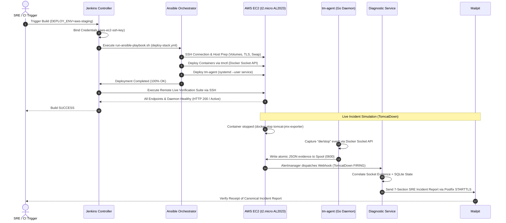

# TM-ADR-0028

| Property | Value |
| --- | --- |
| **ADR ID** | TM-ADR-0028 |
| **Title** | Adopt Cloud-Native Remote Fleet Orchestration, Multi-Engine Socket API Portability, and AWS Free Tier Integration |
| **Project** | Tomcat Monitoring |
| **Section** | Hybrid-Cloud Infrastructure, Deployment Orchestration, and Fleet Portability |
| **Status** | Accepted |
| **Date** | 2026-09-14 |

---

## 🔍 Overview

Dokumen keputusan arsitektur (*Architecture Decision Record* — ADR) ini menetapkan strategi penyebaran armada pemantauan *hybrid-cloud* (*Cloud-Native Remote Fleet Orchestration*), adaptasi portabilitas *Multi-Engine Container Socket API* pada lingkungan cloud (khususnya Amazon Web Services / AWS EC2 Free Tier), integrasi kredensial CI/CD aman (*Zero Secret Leakage*), dan standarisasi penguatan host (*host hardening*) untuk beban kerja kontainer pada instans terbatas (*resource-constrained compute*).

Keputusan ini melengkapi arsitektur CI/CD Jenkins Controller ([TM-ADR-0024](TM-ADR-0024.md)), pembagian peran Jenkins-Ansible ([TM-ADR-0025](TM-ADR-0025.md)), portabilitas multi-runtime ([TM-ADR-0026](TM-ADR-0026.md)), dan orkestrasi Socket API Go ([TM-ADR-0027](TM-ADR-0027.md)) dengan membuktikan kapabilitas *zero-touch deployment* dan *live incident response* di lingkungan cloud publik.

---

## 🌍 Context

Platform Tomcat Monitoring telah berhasil mengimplementasikan *single static binary* Go (`tmctl` dan `tm-agent`), merefaktor Ansible roles menjadi *Thin Declarative Orchestrator*, serta memverifikasi alur CI/CD pada agen build lokal (`devops-lab` Podman rootless).

Untuk memenuhi kesiapan produksi tingkat enterprise (*Enterprise Production-Readiness*), platform perlu dibuktikan di luar lingkungan lokal (*bare-metal / private lab*) menuju lingkungan cloud publik (*Public Cloud Infrastructure*). Dipilih instans **Amazon EC2 (AWS Free Tier - `t2.micro`)** dengan sistem operasi **Amazon Linux 2023 (AL2023)** sebagai target representatif.

Namun, penggelaran pada lingkungan cloud publik memunculkan tantangan arsitektural dan operasional baru:

1. **Kendala Sumber Daya Terbatas (*Resource-Constrained Compute*):**
   Instans `t2.micro` pada AWS Free Tier hanya menyediakan 1 vCPU dan 1 GiB RAM fisik. Menjalankan 6 kontainer aktif (Tomcat JMX Exporter, Prometheus, Alertmanager, Diagnostic Service, Postfix Relay, Mailpit) beserta daemon `tm-agent` berpotensi memicu *Kernel Out-of-Memory (OOM) Killer* jika tidak dilakukan rekayasa swap memory dan alokasi batas memori yang terukur.
2. **Perbedaan Default Container Engine pada Cloud Distribution:**
   Amazon Linux 2023 (AL2023) menggunakan **Docker Engine (25.0.x)** sebagai runtime kontainer standar, berbeda dengan distribusi RHEL/Fedora/CentOS yang mengutamakan Podman rootless. Abstraksi orkestrator dan agen pengumpul event wajib beradaptasi secara dinamis terhadap Docker Socket (`/var/run/docker.sock`) tanpa modifikasi kode aplikasi.
3. **Isolasi Keamanan Izin Pengguna & Hak Akses Soket Systemd:**
   Eksekusi daemon `tm-agent` di bawah `systemd --user` pada Amazon Linux 2023 memerlukan pewarisan GID grup `docker` yang tepat dan pengaktifan *user session lingering* (`loginctl enable-linger`) agar daemon tetap hidup saat sesi SSH terputus.
4. **Perilaku Docker Named Volume UID & Bind-Mount Trap:**
   Berbeda dengan Podman rootless di mana berkas volume otomatis dipetakan ke UID host pengguna, Docker daemon berjalan sebagai root sehingga named volume awal dimiliki oleh `root:root`. Service non-root (seperti `node` UID 1000 pada `diagnostic-service`) akan mengalami *permission denied* saat inisialisasi SQLite database jika permission volume tidak disiapkan secara deklaratif. Selain itu, jika file bind-mount (seperti `postfix-ca.crt`) belum ada di host saat container dijalankan, Docker secara otomatis membuat direktori kosong alih-alih berkas, yang merusak konfigurasi Postfix TLS.
5. **Tata Kelola Kredensial CI/CD Cloud Tanpa Bocor (*Zero Secret Leakage*):**
   Kunci privat SSH (`.pem`) untuk akses ke instans AWS tidak boleh disimpan di dalam repositori Git atau ditulis secara statis di dalam berkas inventori Ansible. Jenkins Controller wajib menginjeksikan kredensial SSH secara aman saat runtime pipeline.

---

## 💡 Keunggulan & Arsitektur Cloud Fleet Orchestration

Arsitektur orkestrasi hybrid-cloud dirancang dengan pemisahan kontrol (*Control Plane*) dan target eksekusi (*Data/Fleet Plane*) yang terisolasi:

```mermaid
flowchart TD
    subgraph CONTROL_PLANE["Control Plane (On-Premise / CI Hub)"]
        JENKINS["Jenkins Controller & Agent (builder-01)"]
        CRED_STORE["Jenkins Credentials Store<br/>(aws-ec2-ssh-key / SSH Key Binding)"]
        ANSIBLE["Ansible Thin Orchestrator<br/>(run-ansible-playbook.sh)"]
        INVENTORY["Dynamic Inventory<br/>(aws-staging.ini / aws-production.ini)"]
        
        CRED_STORE -->|Inject withCredentials| JENKINS
        JENKINS -->|Execute with SSH Key| ANSIBLE
        ANSIBLE -->|Parse Hosts & Vars| INVENTORY
    end

    subgraph AWS_CLOUD["Target Fleet: Amazon EC2 (AWS Free Tier t2.micro)"]
        SSH_TUNNEL["Secure SSH Transport (ec2-user @ Port 22)"]
        
        subgraph HOST_RESOURCES["Host OS & Hardening (Amazon Linux 2023)"]
            SWAP["2GB Persistent Swap Space (/swapfile, vm.swappiness=10)"]
            DOCKER_SOCK["Docker Engine Socket (/var/run/docker.sock)"]
            LINGER["Systemd User Lingering (user@1000.service)"]
        end
        
        subgraph RUNTIME_FLEET["Container Stack (Docker Engine 25.0.x)"]
            TOMCAT["tomcat-jmx-exporter (Port 9404)"]
            PROMETHEUS["prometheus (Port 9090)"]
            ALERTMANAGER["alertmanager (Port 9093)"]
            DIAGNOSTIC["tomcat-diagnostic-service (Port 8443)"]
            POSTFIX["postfix-relay (Port 587 STARTTLS + SASL)"]
            MAILPIT["mailpit (Port 1025/8025)"]
        end
        
        subgraph AGENT_LAYER["Autonomous Agent Layer"]
            TM_AGENT["tm-agent (Go Systemd User Daemon)"]
            SPOOL[("Host Spool (/home/ec2-user/.local/share/.../spool 0700)")]
        end
    end

    ANSIBLE ==>|SSH Tunnel (Zero Secret)| SSH_TUNNEL
    SSH_TUNNEL --> HOST_RESOURCES
    HOST_RESOURCES --> RUNTIME_FLEET
    DOCKER_SOCK -.->|Event Stream (Docker API)| TM_AGENT
    TM_AGENT -->|Atomic Write (0600)| SPOOL
    SPOOL -.->|Mount /run/tomcat-diagnostic/spool:ro| DIAGNOSTIC
    ALERTMANAGER -->|HTTPS Webhook| DIAGNOSTIC
    DIAGNOSTIC -->|STARTTLS / Port 587| POSTFIX
    POSTFIX -->|Internal Relay| MAILPIT
```

---

## 🔄 Evaluasi Pilihan Alternatif

### Alternatif 1 — Menjalankan Stack Tanpa Swap pada EC2 t2.micro
Membiarkan instans EC2 `t2.micro` berjalan hanya dengan 1GB RAM fisik tanpa partisi swap.
- **Kelebihan:** Menghemat penulisan I/O disk pada EBS.
- **Kekurangan:** Terbukti fatal; kompilasi atau startup bersamaan 6 kontainer OCI memicu Linux OOM Killer yang mematikan Prometheus atau Diagnostic Service secara acak.
- **Status:** Ditolak ❌

### Alternatif 2 — Menyimpan SSH Private Key di Host Jenkins Agent secara Statis
Menaruh berkas `.pem` pada direktori `~/.ssh/` di runner Jenkins build agent.
- **Kelebihan:** Konfigurasi Ansible playbook lebih sederhana.
- **Kekurangan:** Melanggar prinsip *Zero Secret Leakage* dan keamanan enterprise; agen build bersama dapat mengakses kunci secara tidak sah, dan kredensial tidak dapat dirotasi secara terpusat.
- **Status:** Ditolak ❌

### Alternatif 3 — Integrasi Jenkins Credentials Store, Dynamic Ansible Injection & Host Hardening (Terpilih ⭐)
Mengintegrasikan SSH Private Key ke Jenkins Credentials (`aws-ec2-ssh-key`), menginjeksi path SSH key dinamis ke runner Ansible, menerapkan 2GB swap space terukur, serta menyesuaikan role Ansible untuk Docker named volume UID handling dan placeholder file creation.
- **Kelebihan:** 
  - Keamanan maksimal (*Zero Secret Leakage* di Git dan inventori).
  - Stabilitas terjamin pada instans cloud terbatas (*zero OOM killer crash*).
  - Portabilitas penuh antara Podman (local lab) dan Docker (AWS EC2 AL2023) tanpa modifikasi kode biner `tmctl` dan `tm-agent`.
- **Kekurangan:** Memerlukan langkah pre-flight bootstrap untuk konfigurasi awal host cloud (swap, docker install, linger).
- **Status:** Diterima ✅

---

## ⚖️ Decision

Ditetapkan keputusan arsitektur orkestrasi armada cloud sebagai berikut:

### 1. Standarisasi Penguatan Host Cloud (*Host Hardening Baseline*)
Untuk seluruh instans cloud berspesifikasi terbatas (AWS Free Tier `t2.micro` / 1 vCPU / 1GB RAM):
- Wajib mengalokasikan **2GB Swap Memory** (`/swapfile`) dengan konfigurasi `vm.swappiness=10` dan didaftarkan pada `/etc/fstab` untuk ketahanan saat reboot.
- Mengaktifkan user lingering (`loginctl enable-linger ec2-user`) dan merestart `user@1000.service` agar session bus mewarisi GID grup `docker`.
- Menjadikan direktori spool pengguna berizin ketat `0700` (`~/.local/share/tomcat-monitoring/spool`).

### 2. Penanganan Khusus Perilaku Docker Volume & Bind-Mount
- **UID Fix pada Named Volume:** Ansible role `role_host_prep` wajib mengeksekusi penyesuaian hak milik (`chown 1000:1000`) pada direktori volume data diagnostik (`diagnostic_data`) agar container non-root dapat menginisialisasi SQLite database.
- **Placeholder Touch untuk Bind-Mount File:** Ansible role `role_host_prep` wajib memastikan file sertifikat dummy/placeholder (`postfix-ca.crt`) ada di host sebelum container diluncurkan untuk mencegah Docker membuat direktori palsu.
- **Auto-Generation JMX TLS Material:** Ansible role `role_host_prep` secara otomatis membuat JMX keystore dan sertifikat publik menggunakan utilitas `keytool` jika belum tersedia di host target.

### 3. Penegakan Kredensial Terisolasi & Dynamic Ansible Inventory Injection
- Seluruh kunci SSH cloud dikelola terpusat pada Jenkins Credentials Store (`aws-ec2-ssh-key`).
- Pipeline Jenkins mengikat kredensial menggunakan blok `withCredentials([sshUserPrivateKey(...)])` dan meneruskannya ke skrip runner `run-ansible-playbook.sh` via variabel `ANSIBLE_SSH_KEY_FILE`.
- Berkas inventori Ansible (`inventories/aws-staging.ini` dan `inventories/aws-production.ini`) hanya mendefinisikan variabel hierarki tanpa *hardcoded paths* rahasia.

### 4. Live Verification Suite via Remote SSH Execution
- Tahap akhir CD Pipeline (`STAGE 4: LIVE VERIFICATION SUITE`) melakukan pengujian kesehatan endpoint langsung melalui SSH ke target cloud host:
  1. Diagnostic Service (`GET /health` $\rightarrow$ `HTTP 200 OK`).
  2. Prometheus TSDB (`GET /-/ready` $\rightarrow$ `HTTP 200 OK`).
  3. Alertmanager (`GET /-/ready` $\rightarrow$ `HTTP 200 OK`).
  4. Tomcat JMX Exporter (`GET /metrics` $\rightarrow$ `HTTP 200 OK`).
  5. Mailpit API (`GET /api/v1/messages` $\rightarrow$ `HTTP 200 OK`).
  6. `tm-agent` Daemon status (`systemctl --user is-active tm-agent` $\rightarrow$ `active`).

---

## 🏛️ Target Architecture & Workflow



---

## 💡 Rationale

- **Efisiensi Biaya & Bukti Portabilitas (*Zero Cloud Cost*):** Menggunakan AWS Free Tier (`t2.micro`) membuktikan bahwa stack pemantauan otonom dirancang sangat efisien dan dapat berjalan di atas infrastruktur cloud termurah tanpa degradasi performa.
- **Kemandirian Container Engine (*Engine Independence*):** Membuktikan secara nyata bahwa biner Go `tmctl` dan `tm-agent` dapat berjalan identik di lingkungan Podman rootless (Fedora/RHEL) maupun Docker daemon (Amazon Linux 2023).
- **Keamanan Skala Enterprise (*Enterprise-Grade Zero Secret Leakage*):** Seluruh kredensial cloud terisolasi di dalam vault Jenkins, memastikan kepatuhan penuh terhadap standar audit keamanan devops modern.

---

## ⚠️ Consequences

### Kelebihan (*Positive*)
1. Memperluas cakupan deployment Tomcat Monitoring Platform dari lingkungan lokal lab ke arsitektur *Hybrid-Cloud*.
2. Membuktikan stabilitas tumpukan 6 kontainer di atas instans cloud berspesifikasi 1GB RAM melalui alokasi swap memory terukur.
3. Menjamin alur rilis CD pipeline 100% otomatis, aman dari kebocoran rahasia, dan dapat diulang (*reproducible*).
4. Menegaskan portabilitas biner Go lintas *container runtime* (Podman $\leftrightarrow$ Docker).

### Keterbatasan (*Trade-offs & Constraints*)
1. Membutuhkan bootstrap awal pada node cloud baru (instalasi Docker, konfigurasi swap, dan SSH key trust).
2. Throughput evaluasi pada instans `t2.micro` dibatasi oleh kuota CPU credits (*burstable performance*).

---

## 📌 Status

**Accepted — Diterapkan dan divalidasi sebagai standar arsitektur orkestrasi cloud dan penyebaran armada multi-lingkungan.**

---

## 📅 Date

**2026-09-14**
