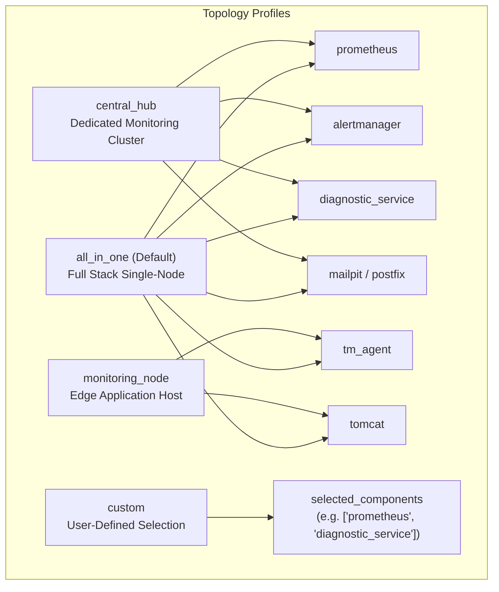
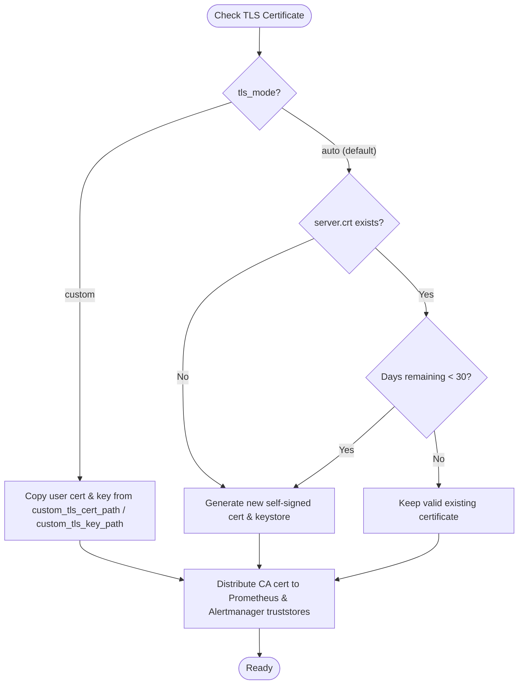

# TM-ADR-0029

| Property | Value |
| --- | --- |
| **ADR ID** | TM-ADR-0029 |
| **Title** | Adopt Multi-OS Flexible Deployment Topology, Granular Component Selection, and TLS Lifecycle Governance |
| **Project** | Tomcat Monitoring |
| **Section** | Deployment Topology, CI/CD Parametrization, Multi-OS Portability, and Security Lifecycle |
| **Status** | Accepted |
| **Date** | 2026-09-16 |

---

## 🔍 Overview

Dokumen keputusan arsitektur (*Architecture Decision Record* — ADR) ini menetapkan standarisasi:
1. **Pola Topologi Deployment Fleksibel (*Flexible Deployment Topology Profiles*)**: Mendukung penyebaran terpusat (*All-In-One* sebagai *default* zero-breaking), node pemantau edge (*Monitoring Node* / Tomcat + `tm-agent`), hub analitik terpusat (*Central Monitoring Hub* / Prometheus + Alertmanager + Diagnostic Service + Mailpit), dan seleksi granular (*Custom Component Selection*).
2. **Tata Kelola Siklus Hidup TLS & Dukungan Custom SSL (*TLS Lifecycle Governance*)**: Pengecekan masa berlaku sertifikat otomatis (< 30 hari) dan regenerasi mandiri (*auto-renewal*), serta integrasi sertifikat dan *private key* eksternal milik pengguna (*Custom TLS / Enterprise CA*).
3. **Pembersihan & Higienitas Script Multi-OS Target (*Target Script & Binary Hygiene*)**: Isolasi pengiriman berkas skrip berbasis OS (`.ps1` untuk Windows, `.sh` untuk Linux) dan eliminasi biner legacy host pasca-migrasi kontainer.
4. **Penyempurnaan Kontekstual Notifikasi Alert (*Alert Contextualization*)**: Penambahan label dan anotasi `host` serta `tomcat_instance` pada *Subject* dan *Body* laporan insiden (`DiagnosticServiceDown` dan `TomcatDown`).

---

## 🌍 Context

Pasca migrasi sukses stack monitoring Windows ke kontainer Docker NanoServer Process Isolation ([TM-ADR-0028](TM-ADR-0028.md), TN-019), hasil *system review* dan pengujian lapangan mengidentifikasi beberapa kebutuhan penyempurnaan arsitektural:

1. **Fleksibilitas Topologi Antar-Server (*Decoupled Deployment Architecture*):**
   Meskipun konfigurasi *All-In-One* sangat ideal untuk dev/lab/staging satu node, arsitektur enterprise skala besar sering memisahkan server beban kerja aplikasi (Tomcat + `tm-agent`) dari server pusat monitoring (Prometheus + Alertmanager + Diagnostic Service). Diperlukan mekanisme deklaratif untuk memilih peran/komponen baik via Jenkins UI (parameter build), CLI runner, maupun file konfigurasi (`CONFIG`).
2. **Masa Berlaku Sertifikat & Dukungan Sertifikat Milik Pengguna (*Custom SSL & Auto-Renewal*):**
   Sertifikat *self-signed* yang digenerate otomatis memiliki masa kedaluwarsa (365 hari). Tanpa mekanisme *auto-renewal*, sertifikat yang kedaluwarsa akan memutuskan komunikasi HTTPS scraper Prometheus ke Diagnostic Service/JMX Exporter. Selain itu, organisasi enterprise sering mengharuskan penggunaan sertifikat yang diterbitkan oleh Corporate Internal CA / PKI resmi.
3. **Pembersihan Berkas Sisa pada Target Host (*Target Cleanliness*):**
   Penyalinan direktori `scripts/` secara menyeluruh menyebabkan file `.sh` (Bash) berada di target Windows (`C:\monitoring\scripts\`), dan biner lama (`alertmanager.exe`, `prometheus.exe`, dll.) masih tersisa di `C:\monitoring\bin\` meskipun layanan sudah 100% berjalan di dalam kontainer NanoServer.
4. **Kejelasan Informasi Host & Instance pada Notifikasi Insiden:**
   Operator SRE memerlukan identitas instan di *Subject* email untuk mengetahui server dan instance Tomcat mana yang mengalami gangguan (`TomcatDown` atau `DiagnosticServiceDown`) tanpa harus membuka lampiran atau mencari log secara manual.

---

## 💡 Arsitektur Topologi & Tata Kelola Komponen

### 1. Model Profil Topologi Deployment

### 2. Alur Pengecekan & Auto-Renewal TLS

---

## ⚖️ Decision

Ditetapkan keputusan arsitektur platform sebagai berikut:

### 1. Penegakan Profil Topologi & Seleksi Komponen Simetris (Multi-OS)
- Menyediakan profil topologi standar pada `inventories/group_vars/all.yml` dan `roles/role_container_stack/defaults/main.yml`:
  - `all_in_one` (Default): Menyebarkan seluruh 6 komponen.
  - `monitoring_node`: Menyebarkan `tomcat` dan `tm_agent`.
  - `central_hub`: Menyebarkan `prometheus`, `alertmanager`, `diagnostic_service`, `mailpit` / `postfix`.
  - `custom`: Menyebarkan hanya komponen yang tercantum pada `selected_components`.
- Menambahkan parameter build pada `Jenkinsfile`: `DEPLOY_TOPOLOGY` (choice) dan `SELECTED_COMPONENTS` (string), yang diteruskan ke runner playbook Ansible sebagai extra-vars.
- Menambahkan conditional `when:` guards dan `tags:` pada seluruh tugas Linux (`tasks/linux/`) dan Windows (`tasks/windows/`).

### 2. Mekanisme Siklus Hidup Sertifikat TLS (Auto-Renewal & Custom SSL)
- Mode `auto` (default):
  - Pada **Windows**: Memeriksa properti `NotAfter` sertifikat via PowerShell .NET `[System.Security.Cryptography.X509Certificates.X509Certificate2]`. Jika masa berlaku `< 30 hari` atau berkas belum ada, sistem men-generate sertifikat baru dan PKCS12 keystore.
  - Pada **Linux**: Memeriksa masa berlaku via `openssl x509 -checkend 2592000` (30 hari). Jika `< 30 hari`, sertifikat diperbarui secara otomatis dengan izin ketat `0400` / `0444`.
- Mode `custom`:
  - Jika `tls_mode == 'custom'` dan `custom_tls_cert_path` / `custom_tls_key_path` disediakan, Ansible menyalin berkas sertifikat eksternal langsung ke direktori TLS target tanpa men-generate *self-signed*.
  - Mendistribusikan sertifikat CA ke direktori truststore Prometheus dan Alertmanager.

### 3. Standarisasi Higienitas Skrip dan Biner Target
- Pada **Windows** (`C:\monitoring\`):
  - Hanya menyinkronkan berkas PowerShell (`*.ps1`) ke `C:\monitoring\scripts\`.
  - Menghapus seluruh file `.sh` yang tersisa di `C:\monitoring\scripts\`.
  - Membersihkan biner legacy di `C:\monitoring\bin\` (`alertmanager.exe`, `mailpit.exe`, `prometheus.exe`, `tm-agent.exe`), hanya mempertahankan biner operator host `tmctl.exe`.
- Pada **Linux**:
  - Hanya menyinkronkan berkas `.sh` dan menghapus berkas `.ps1` dari direktori `${project_root}/scripts/`.

### 4. Kontekstualisasi Template Notifikasi Alert
- **`DiagnosticServiceDown`**:
  - Alertmanager direct email *Subject*: `[{{ if eq .Status "resolved" }}RESOLVED{{ else }}FIRING{{ end }}] [EMERGENCY] Diagnostic Service Alert: {{ .CommonLabels.alertname }} on {{ .CommonLabels.host }} (Instance: {{ .CommonLabels.instance }})`
  - HTML Body: Memuat tabel *Technical Details* lengkap dengan baris Host, Target Hostname / IP (Instance), Job, dan Alert Name.
- **`TomcatDown`**:
  - Prometheus Target Labels: Menambahkan label `host: tomcat-01` dan `tomcat_instance: default / tomcat-primary`.
  - SmtpAdapter Email *Subject*: `[CRITICAL] [LAB] Tomcat Service (tomcat-01 / default): TomcatDown (Target: lab/tomcat-01/default)`
  - Diagnostic SRE Report Body: Menampilkan `Host` dan `Tomcat Instance` secara eksplisit pada Seksi 1 (*Alert Summary*) dan kartu header.

---

## ⚠️ Consequences

### Kelebihan (*Positive*)
1. **Fleksibilitas Penuh**: Pengguna dapat menyebarkan stack *all-in-one* maupun *distributed / multi-node* hanya dengan mengubah parameter Jenkins atau variabel config.
2. **Kesiapan Audit Enterprise**: Dukungan sertifikat custom dan auto-renewal menghilangkan risiko *service disruption* akibat kedaluwarsa TLS.
3. **Higienitas Sistem**: Target host bebas dari biner ganda dan skrip yang tidak kompatibel dengan OS target.
4. **Respon Insiden Lebih Cepat**: Operator SRE langsung mengetahui server dan instance terdampak dari baris subjek email.

### Keterbatasan (*Trade-offs & Constraints*)
1. Regenerasi sertifikat TLS pada mode auto akan me-restart koneksi TLS pada scraper Prometheus berikutnya.

---

## 📌 Status

**Accepted — Diterapkan dan divalidasi sebagai standar arsitektur deployment multi-topologi, tata kelola sertifikat TLS, dan notifikasi insiden.**

---

## 📅 Date

**2026-09-16**
