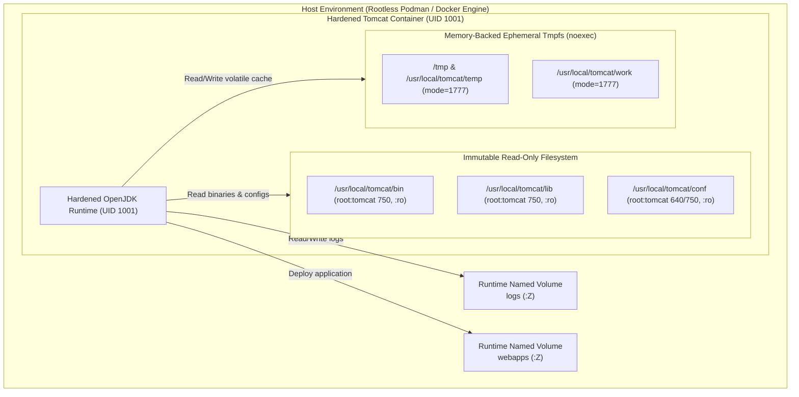

# TC-ADR-0001

| Property | Value |
| --- | --- |
| **ADR ID** | TC-ADR-0001 |
| **Title** | Adopt Greenfield Hardened OCI Container Architecture for Apache Tomcat |
| **Project** | Apache Tomcat Enterprise |
| **Section** | Architecture |
| **Status** | Accepted |
| **Date** | 2026-09-21 |

---

## 🔍 Overview

Apache Tomcat Enterprise mengadopsi arsitektur **Greenfield Hardened OCI Container** sebagai standar runtime utama. Pendekatan migrasi berbasis legacy Virtual Machine (VM) dikesampingkan untuk memprioritaskan immutability, rootless execution, read-only root filesystem, minimal footprint attack surface, dan isolasi keamanan berbasis standar CIS Benchmark.

## 🌍 Context

Pengelolaan Apache Tomcat pada lingkungan enterprise tradisional berbasis bare-metal atau Virtual Machine menghadapi sejumlah tantangan operasional dan keamanan:

1. **Configuration Drift**: Instalasi VM rentan terhadap modifikasi manual ad-hoc, menyebabkan ketidaksinkronan konfigurasi antar lingkungan (Dev, Staging, Prod).
2. **Excessive Privileges**: Instance Tomcat pada VM sering kali dijalankan di bawah akun dengan hak akses tinggi atau user yang memiliki write access ke seluruh direktori instalasi (`CATALINA_HOME`), membuka celah eskalasi hak akses (privilege escalation) jika terjadi eksekusi remote code execution (RCE).
3. **Attack Surface yang Luas**: Image dasar sistem operasi VM membawa utility compiler, paket debug, dan service sistem yang tidak diperlukan oleh Tomcat runtime. Selain itu, distribusi default Tomcat menyertakan aplikasi bawaan (`manager`, `host-manager`, `docs`, `examples`, `ROOT`) yang sering dieksploitasi oleh penyerang.
4. **Lambatnya Patching dan Rollback**: Siklus pembaruan patch OS dan Tomcat pada VM membutuhkan waktu maintenance window yang panjang serta prosedur rollback yang kompleks.

Upaya memigrasikan seluruh artefak VM secara "lift-and-shift" dinilai akan membawa beban konfigurasi usang dan arsitektur yang tidak standar ke dalam container runtime.

## ⚖️ Decision

Project memutuskan untuk mengadopsi **Greenfield Hardened OCI Container Architecture** dengan ketentuan:

1. **Pure Greenfield Model**: Menolak pendekatan migrasi VM lift-and-shift. Seluruh konfigurasi, deployment artefak, dan baseline hardening dirancang ulang dari fondasi kontainer murni.
2. **Minimal Distroless / Alpine-based Hardened Base**: Menggunakan base image terkurasi dengan JRE minimal (`eclipse-temurin` / Alpine-based), membuang seluruh compiler, shell utility yang tidak esensial, serta menghapus seluruh default webapps bawaan Tomcat (`manager`, `host-manager`, `examples`, `docs`, `ROOT`).
3. **Dedicated Unprivileged Service Account**: Menjalankan Tomcat di bawah akun non-root khusus (`tomcat:tomcat`, UID `1001`, GID `1001`). Proses runtime dilarang keras dijalankan sebagai UID 0.
4. **Read-Only Root Filesystem**: Menjalankan kontainer dengan flag `--read-only`. Seluruh direktori binaries (`CATALINA_HOME/bin`, `CATALINA_HOME/lib`) dan konfigurasi (`CATALINA_HOME/conf`) dimiliki oleh `root:tomcat` dengan izin ketat (`750` dan `640`) sehingga tidak dapat dimodifikasi oleh proses Tomcat yang sedang berjalan.
5. **Volatile Ephemeral Storage (tmpfs)**: Direktori yang membutuhkan write access sementara oleh Tomcat runtime (`/tmp`, `/usr/local/tomcat/temp`, `/usr/local/tomcat/work`) dialokasikan melalui memory-backed `tmpfs` mounts dengan mode izin `1777` dan opsi `noexec,nosuid,nodev`.
6. **Linux Capability Dropping**: Menghilangkan seluruh Linux kernel capabilities (`--cap-drop=ALL`) pada container runtime, mencegah eksploitasi kernel atau pelarian kontainer (container escape).

## 🏛️ Architecture

## 💡 Rationale

### Options Evaluated

| Option | Evaluation |
| --- | --- |
| **Lift-and-Shift VM Migration** | Memindahkan konfigurasi dan direktori VM eksisting ke dalam container image. Menghemat waktu penyesuaian di awal, namun membawa debt keamanan, default webapps yang rentan, permission yang longgar, dan file-file sampah host. Ditolak. |
| **Hybrid VM & Container Model** | Mempertahankan arsitektur multi-service di dalam satu container (misal: SSH daemon + Tomcat + rsyslog). Memperbesar footprint image dan melanggar prinsip "one process per container". Ditolak. |
| **Greenfield Hardened OCI Container** | Membangun dari nol dengan security baseline ketat (CIS Benchmark), non-root UID 1001, immutable read-only rootfs, tmpfs mounts, dan runtime volume decoupling. Terverifikasi stabil, aman, dan mudah diautomasi. Dipilih. |

Alasan utama pemilihan greenfield container model:

- **Immutability & Reproducibility**: Image kontainer bersifat identik di seluruh environment, menghilangkan konfigurasi ad-hoc dan drift.
- **Defense in Depth**: Kombinasi UID 1001, read-only rootfs, noexec tmpfs, dan capability drop memastikan bahwa bahkan jika terdapat kerentanan zero-day pada aplikasi web, penyerang tidak dapat mengubah konfigurasi Tomcat, menginjeksi webshell ke direktori sistem, atau melakukan instalasi package.
- **Lightweight & Fast Startup**: Penghapusan default webapps dan dependensi OS yang tidak perlu menghasilkan container image yang ramping dengan waktu cold-start di bawah 50 milidetik.

## ⚠️ Consequences

### Positive

- Keamanan workload meningkat secara drastis selaras dengan CIS Apache Tomcat Benchmark.
- Container escape dan modifikasi biner beralih menjadi mustahil karena read-only rootfs dan kernel capabilities drop.
- Pembaruan versi Tomcat dapat dieksekusi secara instan melalui pergantian base image container tanpa downtime.

### Trade-offs

- Aplikasi legacy yang menulis file secara sembarangan di direktori instalasi Tomcat (`CATALINA_HOME`) akan gagal berjalan kecuali direktori output diarahkan ke volume khusus atau `/tmp`.
- Membutuhkan pemisahan status (stateless application vs persistent data) yang ketat pada arsitektur aplikasi.

## 📌 Status

**Accepted**

## 📅 Date

**2026-09-21**
