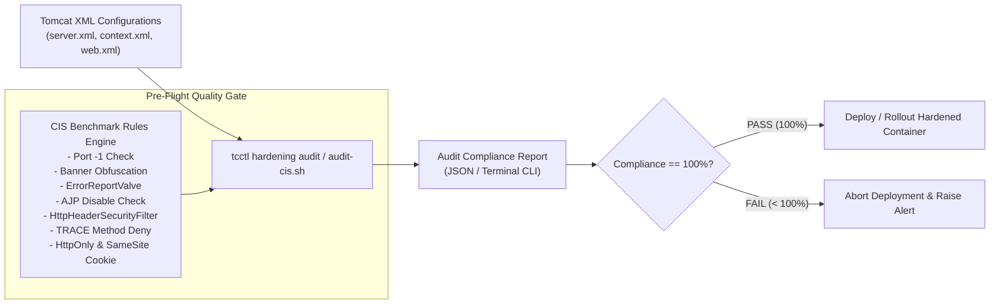

# TC-ADR-0002

| Property | Value |
| --- | --- |
| **ADR ID** | TC-ADR-0002 |
| **Title** | Enforce Pre-Flight Static XML Configuration Audit and CIS Tomcat Benchmark |
| **Project** | Apache Tomcat Enterprise |
| **Section** | Security Architecture |
| **Status** | Accepted |
| **Date** | 2026-09-21 |

---

## 🔍 Overview

Apache Tomcat Enterprise memberlakukan kewajiban **Pre-Flight Static XML Configuration Audit** berbasis standar **CIS Apache Tomcat Benchmark**. Setiap artefak konfigurasi XML (`server.xml`, `context.xml`, `web.xml`) harus diverifikasi secara deterministik oleh automated quality gate sebelum kontainer diizinkan berjalan di lingkungan operasional.

## 🌍 Context

File konfigurasi XML pada Apache Tomcat memegang peranan krusial terhadap postur keamanan runtime. Secara default, konfigurasi bawaan Tomcat dirancang untuk kemudahan pengembang lokal (*developer-friendly*), bukan ketahanan produksi (*production-hardened*):

1. **Information Leakage**: Banner HTTP `Server` dan halaman kesalahan default (stack trace, versi server) membocorkan rincian internal yang memudahkan profiling penyerang.
2. **Insecure Cookie Flags**: Ketiadaan flag `httpOnly` dan `SameSite` mengekspos session cookie terhadap serangan Cross-Site Scripting (XSS) dan Cross-Site Request Forgery (CSRF).
3. **Unprotected Administrative Ports**: Port shutdown default (`8005`) dengan command string default (`SHUTDOWN`) pada jaringan lokal memungkinkan pematian server secara tidak sah jika jaringan host terkompromi.
4. **Vulnerable Network Protocols**: Port AJP (`8009`) yang tidak terkonfigurasi secara ketat rentan terhadap kerentanan Ghostcat (CVE-2020-1938).
5. **Absence of Modern Security Headers**: Ketiadaan filter security header default membiarkan aplikasi web rentan terhadap clickjacking, MIME sniffing, dan downgrade HTTPS.

Mendeteksi kesalahan konfigurasi setelah aplikasi dirilis ke tahap produksi menghasilkan risiko operasional dan keamanan yang tinggi. Diperlukan mekanisme audit statis otomatis yang mampu memeriksa integritas file XML pada tahap build, staging, maupun offline volume inspection.

## ⚖️ Decision

Project menetapkan **Pre-Flight Static XML Configuration Audit** sebagai quality gate wajib dengan aturan audit CIS Tomcat Benchmark sebagai berikut:

1. **Port Shutdown Dinonaktifkan**:
   - Atribut `port` pada elemen `<Server>` di `conf/server.xml` wajib disetel ke `-1`.
   - Mengeliminasi listening socket port 8005 sepenuhnya. Siklus pematian kontainer diserahkan seutuhnya pada standar sinyal POSIX kernel (`SIGTERM` / `SIGINT`).
2. **Server Banner Obfuscation**:
   - Atribut `server` pada elemen `<Connector>` di `conf/server.xml` wajib disetel ke nama generik (misal: `ApplicationServer`) untuk menyamarkan identitas Tomcat dari HTTP header scanner.
3. **ErrorReportValve Enforced**:
   - Elemen `<Valve className="org.apache.catalina.valves.ErrorReportValve">` wajib aktif di dalam elemen `<Host>` pada `conf/server.xml` dengan parameter `showReport="false"` dan `showServerInfo="false"`.
   - Mencegah kebocoran stack trace dan versi Tomcat pada HTTP error code (404, 500).
4. **AJP Connector Disabled**:
   - Seluruh konektor AJP (port 8009) pada `conf/server.xml` wajib dinonaktifkan atau dihapus, kecuali jika terdapat kebutuhan proxy reverse khusus yang menggunakan secret authentication wajib.
5. **HttpHeaderSecurityFilter Globally Active**:
   - Filter `org.apache.catalina.filters.HttpHeaderSecurityFilter` wajib didefinisikan dan dipetakan (`filter-mapping` ke `/*`) pada `conf/web.xml`.
   - Mengaktifkan perlindungan `X-Frame-Options: DENY`, `X-Content-Type-Options: nosniff`, dan `X-XSS-Protection`.
6. **HTTP TRACE Method Restricted**:
   - Elemen `<security-constraint>` wajib dideklarasikan pada `conf/web.xml` untuk memblokir HTTP method `TRACE` secara menyeluruh guna mencegah serangan Cross-Site Tracing (XST).
7. **HttpOnly Cookie Enforcement**:
   - Elemen `<Context>` pada `conf/context.xml` wajib menetapkan atribut `useHttpOnly="true"` untuk melindungi session cookie dari manipulasi JavaScript.
8. **SameSite Cookie Protection**:
   - Elemen `<CookieProcessor className="org.apache.tomcat.util.http.Rfc6265CookieProcessor" sameSiteCookies="lax" />` wajib dikonfigurasi di dalam elemen `<Context>` pada `conf/context.xml`.
9. **Automated Verification Engine**:
   - Seluruh aturan di atas diintegrasikan ke dalam automated scanner (`tcctl hardening audit` dan `scripts/audit-cis.sh`). Build pipeline atau deployment script wajib menghentikan proses (*fail-fast*) jika compliance rate tidak mencapai 100%.

## 🏛️ Architecture

## 💡 Rationale

### Options Evaluated

| Option | Evaluation |
| --- | --- |
| **Manual Configuration Checklist** | Audit dilakukan secara manual menggunakan panduan checklist oleh administrator sebelum rilis. Rawan kelalaian manusia (*human error*), lambat, dan tidak dapat diuji secara otomatis pada CI/CD pipeline. Ditolak. |
| **Runtime DAST Scanner Only** | Memeriksa header dan respons hanya saat aplikasi telah aktif berjalan di lingkungan staging. Mampu mendeteksi header eksternal, namun tidak mampu mendeteksi izin file internal atau konfigurasi shutdown port lokal yang tidak diekspos keluar. Tidak cukup. |
| **Automated Pre-Flight Static Audit Engine** | Membaca dan mem-parsing struktur XML konfigurasi secara statis baik dari repositori kode, staging direktori, maupun container volume sebelum proses dimulai. Menjamin 100% deterministik, cepat (< 10 milidetik), dan dapat diintegrasikan sebagai quality gate mutlak. Dipilih. |

## ⚠️ Consequences

### Positive

- Menjamin zero-configuration drift: seluruh container Tomcat yang beroperasi dipastikan memenuhi standar CIS Benchmark.
- Deteksi kerentanan konfigurasi bergeser ke kiri (*Shift-Left Security*), ditemukan pada saat build atau pre-deployment tanpa menunggu insiden keamanan di produksi.
- Audit dapat dijalankan secara offline langsung pada host volume penyimpanan tanpa harus menyalakan container terlebih dahulu.

### Trade-offs

- Pengembang yang memerlukan penyesuaian khusus (misal aplikasi yang memerlukan iframe eksternal sehingga harus mengubah `X-Frame-Options`) harus mendeklarasikan pengecualian konfigurasi secara sadar dan tercatat dalam evaluasi risiko.

## 📌 Status

**Accepted**

## 📅 Date

**2026-09-21**
