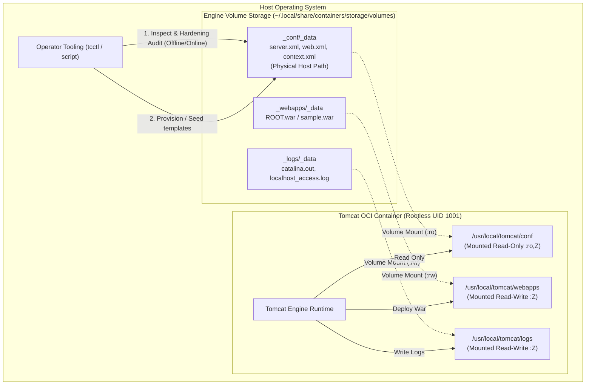

# TC-ADR-0003

| Property | Value |
| --- | --- |
| **ADR ID** | TC-ADR-0003 |
| **Title** | Decouple Configuration State Using Engine Runtime Named Volumes with Read-Only Mounts |
| **Project** | Apache Tomcat Enterprise |
| **Section** | Storage and Container Architecture |
| **Status** | Accepted |
| **Date** | 2026-09-21 |

---

## 🔍 Overview

Apache Tomcat Enterprise mengadopsi strategi **Engine Runtime Named Volumes** (`podman volume` / `docker volume`) untuk memisahkan konfigurasi, aplikasi web, dan log dari siklus hidup (*lifecycle*) container image. Khusus untuk volume konfigurasi (`conf`), mount point diinjeksikan ke dalam kontainer dengan mode **Read-Only (`:ro`)**.

## 🌍 Context

Dalam mendesain containerized Apache Tomcat untuk lingkungan produksi, pengelolaan konfigurasi (`conf/`), aplikasi (`webapps/`), dan log (`logs/`) menghadapi tiga opsi arsitektur:

1. **Bake Inside Image (Self-Contained)**: Menyalin seluruh file XML konfigurasi dan WAR aplikasi ke dalam image saat `podman build`. Meskipun immutable, pendekatan ini mengharuskan image dibangun ulang (*rebuilt*) setiap kali terjadi perubahan parameter kecil (misal: penyesuaian JVM heap, database connection string, atau update minor certificate), sehingga memperlambat siklus release dan memperbesar ukuran registry storage.
2. **Direct Host Bind Mounts (`-v /path/on/host:/path/in/container`)**: Memetakan path absolut direktori host langsung ke dalam container. Pendekatan ini rentan terhadap ketidaksinkronan path antar sistem operasi (misal perbedaan path Linux `/opt/tomcat` vs Windows `C:\data\tomcat`), keterikatan erat pada struktur filesystem host, serta potensi konflik permission UID/GID antara host user dan rootless container subuid mapping.
3. **Engine Runtime Named Volumes (`podman volume create`)**: Memanfaatkan abstraksi volume penyimpanan yang dikelola langsung oleh Container Engine (Podman/Docker).

Tantangan lainnya adalah kebutuhan operasional untuk dapat menginspeksi, mem-backup, dan mengaudit file konfigurasi secara offline ketika kontainer dalam keadaan berhenti (*stopped / off*).

## ⚖️ Decision

Project memutuskan untuk mengadopsi **Engine Runtime Named Volumes** (Opsi 2) dengan rincian arsitektur:

1. **Volume Management Terisolasi per Komponen**:
   - Volume Konfigurasi: `<instance>_conf` dipetakan ke `/usr/local/tomcat/conf` dengan mode **Read-Only (`:ro,Z`)**.
   - Volume Aplikasi: `<instance>_webapps` dipetakan ke `/usr/local/tomcat/webapps` dengan mode **Read-Write (`:Z`)**.
   - Volume Log: `<instance>_logs` dipetakan ke `/usr/local/tomcat/logs` dengan mode **Read-Write (`:Z`)**.
2. **Immutabilitas Konfigurasi Runtime (`:ro`)**:
   - Kontainer Tomcat dilarang keras memiliki izin tulis pada volume konfigurasi. Upaya penyerang yang berhasil memperoleh eksekusi shell di dalam kontainer tidak akan dapat mengubah `server.xml`, `web.xml`, atau `tomcat-users.xml`.
3. **Aksesibilitas Offline pada Host Mountpoint**:
   - Memanfaatkan fakta bahwa Engine Named Volumes memiliki path fisik yang dapat diakses langsung pada host penyimpanan lokal (pada Rootless Podman: `~/.local/share/containers/storage/volumes/<vol_name>/_data/`).
   - Path fisik ini dapat diinspeksi, diaudit oleh scanner statis, di-backup, atau diperbarui secara langsung oleh operator CLI (`tcctl`) tanpa bergantung pada status kontainer (baik kontainer sedang aktif, *stopped*, maupun belum dibuat).
4. **Auto-Initialization Lifecycle**:
   - Operator CLI (`tcctl`) dan deployment orchestration secara otomatis membuat volume (`volume create`) dan melakukan *seeding* (injeksi template XML ter-hardening) apabila volume konfigurasi terdeteksi masih kosong (*unpopulated*), sebelum kontainer pertama kali di-boot.

## 🏛️ Architecture

## 💡 Rationale

### Options Evaluated

| Option | Evaluation |
| --- | --- |
| **Bake Config Inside Image** | Sangat immutable, namun tidak fleksibel. Mengharuskan rebuild image untuk setiap perubahan konfigurasi minor lingkungan operasional. Ditolak. |
| **Direct Host Path Bind Mount** | Bergantung pada struktur direktori host yang spesifik dan berbeda antar OS. Rentan terhadap kesalahan ketik path host dan isu izin SELinux/chown. Ditolak. |
| **Engine Runtime Named Volumes** | Diabstraksikan oleh container engine (`podman volume`), portabel lintas platform, mendukung isolasi SELinux flag (`:Z`), mendukung `:ro` injection, dan data fisik tetap dapat diakses di host bahkan ketika kontainer dalam kondisi nonaktif (*off*). Dipilih. |

## ⚠️ Consequences

### Positive

- **Pemisahan Peran Image vs State**: Image kontainer bersifat 100% murni dan generik (*stateless*), sedangkan konfigurasi dan data tersimpan rapi dalam lifecycle volume engine.
- **Keamanan Maksimal**: Mount `:ro` memastikan proses runtime Tomcat tidak dapat memanipulasi konfigurasinya sendiri.
- **Offline Inspectability**: Auditor keamanan atau automation script dapat memeriksa file konfigurasi di storage volume host kapan saja tanpa perlu menyalakan kontainer terlebih dahulu.
- **Portabilitas Cross-Engine**: Format named volume kompatibel secara transparan baik pada Podman maupun Docker di Linux dan Windows.

### Trade-offs

- Menghapus kontainer tidak otomatis menghapus volume (data bersifat persisten), sehingga operator perlu secara eksplisit menjalankan pembersihan volume (`podman volume rm`) jika ingin melakukan *factory reset* total.

## 📌 Status

**Accepted**

## 📅 Date

**2026-09-21**
