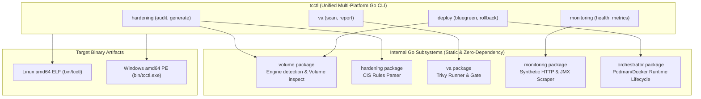

# TC-ADR-0004

| Property | Value |
| --- | --- |
| **ADR ID** | TC-ADR-0004 |
| **Title** | Consolidate Multi-Platform Lifecycle and Hardening Governance into Unified Go Operator (tcctl) |
| **Project** | Apache Tomcat Enterprise |
| **Section** | Tooling and Automation Architecture |
| **Status** | Accepted |
| **Date** | 2026-09-21 |

---

## 🔍 Overview

Apache Tomcat Enterprise mengonsolidasikan seluruh perkakas operasional, audit hardening, vulnerability assessment (VA), monitoring, dan orkestrasi deployment ke dalam sebuah **Unified Multi-Platform CLI Operator** bernama **`tcctl`** yang dikembangkan menggunakan bahasa pemrograman **Go**. Tooling ini menggantikan ketergantungan pada dual-scripting Bash dan PowerShell yang terpisah.

## 🌍 Context

Pengelolaan siklus hidup Apache Tomcat pada infrastruktur heterogen (Linux dan Windows Server) umumnya menghadapi tantangan operasional:

1. **Dual-Script Maintenance Overhead**: Mengelola skrip otomatisasi ganda (Bash untuk Linux dan PowerShell untuk Windows) menimbulkan duplikasi logika bisnis, ketidaksinkronan fitur, serta potensi deviasi kepatuhan keamanan antar sistem operasi.
2. **Ketergantungan Eksternal (Runtime Dependency)**: Skrip shell sering kali membutuhkan utility parsing XML eksternal (seperti `xmlstarlet`, `xmllint`, atau PowerShell XML cmdlets yang versinya bervariasi), menyulitkan eksekusi pada lingkungan mesin tertutup (*minimal air-gapped environment*).
3. **Fragmentasi Tooling Operasional**: Operasi hardening, audit kepatuhan CIS, vulnerability assessment (Trivy), health probe observabilitas, dan zero-downtime deployment dikelola oleh skrip-skrip terpisah tanpa kontrak format laporan yang terstandarisasi.
4. **Isolasi Repositori Eksisting**: Repositori lama (`tmctl`) telah memiliki tujuan awal tertentu dan disepakati oleh stakeholder untuk tidak diubah atau diotak-atik, melainkan fungsinya dimerge dan ditransformasikan ke dalam repositori mandiri baru dengan tata kelola yang lebih komprehensif.

## ⚖️ Decision

Project memutuskan untuk membangun dan mengadopsi **`tcctl`** sebagai standard multi-platform operator CLI dengan ketentuan teknis:

1. **Single Unified Codebase in Go**:
   - Ditulis menggunakan Go 1.23+ dengan kompilasi statis (`CGO_ENABLED=0`), menghasilkan artefak biner tunggal tanpa dependensi runtime eksternal.
   - Mengompilasi artefak untuk dua platform target utama:
     - Linux (amd64 ELF): `bin/tcctl`
     - Windows (amd64 PE): `bin/tcctl.exe`
2. **Pemeliharaan Independen Repositori**:
   - Repositori lama `tmctl` dibiarkan utuh (*untouched*) tanpa modifikasi. Seluruh kemampuan yang disempurnakan ditempatkan pada repositori baru `/home/eddywiyatno/git/tcctl` pada branch `lab`.
3. **Modular Subsystem Architecture**:
   - `internal/volume`: Mendeteksi engine container (`podman` / `docker`), mengelola siklus hidup Engine Runtime Named Volumes, mencari host mountpoint fisik, dan menginisialisasi template XML ter-hardening secara otomatis.
   - `internal/hardening`: Engine audit XML statis berbasis Go standard library (`encoding/xml`) untuk menguji 9 aturan inti CIS Apache Tomcat Benchmark dengan output tabel terminal dan JSON.
   - `internal/va`: Wrapper eksekusi Trivy scanner dengan automated vulnerability quality gate (thresholding CRITICAL/HIGH CVE).
   - `internal/monitoring`: Endpoint health probe sintetis HTTP dan scraper metrics JVM Prometheus.
   - `internal/orchestrator`: Engine zero-downtime Blue-Green deployment dengan automated rollback saat health probe gagal.
4. **Offline Host Volume Inspection**:
   - Mendukung audit hardening langsung terhadap physical mount point dari container engine named volume (`tcctl hardening audit --volume <name>`) saat kontainer dalam keadaan mati.

## 🏛️ Architecture

## 💡 Rationale

### Options Evaluated

| Option | Evaluation |
| --- | --- |
| **Maintain Bash + PowerShell Scripts** | Murah di awal, namun biaya pemeliharaan ganda, rentan syntax error di PowerShell, dan dependensi utility XML eksternal bervariasi antar host. Ditolak. |
| **Python-based Operator CLI** | Kaya pustaka, namun membutuhkan runtime Python 3 dan `virtualenv` atau `pip install` pada setiap mesin host atau jump host. Ditolak. |
| **Unified Go Operator (`tcctl`)** | Menghasilkan biner mandiri (*standalone binary*), eksekusi instan (< 15ms), zero-dependency, multi-platform secara natif, dan parsing XML yang sangat cepat dan kuat. Repositori `tmctl` eksisting tetap terlindungi tanpa sentuhan. Dipilih. |

## ⚠️ Consequences

### Positive

- Pengalaman operator identik (*consistent developer & operator experience*) di lingkungan Linux maupun Windows.
- Tidak membutuhkan instalasi dependensi tambahan di server (cukup copy biner `tcctl` atau `tcctl.exe`).
- Waktu eksekusi audit dan quality gate sangat singkat (< 20 milidetik).
- Repositori `tmctl` lama tetap aman dan tidak terganggu.

### Trade-offs

- Setiap modifikasi fitur CLI memerlukan proses kompilasi rilis (`make build-all`), meskipun proses kompilasi Go hanya memakan waktu beberapa detik.

## 📌 Status

**Accepted**

## 📅 Date

**2026-09-21**
