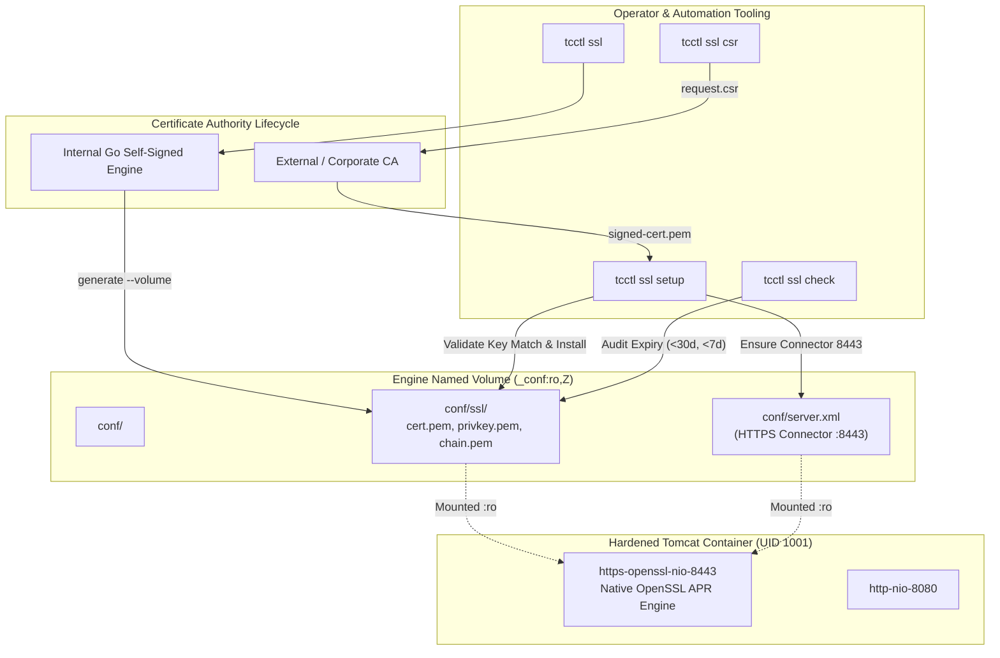

# TC-ADR-0005

| Property | Value |
| --- | --- |
| **ADR ID** | TC-ADR-0005 |
| **Title** | Adopt Native OpenSSL PEM Connector and Automated TLS Lifecycle Governance via tcctl |
| **Project** | Apache Tomcat Enterprise |
| **Section** | Security and TLS Architecture |
| **Status** | Accepted |
| **Date** | 2026-09-21 |

---

## 🔍 Overview

Apache Tomcat Enterprise mengadopsi konektor HTTPS berbasis **Native OpenSSL PEM format** (port 8443) pada Tomcat 9.0+ serta memusatkan tata kelola siklus hidup sertifikat (*TLS lifecycle*) ke dalam operator CLI **`tcctl`**. Arsitektur ini mendukung pembuatan sertifikat mandiri (*self-signed*) untuk lab/bootstrap, pembuatan Certificate Signing Request (CSR) untuk CA Korporat/eksternal, validasi kesesuaian kunci (*public-private key match*), dan pemantauan masa aktif sertifikat secara otomatis tanpa ketergantungan pada utilitas OpenSSL di level sistem operasi host.

## 🌍 Context

Pengelolaan sertifikat SSL/TLS pada instalasi Tomcat tradisional menghadapi hambatan operasional:

1. **Kompleksitas Java Keystore (JKS)**: Tomcat versi terdahulu mewajibkan sertifikat dan private key dikonversi ke format kepemilikan Java (`.jks` atau `.p12`) menggunakan utilitas `keytool`. Proses ini rawan kesalahan sintaks dan menyulitkan otomatisasi dengan Certificate Authority modern (seperti Let's Encrypt atau HashiCorp Vault) yang menghasilkan format standar PEM (`.pem` / `.crt`).
2. **Ketergantungan Utilitas Host (OpenSSL / Bash)**: Operasi pembuatan private key dan CSR umumnya diserahkan pada skrip shell yang memanggil `openssl`. Hal ini menciptakan ketergantungan pada dependensi eksternal di host serta menghambat portabilitas pada sistem operasi Windows Server.
3. **Risiko Mismatched Key**: Kesalahan manusia dalam menyandingkan sertifikat baru dengan private key lama saat rotasi menyebabkan Tomcat gagal melakukan inisialisasi SSLContext saat startup (*runtime crash*).
4. **Resiko Sertifikat Kadaluarsa Tanpa Peringatan**: Tidak tersedianya mekanisme evaluasi masa aktif sertifikat pre-flight menyebabkan insiden downtime saat sertifikat melewati masa berlakunya.

## ⚖️ Decision

Project memutuskan untuk mengadopsi **Native OpenSSL PEM Connector & Centralized TLS Governance via `tcctl`** dengan ketentuan:

1. **Native OpenSSL PEM Connector (Port 8443)**:
   - Tomcat dikonfigurasi menggunakan `org.apache.coyote.http11.Http11NioProtocol` dengan elemen `<SSLHostConfig>` yang merujuk langsung ke file standar PEM (`conf/ssl/cert.pem`, `conf/ssl/privkey.pem`, `conf/ssl/chain.pem`).
   - Format JKS tidak lagi digunakan, menyederhanakan interoperabilitas dengan PKI korporat.
   - Enforce protokol modern `TLSv1.2+TLSv1.3` dengan cipher suite kuat (`HIGH:!aNULL:!eNULL:!EXPORT:!DES:!RC4:!MD5:!PSK`).
2. **Self-Contained TLS Cryptography di `tcctl`**:
   - Seluruh operasi kriptografi diimplementasikan langsung menggunakan pustaka standar Go (`crypto/x509`, `crypto/rsa`, `encoding/pem`).
   - Menghapus ketergantungan terhadap biner eksternal OpenSSL atau skrip Bash.
3. **Penyediaan Subcommand `tcctl ssl`**:
   - `tcctl ssl generate`: Menghasilkan sertifikat self-signed RSA-2048 langsung ke direktori lokal atau engine named volume untuk bootstrapping lab dan staging.
   - `tcctl ssl csr`: Membuat private key dan Certificate Signing Request (`request.csr`) standar untuk dikirimkan ke CA Korporat atau penyedia eksternal.
   - `tcctl ssl setup`: Memvalidasi bahwa modulus publik pada sertifikat eksternal cocok 100% dengan private key sebelum menginstalnya ke named volume atau direktori, serta mengaktifkan konektor 8443 di `server.xml`.
   - `tcctl ssl check`: Memeriksa tanggal kadaluarsa, menghitung sisa hari, dan bertindak sebagai quality gate CI/CD (Warning: `< 30 hari`, Critical/Exit 1: `< 7 hari`).
4. **Isolasi Izin Berkas Container Namespace**:
   - Direktori `ssl/` dibuat dengan izin `0755` dan berkas sertifikat/kunci dengan `0644` agar unprivileged user `tomcat` (UID `1001`) dapat membacanya secara aman di dalam mount point read-only named volume (`:ro,Z`).

## 🏛️ Architecture

## 💡 Rationale

### Options Evaluated

| Option | Evaluation |
| --- | --- |
| **Java Keystore (`.jks`) via keytool** | Membutuhkan JVM keytool pada host pengembang, tidak kompatibel langsung dengan sertifikat PEM dari ACME/Vault, dan rentan terhadap kesalahan format password keystore. Ditolak. |
| **External Scripting (Bash + OpenSSL)** | Cepat dibuat, namun tidak multi-platform (gagal di Windows tanpa layer emulasi), menciptakan dependensi sistem tambahan, dan tidak terintegrasi dengan quality gate `tcctl`. Ditolak. |
| **Native OpenSSL PEM Connector & Built-in Go Cryptography (`tcctl`)** | Menghilangkan konversi JKS, zero external dependency, multi-platform natif, memvalidasi integritas pasangan kunci sebelum dipasang, dan mendukung injeksi langsung ke runtime volume. Dipilih. |

## ⚠️ Consequences

### Positive

- Alur pengadaan sertifikat sangat ringkas: operator cukup menggunakan `tcctl ssl csr` untuk meminta sertifikat ke CA dan `tcctl ssl setup` untuk memasangnya.
- Risiko human error (mismatched key) dieliminasi pada saat setup sebelum kontainer dinyalakan.
- Pemantauan masa aktif dapat diotomatisasikan ke dalam pipeline CI/CD atau cron monitoring (`tcctl ssl check`).
- Kompatibel secara transparan di platform Linux dan Windows.

### Trade-offs

- Konektor Native PEM pada Tomcat 9.0 membutuhkan pustaka Apache Tomcat Native (`libtcnative`) yang terpasang di base container image (sudah tersedia default pada image resmi Tomcat).

## 📌 Status

**Accepted**

## 📅 Date

**2026-09-21**
