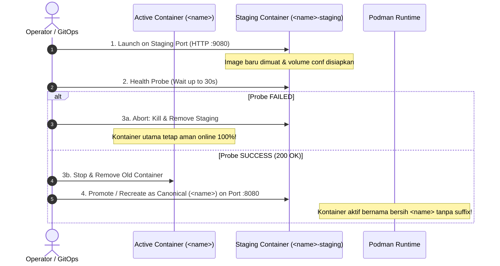

# TC-ADR-0006

| Property | Value |
| --- | --- |
| **ADR ID** | TC-ADR-0006 |
| **Title** | Refactor Zero-Downtime Rollout to Temporary Staging Containers with Canonical Name Promotion |
| **Project** | Apache Tomcat Enterprise |
| **Section** | Deployment and Rollout Architecture |
| **Status** | Accepted |
| **Date** | 2026-09-22 |

---

## 🔍 Overview

Apache Tomcat Enterprise merefaktor mekanisme pembaruan *Zero-Downtime Rollout* pada operator CLI **`tcctl`**. Arsitektur sebelumnya yang menggunakan dua slot kontainer permanen bergantian dengan akhiran statis (`<name>-blue` dan `<name>-green`) dihapuskan, digantikan oleh mekanisme **Temporary Staging Container (`<name>-staging`)** dengan promosi nama kanonikal (*atomic canonical name promotion*). Dengan pendekatan ini, kontainer produksi aktif **selalu memiliki nama kanonikal bersih `<name>`** (misalnya `payment-service` atau `core-banking`), dan akhiran nama `-staging` murni bersifat sementara (*ephemeral*) selama masa verifikasi kesiapan probe.

---

## 🌍 Context

Pada implementasi awal skrip shell dan `tcctl deploy bluegreen` ([TC-ADR-0004](TC-ADR-0004.md)):
1. **Penyematan Akhiran Permanen yang Mengganggu**: Kontainer diwajibkan menggunakan akhiran `-blue` atau `-green`. Setelah rollout selesai, kontainer produksi aktif tetap bernama `<name>-blue` atau `<name>-green`. Hal ini menimbulkan kebingungan bagi tim monitoring dan operasi karena nama kontainer di `podman ps` terus berganti-ganti setiap siklus rilis.
2. **Kebutuhan Identitas Stabil pada Multi-Instance**: Pada ekosistem enterprise yang menjalankan puluhan instance di host yang sama, setiap layanan membutuhkan identitas kontainer yang stabil dan bersih (`payment-service`, `auth-service`, `portal-hr`) untuk kemudahan pelacakan log, metrik Prometheus, dan integrasi reverse proxy.
3. **Mekanisme Transisi yang Lebih Elegan**: Staging container hanya diperlukan selama beberapa detik ketika image baru dimuat dan diverifikasi kesehatannya sebelum mengambil alih port produksi utama.

---

## ⚖️ Decision

Project memutuskan untuk merefaktor mekanisme zero-downtime deployment pada `tcctl deploy rollout` dengan ketentuan arsitektural:

1. **Penamaan Kanonikal Bersih Tanpa Suffix Permanen**:
   - Kontainer produksi aktif selalu bernama persis sesuai nama instance yang ditentukan (`<name>`).
   - Suffix `-blue` dan `-green` dihilangkan sepenuhnya dari sistem penamaan kontainer dan volume.
2. **Penggunaan Temporary Staging Container (`<name>-staging`)**:
   - Saat pembaruan dieksekusi, `tcctl` meluncurkan kontainer baru dengan nama temporary `<name>-staging` pada port staging sementara (misal `HTTP_PORT + 1000`).
   - Kontainer lama `<name>` tetap aktif melayani lalu lintas produksi normal tanpa gangguan.
3. **Pre-Flight Health Verification Gating**:
   - `tcctl` memantau kesiapan `<name>-staging` melalui endpoint health check (`http://localhost:<staging_port>/`).
   - Jika health check **GAGAL**: `tcctl` langsung memusnahkan kontainer `<name>-staging` (*safety abort*). Kontainer produksi lama `<name>` sama sekali tidak terganggu (*zero impact & zero downtime*).
4. **Promosi Atomik Nama Kanonikal**:
   - Jika health check **LOLOS**: `tcctl` menghentikan dan menghapus kontainer lama `<name>`, lalu mempromosikan (rename/recreate) kontainer baru menjadi nama kanonikal `<name>` pada port produksi utama.
   - Akhiran `-staging` dibersihkan. Status akhir di `podman ps` selalu menampilkan kontainer tunggal bernama bersih `<name>`.

---

## 🏛️ Architecture & Rollout Lifecycle

---

## 🌟 Consequences

### Positive
- **Identitas Kontainer Bersih**: Nama kontainer konsisten dengan arsitektur multi-service enterprise (`core-banking`, `payment-gw`).
- **Zero Downtime Terjamin**: Lalu lintas dialihkan hanya setelah kontainer baru terbukti sehat 100%.
- **Resiliensi Tinggi**: Kegagalan rilis image baru tidak pernah mengorbankan kontainer lama yang sedang beroperasi stabil.

### Negative / Trade-offs
- Selama masa transisi (~15 detik), diperlukan port bebas sementara untuk probing staging container sebelum dialihkan ke port utama. Hal ini ditangani secara otomatis melalui offset port dinamis.
