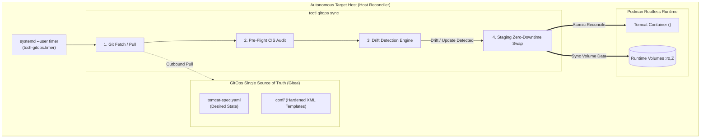

# TC-ADR-0007

| Property | Value |
| --- | --- |
| **ADR ID** | TC-ADR-0007 |
| **Title** | Adoption of Pure Pull-Based GitOps via Autonomous Host Reconciler and Day-1/Day-2 Decoupling |
| **Project** | Apache Tomcat Enterprise |
| **Section** | GitOps and Continuous Deployment |
| **Status** | Accepted |
| **Date** | 2026-09-22 |

---

## 🔍 Overview

Apache Tomcat Enterprise mengadopsi standar **Pure Pull-Based GitOps** (sesuai standar CNCF OpenGitOps) untuk pengelolaan armada kontainer Tomcat di lingkungan multi-host VM/bare-metal. Arsitektur ini memisahkan secara tegas antara **Day-1 One-Time Host Provisioning** dengan **Day-2 Ongoing Autonomous Reconciliation**. Repositori Git berperan sebagai *Single Source of Truth* tunggal (`tomcat-spec.yaml`), dan setiap host target menjalankan biner operator **`tcctl gitops sync`** secara otonom via `systemd --user timer` tanpa membutuhkan koneksi SSH masuk (*zero inbound SSH push*) untuk siklus rilis harian.

---

## 🌍 Context

Pengelolaan deployment Apache Tomcat pada puluhan server di perusahaan enterprise menghadapi pertanyaan fundamental:

> **"Artinya orkestrasinya tetap ada di CI?"**

Terdapat perbedaan arsitektural mendasar antara **Traditional CD** dan **GitOps CD** mengenai letak kendali orkestrasi dan batas keamanannya:

### 1. Traditional CI/CD (Orkestrasi CD Menempel di CI Server)
* **Kendali di CI**: Pada model tradisional, Jenkins (CI) bertindak sebagai pemegang kendali orkestrasi deployment. Setelah build & test selesai, Jenkins login langsung via SSH atau memanggil Ansible untuk me-restart server satu per satu.
* **Kelemahan Keamanan di Enterprise**:
  * Jenkins harus menyimpan SSH keys / kredensial superuser ke seluruh server produksi.
  * Jika server Jenkins disusupi peretas (misal via vulnerabilitas plugin), seluruh armada server produksi dapat dikuasai seketika (*broad blast radius*).
  * Server target wajib membuka port 22 (inbound SSH) ke arah runner CI.
* **Ketiadaan Deteksi Drift**: Model push tidak memiliki mekanisme deteksi deviasi berkelanjutan (*continuous drift detection*). Jika seseorang mengubah konfigurasi di server secara manual, hal tersebut tidak terdeteksi hingga siklus rilis berikutnya.

### 2. GitOps CD (Orkestrasi CD Terpisah / Decoupled dari CI)
* **CI Terisolasi**: Pada model GitOps, CI Server (Jenkins) **TIDAK PERNAH** menyentuh server produksi. Tugas CI selesai setelah image OCI di-push ke registry dan file konfigurasi (`tomcat-spec.yaml`) di Git diperbarui tag versinya.
* **Air Gap & Decoupling Boundary**:
  * Repositori Git bertindak sebagai gerbang pemisah (*air gap / decoupling boundary*).
  * Kendali orkestrasi CD berpindah ke **CD Controller / Reconciler di host target**.
  * Reconciler di host target yang secara otonom mendeteksi perubahan di Git dan mengeksekusi staggered rollout ke armada host menggunakan `tcctl`.

---

## ⚖️ Decision

Project memutuskan untuk mengadopsi **Pure Pull-Based GitOps via `tcctl`** dengan memisahkan batas tanggung jawab secara tegas:

### 🛠️ Peran Modular `tcctl` pada Kedua Domain

Biner operator `tcctl` dirancang secara modular agar melayani kedua domain dengan batas kewenangan yang jelas:

1. **Di Sisi CI (Quality Gates)**:
   * `tcctl hardening audit`: Memastikan file `server.xml` patuh 100% pada CIS Apache Tomcat Benchmark sebelum container image dibangun.
   * `tcctl va scan`: Memastikan container image lolos batas ambang (*threshold*) kerentanan Trivy.
2. **Di Sisi CD / GitOps (Host Reconciliation)**:
   * `tcctl apply -f <spec>`: Menerapkan *desired state* secara deklaratif dari `tomcat-spec.yaml`.
   * `tcctl deploy rollout`: Melakukan zero-downtime swap menggunakan temporary staging container (tanpa akhiran -blue/-green).
   * `tcctl monitoring health`: Memverifikasi kesehatan container pasca-deploy.

### Ketentuan Arsitektur GitOps:

1. **Pemisahan Tegas Day-1 vs Day-2**:
   - **Day-1 (One-Time Provisioning)**: Pemasangan biner `tcctl` dan inisialisasi awal ke VM brownfield menggunakan otomasi bootstrap satu kali. Setelah selesai, akses bootstrap langsung ditutup permanen.
   - **Day-2 (Pure GitOps Lifecycle)**: Seluruh pembaruan image, konfigurasi XML, dan sertifikat SSL selanjutnya dikendalikan murni melalui Git commit dan ditarik secara otonom oleh `tcctl` di host target.
2. **Manifest Deklaratif Tunggal (`tomcat-spec.yaml`)**:
   - Seluruh spesifikasi armada (nama instance, image tag, port binding, JMX exporter, dan volume) didefinisikan dalam format YAML deklaratif di Git repository (`tomcat-fleet-config`).
3. **Autonomous Local Reconciler (`tcctl gitops sync`)**:
   - Dijalankan di setiap host target menggunakan `systemd --user timer` (berjalan sebagai unprivileged user `tomcat` dengan `loginctl enable-linger`).
   - Melakukan polling berkala (misal tiap 5 menit) dengan *randomized jitter* (30 detik) untuk mencegah beban lonjakan (*thundering herd*) pada server Git.
4. **Drift Detection & Continuous Self-Healing**:
   - `tcctl` secara terus-menerus membandingkan *desired state* di Git dengan *actual state* di Podman.
   - Jika konfigurasi lokal diubah secara tidak sah di server atau kontainer mati di luar jadwal rilis, `tcctl` secara otomatis mengembalikannya ke kondisi yang tertera di Git.
5. **Zero Inbound SSH Port Requirement**:
   - Host produksi tidak perlu membuka port SSH inbound untuk keperluan deployment aplikasi. Komunikasi hanya berlangsung satu arah secara keluar (*outbound HTTPS/SSH*) ke server Git.

---

## 🏛️ Architecture & GitOps Flow

---

## 🌟 Consequences

### Positive
- **Keamanan Tertinggi (No Inbound SSH)**: Meniadakan kebutuhan penyimpanan kredensial produksi di CI server.
- **Self-Healing Otomatis**: Menjamin kepatuhan konfigurasi runtime terhadap Git 24/7 tanpa celah manipulasi lokal.
- **Kepatuhan CNCF OpenGitOps**: Selaras dengan prinsip standar industri modern.

### Negative / Trade-offs
- Target host membutuhkan akses jaringan outbound (port HTTPS/SSH) ke repositori Git pusat.
- Memerlukan konfigurasi *deploy key* read-only pada masing-masing host.
