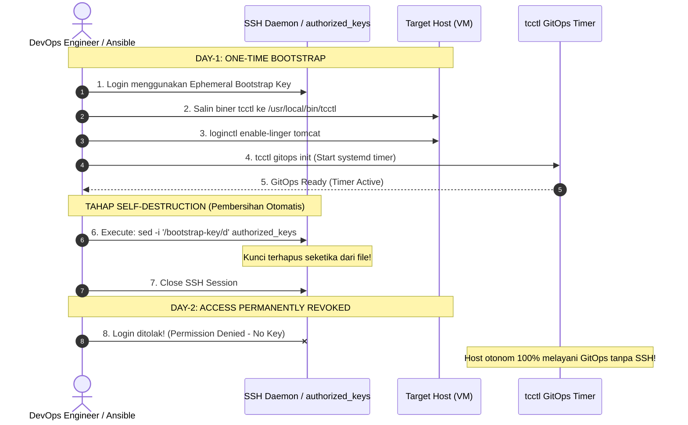

# TC-ADR-0008

| Property | Value |
| --- | --- |
| **ADR ID** | TC-ADR-0008 |
| **Title** | Zero-Touch Day-1 Host Bootstrapping via Self-Destructing Ephemeral SSH Access |
| **Project** | Apache Tomcat Enterprise |
| **Section** | Infrastructure Security and Provisioning |
| **Status** | Accepted |
| **Date** | 2026-09-22 |

---

## 🔍 Overview

Apache Tomcat Enterprise menetapkan pola **Self-Destructing Ephemeral SSH Access** untuk menyelesaikan paradoks *Day-1 Bootstrapping* pada armada VM yang sudah ada (*brownfield hosts*). Pola ini memastikan bahwa kredensial SSH yang digunakan untuk memasang biner `tcctl` dan menginisialisasi GitOps timer pada hari pertama secara otomatis memusnahkan dirinya sendiri (*self-destruct*) dari `~/.ssh/authorized_keys` seketika saat proses bootstrap selesai. Pendekatan ini mengeliminasi risiko celah keamanan (*backdoor*) dan membebaskan administrator dari kewajiban membersihkan kunci secara manual di puluhan host target.

---

## 🌍 Context

Untuk menjalankan model Pure GitOps ([TC-ADR-0007](TC-ADR-0007.md)), host target harus memiliki biner `tcctl` dan unit systemd timer yang terpasang:

1. **The Bootstrapping Paradox**:
   - Pada VM baru yang dibangun dari Golden Image/Packer, biner `tcctl` dapat ditanam sejak awal.
   - Namun pada armada VM eksisting (*brownfield*) yang sudah terbentuk di lingkungan perusahaan, operator harus masuk ke host target satu kali di awal (*Day-1*) untuk menanamkan biner dan mengaktifkan service.
2. **Risiko Tertinggalnya Kunci Statis (*Static Credential Leakage*)**:
   - Jika administrator menambahkan SSH public key ke `~/.ssh/authorized_keys` di 50 server untuk keperluan bootstrap, kunci tersebut kerap tertinggal dan menjadi celah keamanan laten (*dormant backdoor*).
3. **Beban Operasional Penghapusan Manual (PR Besar)**:
   - Menghapus kunci statis dari 50 server secara manual setelah bootstrap selesai adalah pekerjaan yang memakan waktu dan rawan kelalaian manusia (*human error*).

---

## ⚖️ Decision

Project memutuskan untuk mengadopsi pola **Self-Destructing Ephemeral SSH Access** untuk seluruh aktivitas Day-1 Bootstrapping dengan ketentuan:

1. **Otomasi Pembersihan Diri (*Self-Purge Execution*)**:
   - Skrip bootstrap atau playbook Ansible Day-1 diprogram untuk menyertakan instruksi pembersihan dirinya sendiri pada tahap akhir eksekusi:
     ```bash
     # Menghapus baris kunci bootstrap dari authorized_keys sebelum koneksi berakhir
     sed -i '/tcctl-bootstrap-key/d' ~/.ssh/authorized_keys
     ```
   - Pada Ansible:
     ```yaml
     - name: Self-Destruct Bootstrap SSH Key
       ansible.posix.authorized_key:
         user: "{{ ansible_user }}"
         state: absent
         key: "{{ lookup('file', 'files/bootstrap_key.pub') }}"
     ```
2. **Jaminan Waktu Hangus Instan**:
   - Begitu proses `tcctl gitops init` selesai (~15-30 detik), akses SSH tersebut langsung hangus secara permanen. Kunci privat bootstrap yang ada di workstation operator tidak dapat digunakan lagi untuk login.
3. **Zero Manual Cleanup**:
   - Administrator tidak perlu membuat jadwal pembersihan atau login ulang ke host target. Host target secara mandiri berada dalam kondisi bersih (*clean state*).
4. **Transisi Penuh ke GitOps**:
   - Setelah kunci bootstrap terhapus, seluruh kendali operasional server resmi beralih 100% ke GitOps Pull Reconciler otonom (`tcctl gitops sync`).

---

## 🏛️ Architecture & Self-Destruction Lifecycle



---

## 🌟 Consequences

### Positive
- **Beban Operasional Nol**: Tidak ada tiket perbaikan atau PR untuk menghapus kunci di puluhan server.
- **Kepatuhan Audit Ketat**: Tidak ada akun atau kunci SSH sisa instalasi yang tertinggal di lingkungan produksi.
- **Transisi Sempurna**: Menjamin transisi bersih dari era *Push Deployment* ke era *Pure Pull-Based GitOps*.

### Negative / Trade-offs
- Jika eksekusi bootstrap terputus sebelum mencapai baris penghapusan (misal putus koneksi mendadak), kunci mungkin masih tersisa. Hal ini dimitigasi dengan membungkus skrip ke dalam trap sinyal Bash (`trap 'cleanup' EXIT`).
