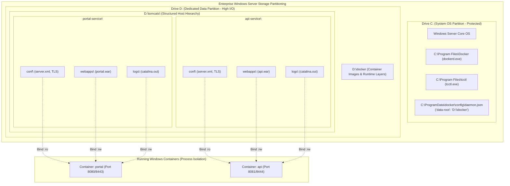

# TC-ADR-0009

| Property | Value |
| --- | --- |
| **ADR ID** | TC-ADR-0009 |
| **Title** | Enterprise Drive Separation and Transparent Host Bind-Mount Hierarchy for Multi-Instance Tomcat Containers |
| **Project** | Apache Tomcat Enterprise |
| **Section** | Storage and Runtime Architecture |
| **Status** | Accepted |
| **Date** | 2026-09-23 |

---

## 🔍 Overview

Apache Tomcat Enterprise menetapkan strategi pemisahan partisi penyimpanan (*Enterprise Drive Separation*) dan standardisasi hierarki penyimpanan berbasis **Host Bind-Mount** (`<Drive>:\tomcats\<instance_name>\[conf, webapps, logs]`) menggantikan ketergantungan pada Docker Engine Named Volumes internal yang tersembunyi. Keputusan ini juga menetapkan pemindahan *data-root* Docker Engine ke drive data (`D:\docker`) guna melindungi partisi sistem operasi (`C:\`) dari kepenuhan disk akibat ukuran citra kontainer (*container images*) dan log aplikasi.

---

## 🌍 Context

Pada implementasi awal runtime kontainer Windows Server, penyimpanan volume runtime Tomcat dialokasikan menggunakan Docker Named Volumes (`<instance>_conf`, `<instance>_webapps`, `<instance>_logs`) yang secara default disimpan oleh Docker daemon di bawah path sistem `C:\ProgramData\docker\volumes\<name>\_data`.

Dalam uji operasional dan validasi lapangan pada server Windows baru (Windows Server 2022 Datacenter), tim mengidentifikasi beberapa risiko arsitektur dan friksi operasional yang signifikan:

1. **Risiko Kepenuhan Partisi Sistem OS (`C:\`)**:
   - Citra kontainer Windows Server (seperti Windows ServerCore) berukuran sangat besar (3–5 GB per layer).
   - Di lingkungan perusahaan, drive `C:\` biasanya merupakan partisi sistem operasi yang dialokasikan terbatas (50–100 GB). Menumpuk citra kontainer, layer kontainer, dan log Tomcat di `C:\ProgramData\docker` dapat dengan cepat menghabiskan kapasitas disk OS, memicu kegagalan sistem (*crash/freeze*), kegagalan Windows update, atau ketidakmampuan administrator untuk login.
2. **Ketiadaan Transparansi Folder (*Opaque Volume Paths*)**:
   - Docker Named Volume menyimpan berkas di kedalaman direktori internal berformat `C:\ProgramData\docker\volumes\<instance>_webapps\_data`.
   - Tim operasional dan pengembang aplikasi kesulitan berinteraksi secara visual via File Explorer untuk meletakkan berkas aplikasi (`.war`), memeriksa `server.xml`, atau men-tail berkas `catalina.out` dan `localhost_access_log.txt`.
3. **Kebutuhan Isolasi Multi-Instance Bersih**:
   - Pada host yang menjalankan lebih dari 1 instance Tomcat (misal `portal`, `api`, `billing`), setiap instans harus memiliki partisi konfigurasi, webapps, dan log yang terpisah secara tegas tanpa risiko tumpang tindih (*cross-instance contamination*).

---

## ⚖️ Decision

Project memutuskan untuk membakukan arsitektur penyimpanan runtime Apache Tomcat Enterprise dengan ketentuan teknis berikut:

### 1. Dual-Tier Drive Partitioning Strategy (Pemisahan Drive OS vs Data)
- **Drive Sistem (`C:\`)**: Dikhususkan hanya untuk sistem operasi Windows, pembaruan Windows, biner layanan Docker (`C:\Program Files\Docker`), dan biner operator `tcctl.exe` (`C:\Program Files\tcctl`).
- **Drive Data (`D:\`)**: 
  - Jika drive `D:\` tersedia, Docker daemon secara otomatis dikonfigurasi melalui `C:\ProgramData\docker\config\daemon.json` dengan:
    ```json
    {
      "data-root": "D:\\docker"
    }
    ```
  - Seluruh lapisan image kontainer, write layers, dan cache disimpan di `D:\docker`.
  - Jika server target hanya memiliki 1 partisi (`C:\`), sistem secara aman melakukan fallback ke `C:\ProgramData\docker`.

### 2. Standardized Transparent Host Bind-Mount Hierarchy
Penyimpanan kontainer dialihkan dari Docker Named Volume internal ke **Host Bind-Mount** terstruktur dengan pola hierarki:

```text
<BaseDir>\
├── <instance_name_1>\
│   ├── conf\       <-- server.xml, web.xml, context.xml, TLS certs (Mounted :ro)
│   ├── webapps\    <-- Tempat berkas aplikasi (.war) dan uncompressed folders
│   └── logs\       <-- catalina.log, localhost_access_log.txt
└── <instance_name_2>\
    ├── conf\
    ├── webapps\
    └── logs\
```

- **Nilai Default BaseDir**:
  - Jika drive `D:\` tersedia: `D:\tomcats`
  - Jika hanya ada drive `C:\`: `C:\tomcats`
- **Fleksibilitas Argumen CLI & Interaktif**:
  - `tcctl deploy run` mendukung flag `--base-dir <Path>` untuk penentuan lokasi kustom.
  - Jika flag diabaikan pada sesi interaktif TTY, `tcctl` menampilkan prompt pemilihan direktori dasar.

### 3. Container Bind-Mount Binding Contract
Saat meluncurkan kontainer, `tcctl` memetakan ketiga direktori host ke dalam kontainer Windows:
- `-v <BaseDir>\<instance>\conf:C:\usr\local\tomcat\conf:ro` (Menjamin kekebalan konfigurasi terhadap mutasi kontainer).
- `-v <BaseDir>\<instance>\webapps:C:\usr\local\tomcat\webapps` (Mendukung hot-deployment berkas `.war`).
- `-v <BaseDir>\<instance>\logs:C:\usr\local\tomcat\logs` (Memungkinkan pembacaan log langsung oleh agent monitoring atau administrator).

---

## 🏛️ Architecture



---

## 💡 Rationale & Performance Verification

### Analisis Kinerja I/O (Bind Mount vs Named Volume pada Windows Server):
Muncul kekhawatiran umum bahwa Bind Mount memiliki penalti performa I/O dibandingkan Named Volume. Investigasi teknis membuktikan:
1. **Zero Virtualization Overhead**: Mitos I/O lambat pada bind mount hanya berlaku untuk Docker Desktop di macOS/WSL2 yang melewati layer konversi jaringan virtual (`gRPC-FUSE`/`9P`).
2. **Native NTFS Kernel Execution**: Pada Windows Server dengan *Process Isolation*, kontainer berjalan langsung di atas kernel NT yang sama dengan host. Baik Bind Mount maupun Named Volume dieksekusi melalui filter driver NTFS yang sama (`wcifs.sys`), menghasilkan **100% Native NTFS Speed** tanpa perbedaan kinerja.
3. **Reduksi I/O Contention**: Meletakkan direktori log pada drive terpisah (`D:\`) justru meningkatkan performa I/O secara keseluruhan karena terbebas dari antrean disk (*disk queue contention*) sistem operasi Windows di drive `C:\`.

---

## 🚀 Consequences

### Positif:
- **Resiliensi OS**: Partisi sistem `C:\` terlindungi 100% dari potensi disk exhaustion akibat akumulasi log Tomcat atau unduhan citra kontainer.
- **Operator-Friendly**: Tim sysadmin dan pengembang dapat dengan mudah membuka File Explorer ke `D:\tomcats\<instance>\webapps` untuk drop `.war` atau meninjau berkas log tanpa membutuhkan perintah `docker cp` atau `docker volume inspect`.
- **Integrasi Monitoring Transparan**: Agent monitoring host (Promtail, Fluentbit, Telegraf) dapat langsung membaca log dari direktori host yang pasti dan terstruktur.
- **Dukungan Multi-Instance Bersih**: Setiap instans memiliki direktori terisolasi penuh dengan penamaan yang deterministik.

### Kompromi / Pertimbangan:
- Administrator host harus memastikan izin akses NTFS pada folder `<BaseDir>` dapat dibaca dan ditulis oleh konteks pengguna runtime kontainer (`ContainerUser` atau `ContainerAdministrator`). Logika ini ditangani secara otomatis oleh `tcctl deploy run`.
