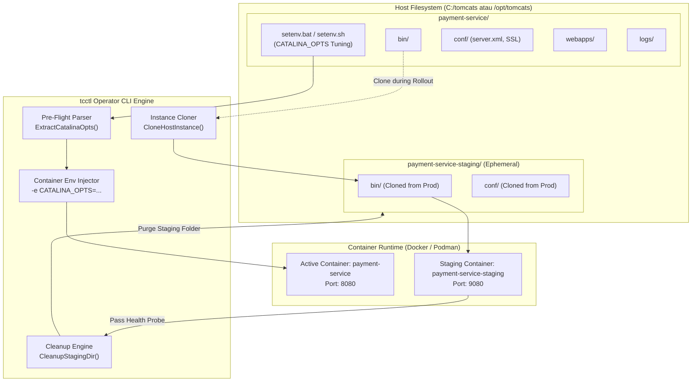

# TC-ADR-0010

| Property | Value |
| --- | --- |
| **ADR ID** | TC-ADR-0010 |
| **Title** | Host Environment Configuration Architecture (bin/setenv) and Dynamic Container-Aware JVM Memory Tuning for Zero-Downtime Deployments |
| **Project** | Apache Tomcat Enterprise |
| **Section** | Runtime and Deployment Architecture |
| **Status** | Accepted |
| **Date** | 2026-09-25 |

---

## 🔍 Overview

Apache Tomcat Enterprise menetapkan standarisasi tata kelola variabel lingkungan dan alokasi memori JVM (*Java Virtual Machine Memory Tuning*) melalui pemetaan direktori host bind-mount `<BaseDir>/<instance>/bin/` yang memuat berkas konfigurasi `setenv.bat` (Windows) dan `setenv.sh` (Linux). Keputusan ini menggabungkan otomasi seeding parameter JVM berbasis *container-aware* (`-XX:MaxRAMPercentage`, G1GC, Timezone, Encoding) dengan mekanisme ekstraksi pra-peluncuran (*pre-flight environment injection*) oleh operator CLI `tcctl`. Arsitektur ini menjamin bahwa seluruh modifikasi parameter Java oleh administrator host tetap persisten, kompatibel secara universal di Windows dan Linux container engines, serta tersinkronisasi secara otomatis saat eksekusi *Zero-Downtime Rollout* tanpa meninggalkan sisa direktori sementara (*ephemeral staging cleanup*).

---

## 🌍 Context

Pada implementasi runtime kontainer Tomcat sebelumnya (TC-ADR-0009), hierarki penyimpanan host bind-mount mencakup tiga direktori utama:
- `conf/`: Konfigurasi XML dan sertifikat TLS (`:ro`).
- `webapps/`: Berkas artefak aplikasi `.war` (`:rw`).
- `logs/`: Berkas log transaksi dan catalina (`:rw`).

Dalam operasional produksi enterprise, tim operasional membutuhkan kendali granular terhadap alokasi memori Java (Heap Size, GC Collector, Headless mode, System Properties) per instans aplikasi tanpa harus memodifikasi citra kontainer (*container image*) dasar atau membangun ulang (*rebuild*) citra setiap kali terjadi penyesuaian kapasitas memori.

Secara tradisional pada Apache Tomcat, kustomisasi ini dilakukan melalui berkas `<CATALINA_BASE>/bin/setenv.sh` atau `setenv.bat`. Namun, penerapannya pada lingkungan kontainer multi-platform (terutama Windows Containers) memicu tiga batasan teknis kritis:

1. **Batasan Single-File Bind Mount pada Windows Containers**:
   - Docker daemon pada Windows Server tidak mendukung *single-file bind mount* (`-v C:\path\setenv.bat:C:\usr\local\tomcat\bin\setenv.bat`). Eksekusi perintah tersebut memicu kegagalan daemon: `Error response from daemon: invalid volume specification`.
2. **Risiko Shadowing Direktori Inti Tomcat (`/bin`)**:
   - Memetakan direktori host `<instance>\bin` langsung ke `C:\usr\local\tomcat\bin` akan menimpa (*shadowing*) seluruh biner dan skrip bawaan Apache Tomcat (`catalina.bat`, `bootstrap.jar`, `tomcat-juli.jar`), menyebabkan kontainer gagal melakukan *bootstrap* dan langsung keluar (*exit code 1*).
3. **Risiko Kehilangan Kustomisasi saat Zero-Downtime Rollout**:
   - Pada pola *Zero-Downtime Temporary Staging Rollout* (TC-ADR-0006), kontainer pengujian sementara (`<instance>-staging`) diluncurkan pada port berbeda. Jika parameter JVM dikonfigurasi pada direktori host primer, kontainer staging dapat kehilangan konfigurasi memori kustom tersebut, memicu perbedaan perilaku runtime (*runtime drift*) saat dipromosikan ke produksi.

---

## ⚖️ Decision

Proyek memutuskan untuk membakukan arsitektur konfigurasi environment JVM dan tata kelola direktori `bin` dengan ketentuan teknis berikut:

### 1. Perluasan Standar Hierarki Host Bind-Mount (`bin/`)
Hierarki direktori instans di host diperluas secara resmi menjadi 4 direktori standar:
```text
<BaseDir>/<instance>/
├── bin/                      <-- Host Bind-Mount & Setting Java / Environment (Baru)
│   ├── setenv.bat            <-- Konfigurasi runtime Windows (CATALINA_OPTS, JVM args)
│   └── setenv.sh             <-- Konfigurasi runtime Linux (CATALINA_OPTS, JVM args)
├── conf/                     <-- Konfigurasi XML & TLS Material (Read-Only :ro)
├── webapps/                  <-- Tempat berkas deployment .war
└── logs/                     <-- Log catalina & access log
```

### 2. Auto-Seeding Template `setenv` Berbasis Container-Aware
Saat pertama kali sebuah instans dideploy via `tcctl deploy run`, direktori `<BaseDir>/<instance>/bin` otomatis dibuat dan diisi template standar jika belum tersedia:
- **Default Baseline Tuning**:
  ```cmd
  set "CATALINA_OPTS=-XX:MaxRAMPercentage=75.0 -XX:InitialRAMPercentage=50.0 -XX:+UseG1GC -XX:+UseStringDeduplication -Dfile.encoding=UTF-8 -Duser.timezone=Asia/Jakarta -Djava.awt.headless=true"
  ```
- **Karakteristik Template**:
  - Mengadopsi `-XX:MaxRAMPercentage` dan `-XX:InitialRAMPercentage` alih-alih nilai statis (`-Xmx`/`-Xms`), sehingga JVM secara otomatis beradaptasi dengan batas memori kontainer (`--memory`).
  - Mengaktifkan Garbage Collector G1 (`-XX:+UseG1GC`) dan penghematan memori string (`-XX:+UseStringDeduplication`).
  - Standardisasi timezone (`Asia/Jakarta`) dan encoding (`UTF-8`).
  - Menangani kompatibilitas Eclipse Temurin JRE pada Windows Server (`if not "%JAVA_HOME%" == "" set "JRE_HOME=%JAVA_HOME%"`).

### 3. Pre-Flight Extraction dan Injeksi Ganda (Dual-Mount & Env)
Untuk mengatasi batasan *single-file bind mount* dan mencegah *directory shadowing* pada Windows:
- **Dynamic Pre-Flight Parser**: Biner `tcctl` membaca berkas `setenv.bat` (atau `setenv.sh`) pada host secara langsung sebelum menjalankan kontainer, mengekstrak nilai variabel `CATALINA_OPTS`, dan menginjeksikannya sebagai variabel lingkungan kontainer (`-e CATALINA_OPTS="..."`).
- **Custom Directory Isolation**: Direktori host `bin/` di-mount secara aman ke lokasi terisolasi `/usr/local/tomcat/bin/custom:ro` (Linux) atau `C:\usr\local\tomcat\bin\custom:ro` (Windows), menjaga integritas biner inti Tomcat di `bin/`.

### 4. Sinkronisasi Penuh Zero-Downtime Rollout & Ephemeral Cleanup
Pada proses zero-downtime rollout (`tcctl deploy rollout`):
- `tcctl` secara otomatis mengkloning direktori `bin/` dan `conf/` dari instans aktif ke direktori staging sementara (`<BaseDir>/<instance>-staging/`).
- Kontainer staging memuat seluruh opsi memori dan kustomisasi yang telah dibuat oleh administrator.
- Setelah kontainer staging lolos *healthcheck probe* dan versi baru dipromosikan ke port kanonikal, seluruh direktori staging sementara dihapus secara bersih dari host (*ephemeral staging cleanup*).

---

## 🏛️ Architecture



---

## 💡 Rationale & Technical Verification

### 1. Keandalan Injeksi Antar-Engine:
Dengan mengekstrak `CATALINA_OPTS` di tingkat operator CLI `tcctl` dan mengirimkannya via Docker/Podman `-e`, konfigurasi memori dijamin 100% teraplikasikan pada JVM startup tanpa bergantung pada mekanisme file sourcing shell di dalam container nanoserver/scratch.

### 2. Eliminasi Runtime Configuration Drift:
Sebelumnya, jika parameter JVM disuntikkan secara ad-hoc saat `docker run`, parameter tersebut tidak tercatat di penyimpanan persisten. Dengan menyimpan konfigurasi di `<BaseDir>/<instance>/bin/setenv.bat`, konfigurasi menjadi *declarative*, persisten terhadap reboot host, dan dapat di-version control jika direktori host dihubungkan dengan GitOps.

### 3. Hasil Pengujian Live:
- **Windows Server 2022 (Build 20348)**:
  - Eksekusi `tcctl deploy run` berhasil membuat `C:/tomcats/tomcat-lab/bin/setenv.bat`.
  - Verifikasi `%CATALINA_OPTS%` di dalam container menunjukkan kecocokan 100%.
  - Modifikasi kustom (`-Dcustom.property=tcctl-works -XX:MaxRAMPercentage=80.0`) berhasil diaplikasikan secara mulus saat `tcctl deploy rollout`.
  - Direktori staging `C:\tomcats\tomcat-lab-staging` terbukti otomatis terhapus pasca promosi.
- **Windows Server 2019 (Build 17763)**:
  - Berhasil diuji coba pada Docker CE dengan isolasi proses, memverifikasi portabilitas skema bind-mount dan zero-downtime rollout lintas generasi sistem operasi.

---

## 🚀 Consequences

### Positif:
- **Kemudahan Administrasi**: Sysadmin dapat mengubah heap size atau argumen Java cukup dengan mengedit file `setenv.bat` atau `setenv.sh` di host tanpa perlu masuk ke shell kontainer.
- **Container-Aware Memory Safety**: Penggunaan rasio persentase RAM (`MaxRAMPercentage=75.0`) mencegah terjadinya kondisi *OOMKilled* (Out Of Memory) akibat alokasi heap yang melampaui batas kontainer.
- **Zero-Downtime Safe**: Perubahan parameter JVM pada host secara otomatis diuji kelayakannya di staging container sebelum menggantikan instance produksi.
- **Konsistensi Multi-Platform**: Pola hierarki dan perilaku parsing seragam antara lingkungan Windows Server dan Linux.

### Kompromi / Pertimbangan:
- Format pemisah baris (*newline*) pada `setenv.bat` harus menggunakan `CRLF` (Windows) dan `setenv.sh` menggunakan `LF` (Linux). Hal ini ditangani secara otomatis oleh generator template `tcctl`.

---

## 📦 Implementation & Operational Artifacts

Keputusan arsitektur ini diimplementasikan pada repositori dan berkas berikut:
- **`tcctl/internal/hardening/templates.go`**: Mendefinisikan `SetenvBatTemplate`, `SetenvShTemplate`, dan `ApplyDefaultSetenv()`.
- **`tcctl/internal/orchestrator/runner.go`**: Mendefinisikan `ExtractCatalinaOpts()`, pemetaan bind mount `bin/`, dan penyuntikan variabel lingkungan `CATALINA_OPTS`.
- **`tcctl/internal/orchestrator/rollout.go`**: Mendefinisikan `CloneHostInstance()` dan `CleanupStagingDir()`.
- **`tcctl/internal/orchestrator/runner_test.go`**: Unit test pengujian pembuatan direktori `bin/`, template seeding, dan parsing `CATALINA_OPTS`.
- **[TN-010](../../../projects/tomcat/engineering-journal/platform-foundation-and-hardening/TN-010-implement-host-bin-setenv-and-container-aware-dynamic-jvm-tuning.md)**: Catatan teknis pengujian dan verifikasi live pada Windows Server 2022 dan Windows Server 2019.
