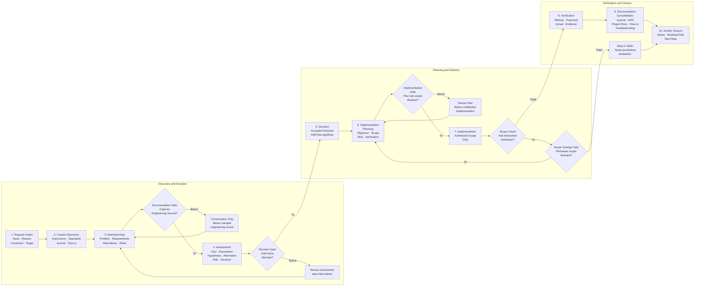

# Stage 01 — Review and Agree the Working Lifecycle

| Field | Value |
| --- | --- |
| Project | Tomcat Monitoring |
| Review Area | Standards, process, Engineering Journal, and AI collaboration |
| Activity Type | Discovery and Assessment |
| Working Mode | Read-only assessment; this file records the agreed result |
| Status | Completed |
| Date | 2026-08-20 |
| Approved By | Project owner |
| Approval Date | 2026-08-20 |

## Purpose

Meninjau kembali cara pengguna dan AI bekerja sejak project Tomcat Monitoring
dimulai sampai implementasi JMX Exporter, kemudian menyepakati lifecycle kerja
yang akan menjadi dasar perbaikan Engineering Journal Standards.

Tahap ini tidak mengubah Engineering Journal Standards, Engineering Journal
Tomcat Monitoring, project documentation, ADR, atau source repository.

## Communication Context

Pengguna meminta assessment terhadap perjalanan project Tomcat Monitoring dari
awal sampai implementasi JMX Exporter. Review difokuskan pada hal yang perlu
ditambah atau diperbaiki dari sisi standar, proses kerja, Engineering Journal,
ADR, project documentation, dan governance penggunaan AI.

Assessment menemukan bahwa arah teknis project dan pemisahan repository sudah
cukup baik. Namun, Engineering Journal disusun setelah sebagian besar diskusi,
desain, dan implementasi berlangsung. Akibatnya, jurnal saat ini lebih banyak
merekonstruksi perjalanan daripada mencatat aktivitas secara paralel sejak
brainstorming dimulai.

Pengguna dan AI kemudian menyepakati bahwa pekerjaan tidak langsung dilanjutkan
dengan perubahan dokumen. Langkah pertama adalah menyepakati lifecycle kerja
yang benar. Setelah lifecycle disetujui, hasilnya akan diterjemahkan ke dalam
Engineering Journal Standards, lalu digunakan untuk menilai dan menyesuaikan
Engineering Journal Tomcat Monitoring.

## Agreed Principles

1. Engineering Journal merupakan rekaman utama perjalanan project sejak
   kebutuhan, brainstorming, assessment, decision, implementation, verification,
   sampai activity closure.
2. Engineering Journal bukan transkrip mentah percakapan. Informasi dari diskusi
   dikurasi dengan tetap mempertahankan konteks, alternatif, asumsi, keputusan,
   evidence, dan hasil aktual.
3. Project documentation menjelaskan current state dan ringkasan yang telah
   dikonsolidasikan. Project documentation bukan tempat utama untuk menyimpan
   proses brainstorming atau rencana yang belum disepakati.
4. ADR menjadi sumber keputusan arsitektur yang signifikan beserta alasan,
   alternatif, dan konsekuensinya.
5. How-to menyimpan prosedur reusable yang dapat digunakan lintas project.
6. Troubleshooting menyimpan diagnosis dan resolution yang dapat digunakan
   kembali.
7. `AGENTS.md` mengatur cara AI bekerja pada repository dan bukan pengganti
   Engineering Journal.
8. AI tidak melakukan implementation sebelum scope dan verification plan
   disetujui oleh pengguna.
9. AI harus berhenti dan meminta persetujuan apabila pekerjaan membutuhkan
   perluasan scope.

## Agreed Working Lifecycle

| Stage | Activity | Primary Output | User Approval |
| --- | --- | --- | --- |
| 1. Request Intake | Menyampaikan kebutuhan, alasan, constraint, dan hasil yang diharapkan. | Initial project intent | Belum diperlukan |
| 2. Context Discovery | Membaca `AGENTS.md`, standar, current-state documentation, jurnal, ADR, dan source terkait. | Context summary dan initial gaps | Belum diperlukan |
| 3. Brainstorming | Membahas masalah, kebutuhan, alternatif, risiko, dan open questions. | Curated brainstorming record | Diperlukan sebelum menulis jurnal |
| 4. Assessment | Memisahkan fact, assumption, hypothesis, alternative, constraint, dan risk. | Assessment result dan rekomendasi | Pengguna mereview hasil |
| 5. Decision | Menetapkan pilihan dan mencatat keputusan signifikan sebagai ADR. | Accepted direction atau ADR | Wajib |
| 6. Implementation Planning | Menentukan objective, authorized scope, target, urutan kerja, risiko, verification, dan stop condition. | Implementation Technical Note berstatus `Planned` | Wajib |
| 7. Implementation | Melakukan perubahan hanya dalam authorized scope dan mencatat hasil aktual. | Source atau configuration changes dan evidence | Tidak diperlukan selama tetap dalam scope |
| 8. Verification | Membandingkan method, expected result, actual result, dan evidence. | Passed, Failed, atau Blocked result | Diperlukan jika ada perubahan scope |
| 9. Documentation Consolidation | Menempatkan hasil terverifikasi ke dokumentasi yang sesuai. | Project documentation, ADR, How-to, atau Troubleshooting | Sesuai scope yang disetujui |
| 10. Activity Closure | Menilai objective, outstanding item, residual risk, dan next step. | Technical Note dengan status akhir | Pengguna menerima hasil |

### Workflow Diagram

## Approval Gates

Empat approval gate digunakan agar workflow aman tanpa membuat setiap command
memerlukan persetujuan terpisah.

| Gate | Question |
| --- | --- |
| Documentation Gate | Apakah hasil brainstorming sudah boleh dicatat ke Engineering Journal? |
| Decision Gate | Apakah alternatif atau keputusan arsitektur sudah disetujui? |
| Implementation Gate | Apakah implementation plan dan authorized scope sudah disetujui? |
| Scope Change Gate | Apakah AI boleh melanjutkan ketika ditemukan kebutuhan di luar scope? |

## Documentation Mapping

| Information | Source of Truth |
| --- | --- |
| Perjalanan project dan activity evidence | Engineering Journal |
| Keputusan signifikan dan konsekuensinya | ADR |
| Kondisi project yang berlaku | Project documentation |
| Prosedur reusable lintas project | Root How-to |
| Diagnosis dan resolution reusable | Troubleshooting |
| Aturan kerja AI pada repository | `AGENTS.md` |
| Diskusi mentah yang belum dikurasi | Percakapan; bukan dokumentasi resmi |

## Position of AGENTS.md

`AGENTS.md` merupakan governance layer yang selalu aktif ketika tersedia. File
tersebut mengatur repository boundary, allowed actions, approval requirement,
verification command, larangan, dan stop condition.

Untuk project baru, repository-level `AGENTS.md` disiapkan setelah project
intent dan repository boundary cukup jelas, tetapi sebelum AI melakukan
perubahan implementasi pertama. Jika file tersebut belum tersedia, AI mengikuti
scope percakapan dan standar yang berlaku tanpa menganggap percakapan sebagai
governance permanen.

## Decision

Lifecycle kerja di atas disetujui sebagai baseline konseptual. Baseline ini
belum otomatis menjadi standar handbook sampai Engineering Journal Standards
direview, diperbarui, dan disetujui secara terpisah.

## Next Step

Review bagaimana lifecycle yang telah disetujui diterjemahkan ke dalam
Engineering Journal Standards, khususnya:

- Activity types;
- Base template dan conditional sections;
- Brainstorming record;
- Information classification dan status;
- Live dan reconstructed record;
- Activity date dan recorded date;
- Approval dan authorization metadata; serta
- Hubungan Engineering Journal, ADR, project documentation, How-to,
  Troubleshooting, dan `AGENTS.md`.

Belum ada perubahan terhadap dokumen standar sampai rancangan tersebut direview
dan disetujui oleh pengguna.

## Closure Result

Stage 01 dinyatakan `Completed` setelah project owner menyetujui:

- Lifecycle kerja sepuluh tahap;
- Empat approval gate;
- Engineering Journal sebagai rekaman utama perjalanan project;
- Pemisahan tanggung jawab Engineering Journal, ADR, project documentation,
  How-to, dan Troubleshooting;
- `AGENTS.md` sebagai governance layer untuk cara AI bekerja; serta
- Engineering Journal Standards Design sebagai tahap berikutnya.

Tidak ada perubahan terhadap Engineering Journal Standards, Engineering Journal
Tomcat Monitoring, project documentation, ADR, atau source repository selama
Stage 01.
