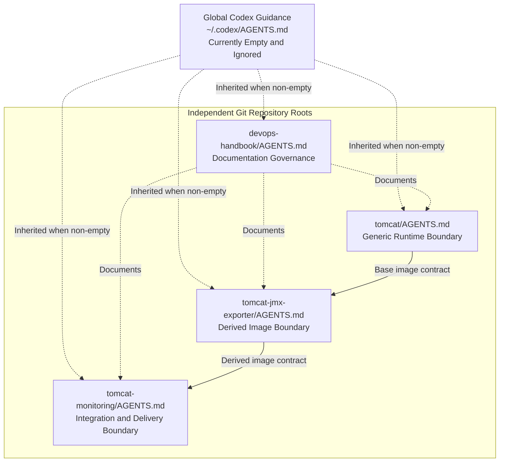

# Stage 06 — Design Repository AGENTS.md Governance

| Field | Value |
| --- | --- |
| Project | Tomcat Monitoring Workflow Review |
| Review Area | AI repository governance |
| Activity Type | Discovery and Assessment |
| Record Type | Live |
| Working Mode | Read-only; only this working record may be updated |
| Status | Completed |
| Activity Date | 2026-08-20 |
| Recorded Date | 2026-08-20 |
| Completed Date | 2026-08-20 |
| Owner | Project owner |
| Approved By | Project owner |
| Approval Date | 2026-08-20 |

## Objective

Merancang layering dan content contract `AGENTS.md` untuk repository yang
terlibat dalam Tomcat Monitoring sebelum AI melakukan technical implementation
berikutnya.

## Background

Stage 01 menetapkan `AGENTS.md` sebagai governance layer yang mengatur cara AI
bekerja, sedangkan Engineering Journal mencatat perjalanan, authorization, dan
evidence aktivitas. Stage 04 dan Stage 05 menemukan bahwa belum ada
repository-level `AGENTS.md` pada `devops-handbook`, `tomcat`,
`tomcat-jmx-exporter`, atau `tomcat-monitoring`.

Official OpenAI documentation menjelaskan bahwa Codex membaca `AGENTS.md`
sebelum bekerja, menyusun instruction chain dari global scope kemudian project
root menuju current working directory, dan memberikan precedence lebih tinggi
kepada instruksi yang lebih dekat dengan working directory. Instruction chain
dibentuk sekali pada awal run atau session.

Stage ini hanya merancang governance. Instruction file belum dibuat agar
content dan boundary dapat direview sebelum menjadi aturan aktif.

## Scope

- Memeriksa official discovery dan precedence behavior `AGENTS.md`;
- Menginventarisasi instruction file yang sudah tersedia;
- Memetakan repository responsibility dan verification interface;
- Merancang layering, common content contract, dan repository-specific rules;
- Menetapkan approval, destructive-action, Git, secret, dan stop-condition
  policy; serta
- Menentukan verification plan setelah instruction file dibuat.

Stage ini tidak membuat atau mengubah `AGENTS.md`, source, runtime,
configuration, project documentation, standard, ADR, atau Engineering Journal
Tomcat Monitoring.

## Inputs

| Input | Purpose |
| --- | --- |
| [Official OpenAI AGENTS.md documentation](https://learn.chatgpt.com/docs/agent-configuration/agents-md) | Menetapkan discovery, precedence, layering, size limit, dan verification behavior. |
| Stage 01 lifecycle | Menetapkan posisi governance dan approval gate. |
| Engineering Journal Standards | Memisahkan persistent AI rules dari activity record. |
| Stage 04 dan Stage 05 | Menetapkan AGENTS.md sebagai prerequisite implementation berikutnya. |
| Repository source dan scripts | Menentukan ownership, safe verification, side effect, dan stop condition. |

## Findings

### Official discovery behavior

| Behavior | Design Implication |
| --- | --- |
| Global scope membaca `AGENTS.override.md` atau `AGENTS.md` pertama yang tidak kosong. | Global guidance harus benar-benar umum; repository rule tidak ditempatkan di global scope. |
| Project discovery dimulai dari Git root menuju current working directory. | Setiap Git repository membutuhkan root instruction file sendiri. |
| Dalam satu directory, override diperiksa sebelum regular file. | `AGENTS.override.md` digunakan hanya untuk temporary exception, bukan baseline. |
| Instruction yang lebih dekat ke working directory muncul lebih akhir dan dapat mengoverride rule sebelumnya. | Nested instruction hanya dibuat ketika subdirectory benar-benar membutuhkan rule berbeda. |
| Empty instruction file dilewati. | Global `~/.codex/AGENTS.md` yang saat ini kosong tidak memberikan governance. |
| Combined project instructions memiliki default limit 32 KiB. | Instruction harus ringkas dan menghindari penyalinan standar atau dokumentasi panjang. |
| Instruction chain dibentuk sekali pada awal run atau session. | Verification wajib menggunakan Codex session baru setelah file dibuat. |

### Current instruction state

| Scope | Condition | Assessment |
| --- | --- | --- |
| Global `~/.codex/AGENTS.md` | Present but empty | Diabaikan oleh discovery; tidak menjadi governance aktif. |
| `/home/eddywiyatno/git` | Tidak memiliki instruction file | Tidak perlu dibuat karena bukan Git root project dan akan mencampur aturan repository yang berbeda. |
| `devops-handbook` | Tidak memiliki instruction file | Repository-level governance diperlukan untuk documentation ownership dan dirty-worktree safety. |
| `tomcat` | Tidak memiliki instruction file | Repository-level governance diperlukan untuk menjaga generic base-image boundary. |
| `tomcat-jmx-exporter` | Tidak memiliki instruction file | Repository-level governance diperlukan untuk derived-image, TLS, artifact, dan test boundary. |
| `tomcat-monitoring` | Tidak memiliki instruction file | Repository-level governance diperlukan sebelum repository kosong mulai menerima integration source. |

### Repository responsibility

| Repository | Owned Responsibility | Must Not Own |
| --- | --- | --- |
| `devops-handbook` | Standards, ADR, How-to, Engineering Journal, dan project documentation. | Runtime source, generated secret, container artifact, atau deployment state. |
| `tomcat` | Generic reusable Apache Tomcat base image dan runtime launcher. | JMX Exporter, environment-specific metrics rules, Prometheus, Telegraf, atau integration configuration. |
| `tomcat-jmx-exporter` | Derived Tomcat image dengan pinned JMX Exporter Java Agent dan local component test. | Prometheus rules, dashboard, Telegraf, production certificate, alert routing, atau deployment orchestration. |
| `tomcat-monitoring` | Monitoring configuration, integration validation, dashboard, alerting, CI/CD, Ansible, dan deployment automation. | Generic Tomcat implementation atau JMX Exporter binary lifecycle. |

### Command side effects

| Repository Command | Side Effect | Governance Direction |
| --- | --- | --- |
| Documentation inspection and Git diff | Read-only | Dapat dijalankan selama relevan dengan task. |
| `mkdocs build --strict` | Menghasilkan build output | Gunakan temporary site directory; jika executable tidak tersedia, laporkan `Not verified` dan jangan memasang dependency tanpa approval. |
| `tomcat/scripts/build.sh` | Membuat atau mengganti local Podman image. | Memerlukan approved implementation or verification scope. |
| `tomcat/scripts/run.sh` | Membuat volume, container, network relationship, dan port binding. | Memerlukan target serta authorization eksplisit. |
| `tomcat/scripts/clean.sh` | Menghapus container dan image; volume dipertahankan oleh script saat ini. | Memerlukan target eksplisit dan destructive-action confirmation. |
| `tomcat-jmx-exporter/scripts/build.sh` | Mengunduh artifact dan membuat local image. | Memerlukan approved implementation or verification scope serta network access jika artifact belum tersedia. |
| `tomcat-jmx-exporter/scripts/test.sh` | Membuat temporary certificate, container, port binding, lalu membersihkannya. | Boleh dijalankan dalam approved verification scope; hasil hanya berlaku pada image yang benar-benar dibangun dari current source. |
| `tomcat-jmx-exporter/scripts/run.sh` | Membuat network dan persistent local container. | Memerlukan target serta authorization eksplisit. |
| `tomcat-jmx-exporter/scripts/clean.sh` | Menghapus container dan secara optional image. | Memerlukan target eksplisit; `--image` membutuhkan destructive-action confirmation. |
| Commit, push, tag, release, dan deployment | Mengubah persistent repository atau environment state. | Memerlukan authorization terpisah dan tidak boleh disimpulkan dari izin edit. |

## Proposed Layering

Gunakan satu root `AGENTS.md` pada setiap Git repository. Jangan membuat nested
instruction atau override pada tahap awal.

Garis `Documents` hanya menunjukkan hubungan dokumentasi. `devops-handbook`
tidak menjadi parent instruction scope bagi repository lain karena setiap
repository merupakan Git root independen.

## Proposed Common Content Contract

Setiap repository-level `AGENTS.md` menggunakan section minimum berikut:

| Section | Purpose |
| --- | --- |
| Repository Purpose | Menjelaskan hasil yang dimiliki repository. |
| Source of Truth | Menautkan file atau dokumentasi yang harus dibaca sebelum perubahan. |
| Repository Boundaries | Menetapkan tanggung jawab dan hal yang harus tetap berada di repository lain. |
| Working Rules | Menetapkan discovery-before-change, dirty-worktree safety, dan scope discipline. |
| Approval Requirements | Menentukan tindakan yang memerlukan Documentation, Decision, Implementation, atau Scope Change Gate. |
| Verification | Menentukan command, expected evidence, dan batas klaim keberhasilan. |
| Git and External State | Mengatur commit, push, tag, release, registry, dan deployment. |
| Secrets and Sensitive Data | Melarang secret, private key, password, token, dan generated TLS material masuk Git atau log. |
| Documentation Handoff | Menentukan kapan Engineering Journal, ADR, How-to, atau project documentation diperbarui. |
| Stop Conditions | Menentukan kondisi saat AI harus berhenti dan meminta direction. |

Instruction harus berupa aturan singkat dan operasional. Detail arsitektur,
histori, tutorial, atau konfigurasi panjang tetap berada pada source of truth
masing-masing dan cukup ditautkan dari `AGENTS.md`.

## Proposed Repository-specific Rules

### devops-handbook

- Perlakukan repository sebagai documentation source of truth.
- Baca standard yang relevan secara penuh sebelum memperbarui dokumentasi.
- Jangan mengubah section atau project di luar explicit scope.
- Pertahankan unrelated dirty-worktree changes.
- Gunakan Engineering Journal untuk activity history, ADR untuk significant
  decision, How-to untuk reusable procedure, dan project pages untuk current
  state.
- Jalankan structural, link, whitespace, dan MkDocs checks yang tersedia.
- Jangan memasang dependency, commit, push, atau menerbitkan site tanpa approval.

### tomcat

- Pertahankan image sebagai generic reusable Apache Tomcat runtime.
- Jangan menambahkan JMX Exporter atau monitoring-platform configuration.
- Perlakukan `PROJECT`, `VERSION`, `CONFIG`, `Containerfile`, entrypoint, dan
  scripts sebagai runtime contract yang harus direview bersama.
- Jalankan shell syntax check sebelum build.
- Build hanya dalam approved scope; run dan cleanup membutuhkan target eksplisit.
- Jangan menghapus named volumes kecuali pengguna menyebut volume dan memberi
  authorization khusus.

### tomcat-jmx-exporter

- Pertahankan dependency pada `localhost/tomcat:9.0` sebagai base-image
  contract sampai decision baru disetujui.
- Jaga version dan SHA-256 JMX Exporter tetap dipin dan tervalidasi.
- Jangan menyimpan generated JAR, certificate, private key, password, atau test
  artifact ke Git.
- Jangan memindahkan environment-specific metrics rule dan monitoring stack ke
  repository ini.
- Klaim build dan smoke test hanya berlaku jika current source dibangun terlebih
  dahulu lalu image tersebut diuji.
- `scripts/test.sh` menjadi local component verification interface; Prometheus,
  Telegraf, CI, dan deployment tetap outside component test scope.
- Commit, push, image publication, dan cleanup image memerlukan authorization
  terpisah.

### tomcat-monitoring

- Repository memiliki integration configuration dan delivery automation, bukan
  source generic Tomcat atau JMX Exporter artifact.
- Karena repository belum memiliki commit, mulai dari approved repository
  structure dan implementation plan; jangan mengasumsikan layout.
- Pisahkan non-secret configuration dari certificate, password, token, dan
  environment credential.
- Setiap komponen harus memiliki validation interface sebelum CI/CD dibuat.
- Deployment target, network, storage, certificate source, rollback, dan
  destructive action harus disebutkan secara eksplisit.
- Jangan menganggap local component smoke test sebagai end-to-end monitoring
  verification.

## Proposed Approval Model

| Action Class | Default Behavior |
| --- | --- |
| Read source, documentation, Git status, or local configuration | Dapat dilakukan jika relevan dan tidak menampilkan secret. |
| Create or update documentation | Memerlukan approved documentation scope. |
| Modify source or configuration | Memerlukan approved implementation plan dan authorized scope. |
| Add dependency or download artifact | Memerlukan approved implementation scope; dependency identity dan integrity harus ditetapkan. |
| Build local image | Memerlukan approved build or verification scope. |
| Run temporary self-cleaning test | Diperbolehkan setelah verification plan disetujui dan target dapat diisolasi. |
| Start or replace persistent container | Memerlukan target dan approval eksplisit. |
| Delete container, image, volume, artifact, or data | Memerlukan exact target dan destructive-action approval. |
| Commit | Memerlukan instruksi eksplisit; izin edit tidak otomatis mengizinkan commit. |
| Push, tag, release, publish image, or deploy | Memerlukan authorization terpisah untuk external or runtime state. |
| Work outside approved scope | Berhenti, catat scope change, dan minta approval. |

## Stop Conditions

AI harus berhenti dan meminta direction ketika:

- Repository boundary atau source of truth tidak dapat ditentukan;
- Required decision belum accepted atau ADR yang diperlukan belum tersedia;
- Scope change diperlukan untuk mencapai objective;
- Target destructive action tidak spesifik;
- Secret atau sensitive data berisiko masuk output, Git, image, atau log;
- Verification membutuhkan dependency, network, privilege, atau environment
  access yang belum diotorisasi;
- Working tree memiliki overlapping user changes yang tidak dapat dipertahankan;
- Actual result tidak memenuhi expected result dan corrective action berada di
  luar authorized scope; atau
- Evidence tidak cukup untuk mendukung status `Completed` atau `Verified`.

## Verification Plan

Setelah root `AGENTS.md` dibuat pada stage berikutnya:

1. Pastikan setiap file non-empty, berada di Git root yang benar, dan tetap
   ringkas di bawah combined instruction limit.
2. Review content terhadap repository source of truth dan pastikan tidak ada
   rule yang saling bertentangan.
3. Mulai Codex session baru dari setiap repository root karena instruction
   chain tidak dimuat ulang pada session yang sedang berjalan.
4. Minta Codex menyebutkan instruction source yang aktif dan merangkum
   repository purpose, boundaries, approval rules, verification, serta stop
   conditions.
5. Uji tabletop scenario tanpa mengubah state: documentation-only request,
   source change, local build, destructive cleanup, push, dan scope change.
6. Catat actual result dan evidence pada live Documentation Consolidation or
   Verification record.

Verification tidak boleh dinyatakan berhasil hanya karena file tersedia.
Keberhasilan berarti fresh session menemukan file yang benar dan dapat
menerapkan boundary tanpa mencampur tanggung jawab repository.

## Alternatives

| Alternative | Assessment | State |
| --- | --- | --- |
| Hanya menggunakan global `~/.codex/AGENTS.md` | Tidak dapat menjelaskan boundary dan command setiap repository secara aman. | Rejected |
| Membuat satu instruction file di `/home/eddywiyatno/git` | Bukan project root dan berisiko memberi kesan bahwa seluruh repository memiliki aturan yang sama. | Rejected |
| Membuat `AGENTS.md` hanya pada `devops-handbook` | Tidak mengatur AI ketika bekerja langsung dari source repository. | Rejected |
| Membuat root `AGENTS.md` pada empat repository | Boundary jelas, dekat dengan source, dan sesuai official project discovery. | Recommended |
| Langsung membuat nested overrides | Menambah precedence complexity sebelum terdapat kebutuhan nyata. | Deferred |

## Risks

| Risk | State | Mitigation |
| --- | --- | --- |
| Instruction terlalu panjang dan terpotong | Open | Gunakan concise rules dan link ke source of truth. |
| Rule menduplikasi atau menjadi stale terhadap scripts | Open | Simpan command contract dekat repository dan review saat scripts berubah. |
| Approval policy terlalu ketat untuk read-only work | Open | Bedakan read-only inspection dari persistent or destructive state change. |
| Approval policy terlalu longgar untuk Podman operations | Open | Klasifikasikan build, temporary test, persistent run, dan cleanup secara terpisah. |
| File baru dianggap aktif pada current session | Open | Wajibkan fresh-session verification. |
| Empty global instruction memberi rasa aman palsu | Open | Nyatakan bahwa empty file diabaikan; jangan bergantung padanya. |

## Open Questions

1. Apakah `AGENTS.md` akan ditulis dalam bahasa Indonesia dengan technical term
   yang tetap menggunakan bahasa Inggris? Rekomendasi: ya, agar konsisten dengan
   source self-documentation.
2. Apakah global `~/.codex/AGENTS.md` perlu diisi? Rekomendasi: tidak pada scope
   Tomcat Monitoring; global guidance harus dirancang terpisah karena berdampak
   pada seluruh repository.
3. Apakah `devops-handbook` memerlukan nested `AGENTS.md` di
   `docs/projects/tomcat-monitoring`? Rekomendasi: belum; root rule dan explicit
   task scope sudah cukup.
4. Apakah Stage 07 boleh membuat empat instruction files sekaligus?
   Rekomendasi: ya, tetapi hanya membuat file dan melakukan non-mutating
   verification; commit atau push tidak termasuk authorization.

## Recommendation

Lanjutkan ke Stage 07 untuk membuat empat root `AGENTS.md` berdasarkan content
contract ini. Gunakan bahasa Indonesia, pertahankan technical terms yang
diperlukan, jangan mengisi global instruction, dan jangan membuat nested
override.

Stage 07 harus dibatasi pada instruction files dan verification evidence.
Technical implementation Tomcat Monitoring baru boleh dilanjutkan setelah
fresh-session verification menunjukkan bahwa setiap repository memuat rule yang
tepat.

## Decision Handoff

Project owner perlu menyetujui atau mengoreksi:

1. Satu root `AGENTS.md` pada masing-masing dari empat repository;
2. Tidak mengubah global `~/.codex/AGENTS.md`;
3. Tidak membuat parent atau nested instruction pada tahap awal;
4. Common content contract sepuluh section;
5. Repository responsibility dan prohibited boundary masing-masing;
6. Approval model untuk read, write, build, test, run, cleanup, Git, dan
   external state;
7. Stop conditions;
8. Fresh-session verification plan; dan
9. Stage 07 hanya membuat instruction files tanpa commit, push, source change,
   build, test, cleanup, atau deployment.

Keputusan ini tidak memerlukan ADR karena mengatur AI working governance dan
tidak mengubah arsitektur Tomcat Monitoring.

### Decision result

Project owner menyetujui seluruh sembilan decision handoff:

1. Gunakan satu root `AGENTS.md` pada masing-masing dari empat repository.
2. Jangan mengubah global `~/.codex/AGENTS.md` dalam scope Tomcat Monitoring.
3. Jangan membuat parent atau nested instruction pada tahap awal.
4. Gunakan common content contract sepuluh section.
5. Terapkan repository responsibility dan prohibited boundary masing-masing.
6. Gunakan approval model yang membedakan read, write, build, test, run,
   cleanup, Git, dan external state.
7. Terapkan stop conditions yang telah dirancang.
8. Verifikasi instruction discovery menggunakan fresh Codex session.
9. Batasi Stage 07 pada pembuatan dan verifikasi instruction files tanpa
   commit, push, source change, build, test, cleanup, atau deployment.

## Outcome

Rancangan governance menghasilkan layering satu root `AGENTS.md` per
repository, content contract bersama, repository-specific boundary, approval
model, stop conditions, dan fresh-session verification plan.

Stage 06 dinyatakan `Completed` setelah project owner menyetujui sembilan
decision handoff. Tidak ada instruction file, source, runtime, atau project
documentation yang diubah selama assessment.

## Closure Result

Stage 06 menghasilkan approved governance design untuk empat repository.
Global instruction tetap berada di luar scope dan masih kosong. Stage 07 dapat
dimulai untuk membuat repository-level `AGENTS.md` serta menjalankan
fresh-session verification sesuai approved scope.

## Related Documentation

- [Stage 01 — Review and Agree the Working Lifecycle](stage-01-working-lifecycle.md)
- [Stage 05 — Normalize Tomcat Monitoring Engineering Journal](stage-05-normalize-tomcat-monitoring-engineering-journal.md)
- [Engineering Journal Standards](../../standards/engineering-journal-standards.md)
- [Official OpenAI AGENTS.md documentation](https://learn.chatgpt.com/docs/agent-configuration/agents-md)
