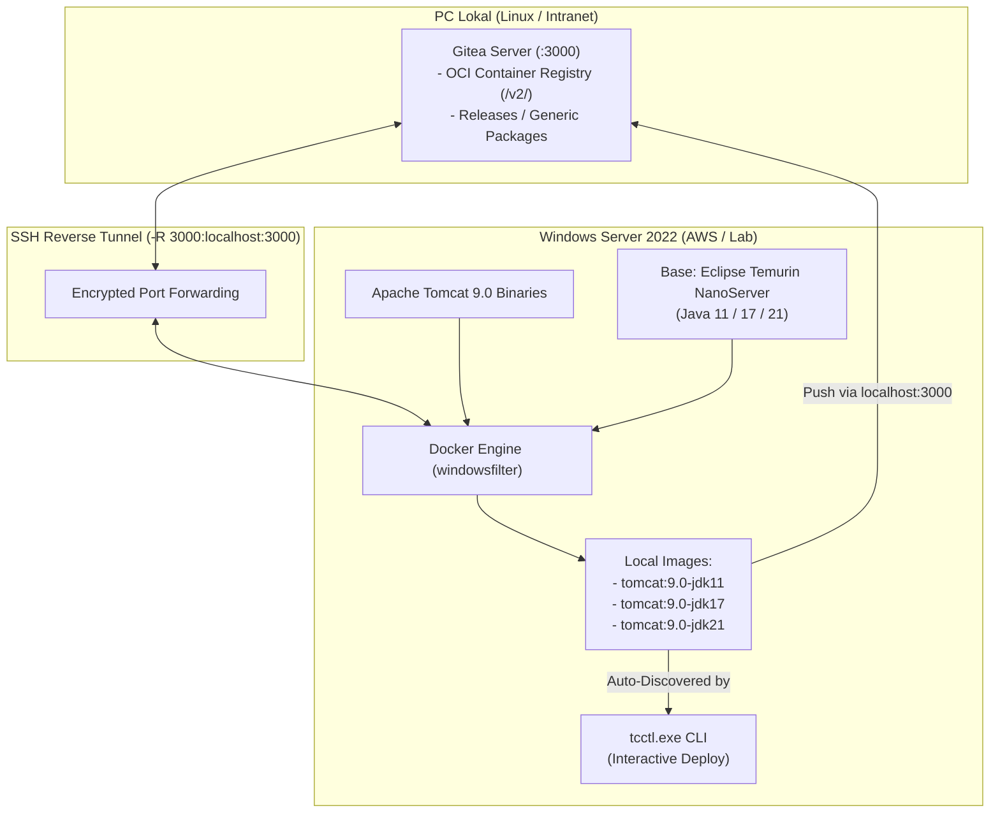

# Build Windows Container Tomcat NanoServer & Publikasi ke Gitea Registry

## 🔍 Overview

Pada lingkungan infrastruktur enterprise atau server *production*, akses langsung ke internet publik sering kali dibatasi atau dilarang sama sekali (*air-gapped environment*). Kondisi ini menimbulkan tantangan saat melakukan provisioning container Windows, karena image dasar seperti Apache Tomcat dan Java runtime tidak dapat langsung diunduh dari Docker Hub atau Microsoft Container Registry (`mcr.microsoft.com`).

Panduan ini mendokumentasikan cara:
1. Membangun (*build*) container image Apache Tomcat berbasis **Windows NanoServer** dengan varian **Java 11, 17, dan 21** berukuran ultra-ramping (~185 MB).
2. Mendistribusikan dan menyimpan image tersebut ke repositori internal **Gitea** (baik melalui **Gitea Container Registry** maupun file arsip `.tar` pada **Gitea Releases**).
3. Mengintegrasikannya dengan CLI **`tcctl`** agar operator dapat memilih versi Java secara interaktif saat deployment tanpa membutuhkan koneksi internet publik.

---

## 🎯 Objectives

- Membangun container image Windows native yang ringan (< 200 MB) menggunakan Windows Server 2022 NanoServer (`ltsc2022`).
- Menyediakan multi-versi Java runtime (Eclipse Temurin JRE 11, 17, dan 21) menggunakan satu *Dockerfile* modular.
- Mengonfigurasi distribusi image offline melalui Gitea Container Registry bawaan (`/v2/`) dan file arsip `.tar`.
- Memvalidasi interaktivitas `tcctl deploy` dalam mendeteksi dan menjalankan container berbasis image lokal.
- Menghindari jebakan operasional (*operational pitfalls*) umum pada PowerShell dan Docker Windows.

---

## 🏗️ Architecture & Topology

Proses build dan publikasi memanfaatkan server Windows yang sedang aktif, lalu menyalurkan hasilnya ke Gitea di PC lokal melalui *SSH Reverse Port Forwarding*:



---

## 📋 Prerequisites

Sebelum memulai, pastikan prasyarat berikut terpenuhi:

1. **Host Windows**: Windows Server 2022 (OS Build 20348) dengan fitur Containers dan Docker CE aktif.
2. **Koneksi SSH**: Akses SSH administratif ke host Windows (`Administrator@<ip-windows>`).
3. **Gitea Server**: Gitea versi 1.20+ yang berjalan di PC lokal (`http://localhost:3000`) dengan fitur Container Registry aktif.

---

## 🚀 Step-by-Step Implementation

### 1. Unduh dan Persiapan Apache Tomcat Binary

Jalankan perintah PowerShell berikut di host Windows untuk menyiapkan direktori kerja dan mengunduh distribusi binary Apache Tomcat:

```powershell
# 1. Buat folder build kerja
New-Item -ItemType Directory -Force -Path C:\build | Out-Null
Set-Location C:\build

# 2. Unduh Apache Tomcat 9.0 binary zip (~11 MB) dari arsip resmi
Invoke-WebRequest -Uri "https://archive.apache.org/dist/tomcat/tomcat-9/v9.0.98/bin/apache-tomcat-9.0.98.zip" -OutFile "tomcat.zip"

# 3. Ekstrak dan rapikan struktur folder
Expand-Archive -Path "tomcat.zip" -DestinationPath "temp"
Move-Item "temp\apache-tomcat-9.0.98" "tomcat"
Remove-Item -Recurse -Force "temp", "tomcat.zip"

# 4. Tambahkan setenv.bat agar Tomcat mengenali JRE Temurin (mengalihkan ke JRE_HOME)
Set-Content -Path "C:\build\tomcat\bin\setenv.bat" -Value 'set "JRE_HOME=%JAVA_HOME%" & set "JAVA_HOME="'
```

!!! tip "Mengapa Membutuhkan setenv.bat?"
    Image Temurin JRE mengekspor variabel `JAVA_HOME`. Script `catalina.bat` secara default mewajibkan compiler `javac.exe` jika `JAVA_HOME` didefinisikan (beranggapan bahwa `JAVA_HOME` adalah JDK lengkap). File `setenv.bat` otomatis mengalihkan nilai tersebut ke `JRE_HOME` sehingga Tomcat hanya memvalidasi `java.exe` dan dapat berjalan normal.

---

### 2. Buat Dockerfile Modular Multi-Java

Gunakan sintaks array string `@( ... ) | Set-Content` untuk membuat file `C:\build\Dockerfile`. Gunakan *forward slash* (`/`) untuk path Windows guna menghindari masalah *backslash escaping*:

```powershell
@(
    "ARG JAVA_TAG=11-jre-nanoserver-ltsc2022",
    'FROM eclipse-temurin:${JAVA_TAG}',
    'ENV CATALINA_HOME="C:/usr/local/tomcat"',
    'WORKDIR C:/usr/local/tomcat',
    'COPY tomcat .',
    'EXPOSE 8080 8443',
    'CMD ["cmd.exe", "/c", "bin\\catalina.bat", "run"]'
) | Set-Content -Path "C:\build\Dockerfile" -Encoding ASCII

# Verifikasi isi Dockerfile
Get-Content C:\build\Dockerfile
```

!!! note "Cukup Dijalankan Sekali Saja"
    Langkah pembuatan Dockerfile ini **hanya perlu dijalankan 1 kali**. Baris `ARG JAVA_TAG=11-...` hanyalah nilai *default*. Saat proses build di Langkah 3, nilai ini akan ditimpa (*override*) secara dinamis menggunakan parameter `--build-arg`. Penggunaan `C:/usr/local/tomcat` dengan *forward slash* adalah standar resmi Docker untuk menghindari error `the working directory is invalid`.

---

### 3. Build Varian Image Java (JDK 11, 17, 21)

Jalankan proses build untuk ketiga versi Java LTS. Docker akan otomatis mengunduh base image Eclipse Temurin NanoServer yang bersangkutan dan memasukkan binary Apache Tomcat ke dalamnya:

```powershell
# Build varian Java 11
docker build --build-arg JAVA_TAG=11-jre-nanoserver-ltsc2022 -t tomcat:9.0-jdk11 .

# Build varian Java 17
docker build --build-arg JAVA_TAG=17-jre-nanoserver-ltsc2022 -t tomcat:9.0-jdk17 .

# Build varian Java 21
docker build --build-arg JAVA_TAG=21-jre-nanoserver-ltsc2022 -t tomcat:9.0-jdk21 .
```

Verifikasi hasil build di repositori lokal:
```powershell
docker images
```

Hasil yang diharapkan menunjukkan ukuran yang sangat efisien:
```text
REPOSITORY   TAG        IMAGE ID       CREATED         SIZE
tomcat       9.0-jdk21  406e457bc8ed   1 minute ago    456MB
tomcat       9.0-jdk17  0789b6cb3d6f   2 minutes ago   435MB
tomcat       9.0-jdk11  3b5ceae84cd7   3 minutes ago   430MB
```

!!! tip "Jika Image Berstatus `<none>:<none>`"
    Jika parameter `-t` terpotong saat paste perintah build, image tetap berhasil dibuat namun tanpa label nama. Cukup beri tag manual menggunakan Image ID tanpa perlu build ulang:
    ```powershell
    docker tag <IMAGE_ID_JAVA11> tomcat:9.0-jdk11
    docker tag <IMAGE_ID_JAVA17> tomcat:9.0-jdk17
    docker tag <IMAGE_ID_JAVA21> tomcat:9.0-jdk21
    ```

---

### 4. Publikasikan Image ke Gitea Lokal

Tersedia dua metode publikasi tergantung kebutuhan arsitektur:

#### Metode A: Gitea Container Registry (OCI Push/Pull) — *Direkomendasikan*

Metode ini memungkinkan host production lain melakukan `docker pull` secara langsung dari Gitea.

1. **Buka Sesi SSH dengan Reverse Port Forwarding** (dari PC Linux Anda):
   ```bash
   ssh -R 3000:localhost:3000 -i ~/Downloads/tomcat-monitoring-aws-key.pem \
       -o IdentitiesOnly=yes Administrator@<ip-windows-server>
   ```
   *Port `3000` pada host Windows kini terhubung langsung ke Gitea di PC lokal Anda.*

2. **Izinkan Insecure Registry HTTP** (di PowerShell host Windows):
   Karena registry internal menggunakan protokol HTTP (bukan HTTPS publik), daftarkan ke `daemon.json`. Pastikan folder induk dibuat terlebih dahulu untuk mencegah error `DirectoryNotFoundException`:
   ```powershell
   # 1. Pastikan folder induk config ada
   $configDir = "C:\ProgramData\docker\config"
   if (-not (Test-Path $configDir)) {
       New-Item -ItemType Directory -Force -Path $configDir | Out-Null
   }

   # 2. Tulis insecure-registries ke daemon.json
   $configPath = "$configDir\daemon.json"
   $json = if (Test-Path $configPath) { Get-Content $configPath -Raw | ConvertFrom-Json } else { @{} }
   $json | Add-Member -NotePropertyName "insecure-registries" -NotePropertyValue @("localhost:3000") -Force
   $json | ConvertTo-Json | Set-Content $configPath -Encoding ASCII

   # 3. Restart Docker Engine
   Restart-Service docker
   ```

3. **Login dan Push ke Gitea**:
   ```powershell
   # Login menggunakan akun Gitea
   docker login localhost:3000 -u gitadm

   # Tag image sesuai format: <registry>/<owner>/<repo>:<tag>
   docker tag tomcat:9.0-jdk11 localhost:3000/gitadm/tomcat:9.0-jdk11
   docker tag tomcat:9.0-jdk17 localhost:3000/gitadm/tomcat:9.0-jdk17
   docker tag tomcat:9.0-jdk21 localhost:3000/gitadm/tomcat:9.0-jdk21

   # Push ke Gitea Container Registry
   docker push localhost:3000/gitadm/tomcat:9.0-jdk11
   docker push localhost:3000/gitadm/tomcat:9.0-jdk17
   docker push localhost:3000/gitadm/tomcat:9.0-jdk21
   ```

4. **Verifikasi Image di Gitea Web UI**:
   Setelah proses push selesai, image container dapat langsung dipantau melalui antarmuka web Gitea:
   - **Halaman Daftar Paket**: Buka [http://localhost:3000/gitadm/-/packages](http://localhost:3000/gitadm/-/packages).
   - **Tautan Langsung Paket `tomcat`**: Buka [http://localhost:3000/gitadm/-/packages/container/tomcat/9.0-jdk21](http://localhost:3000/gitadm/-/packages/container/tomcat/9.0-jdk21).

   !!! tip "Lokasi Image Container di Gitea"
       Image OCI/Docker berada di level akun user/organisasi (`gitadm`), bukan di dalam menu repository source code biasa. Di halaman package tersebut, klik tab **Versions** untuk melihat ketiga varian tag (`9.0-jdk11`, `9.0-jdk17`, `9.0-jdk21`), metadata platform `windows/amd64`, rincian ukuran layer, dan digest SHA-256.

5. **Menarik (*Pull*) Image di Server Target**:
   Pada server target masa depan yang terisolasi, image cukup ditarik dengan:
   ```powershell
   docker pull localhost:3000/gitadm/tomcat:9.0-jdk17
   ```

---

#### Metode B: File Arsip `.tar` ke Gitea Releases / Generic Package

Jika Anda tidak ingin mengonfigurasi insecure registry dan lebih memilih distribusi file mandiri:

1. **Ekspor Image ke File `.tar`** (di PowerShell host Windows):
   ```powershell
   docker save -o C:\build\tomcat-9.0-jdk11.tar tomcat:9.0-jdk11
   docker save -o C:\build\tomcat-9.0-jdk17.tar tomcat:9.0-jdk17
   docker save -o C:\build\tomcat-9.0-jdk21.tar tomcat:9.0-jdk21
   ```

2. **Transfer Arsip ke PC Lokal** (dari terminal Linux PC):
   ```bash
   mkdir -p ~/images-archive
   scp -i ~/Downloads/tomcat-monitoring-aws-key.pem -o IdentitiesOnly=yes \
       Administrator@<ip-windows-server>:C:/build/tomcat-9.0-jdk*.tar ~/images-archive/
   ```

3. **Upload ke Gitea Releases**:
   - Buka web browser ke repositori Gitea: `http://localhost:3000/gitadm/tcctl/releases`.
   - Buat Release baru (misal tag `v1.0-images`), kemudian unggah berkas `.tar` tersebut sebagai aset rilis.

4. **Impor di Server Production Offline**:
   Unduh file `.tar` dari Gitea Releases menggunakan browser atau curl, lalu impor ke Docker:
   ```powershell
   docker load -i tomcat-9.0-jdk17.tar
   ```

---

### 5. Verifikasi Deploy Interaktif via `tcctl`

Setelah image tersedia di repositori Docker lokal host Windows, jalankan perintah deployment `tcctl`:

```powershell
C:\Users\Administrator\tcctl.exe deploy run --name tomcat-lab --port 8080 --https-port 8443
```

`tcctl` akan secara otomatis memindai Docker lokal dan menyajikan menu interaktif:

```text
ℹ Discovered available Tomcat / Java images in local container repository:
   [1] tomcat:9.0-jdk11
   [2] eclipse-temurin:21-jre-nanoserver-ltsc2022
   [3] localhost/tomcat:9.0-jdk21
   [4] eclipse-temurin:17-jre-nanoserver-ltsc2022
   [5] localhost/tomcat:9.0-jdk17
   [6] eclipse-temurin:11-jre-nanoserver-ltsc2022

 Select image to deploy [1-6] (default: 1): 1
✔ Selected image: tomcat:9.0-jdk11

========================================================
 Deploying Hardened Tomcat Container: tomcat-lab
========================================================
ℹ Detected Container Engine: docker
ℹ Step 1: Preparing Host Bind-Mount Directory Structure in C:\tomcats\tomcat-lab...
ℹ Seeding hardened XML configuration templates into C:\tomcats\tomcat-lab\conf...
✔ Hardened XML templates successfully written into 'C:\tomcats\tomcat-lab\conf'.
ℹ Bootstrapping self-signed TLS material for instance 'tomcat-lab'...
✔ Self-signed TLS certificate created in C:\tomcats\tomcat-lab\conf\ssl
ℹ Step 2: Auditing XML in Host Directory (C:\tomcats\tomcat-lab\conf)...
✔ Pre-flight XML audit on Host Directory passed (100% compliant).
ℹ Step 3: Launching container 'tomcat-lab' (image: tomcat:9.0-jdk11) via docker...
✔ Container started successfully (ID: a7e962a23e67)
ℹ Step 4: Probing HTTP healthcheck endpoint: http://localhost:8080/
✔ Tomcat HTTP Server is HEALTHY (Response status: 404)
✔ HTTP healthcheck probe passed.
✔ Tomcat instance 'tomcat-lab' is up, running, and fully hardened!

 Endpoints:
   - HTTP    : http://localhost:8080/
   - HTTPS   : https://localhost:8443/

 Host Bind Mounts (TC-ADR-0009):
   - Base Dir : C:\tomcats
   - Conf     : C:\tomcats\tomcat-lab\conf (Read-Only :ro)
   - Webapps  : C:\tomcats\tomcat-lab\webapps
   - Logs     : C:\tomcats\tomcat-lab\logs
```

---

## ⚠️ Troubleshooting & Catatan Penting

### PowerShell Here-String Indentation Trap (Stuck pada Prompt `>>`)

Saat meng-copy-paste script yang menggunakan sintaks *here-string* (`@' ... '@`) ke terminal PowerShell:
- Tanda penutup `'@` **wajib berada tepat di karakter pertama baris** (tanpa spasi atau indentasi sama sekali).
- Jika ada spasi di depan `'@`, PowerShell tidak akan mengenalinya sebagai penutup dan akan terus menunggu input baris baru dengan prompt `>>`.
- **Solusi**: Tekan `Ctrl + C` untuk membatalkan, dan gunakan sintaks array string `@( ... ) | Set-Content` yang kebal terhadap masalah spasi dan indentasi.

### Error "Could not find a part of the path C:\ProgramData\docker\config\daemon.json"

Secara default, instalasi Docker CE di Windows Server tidak langsung membuat subfolder `config` di bawah `C:\ProgramData\docker`.
- Perintah `Set-Content` akan melempar `DirectoryNotFoundException` jika folder induknya belum ada.
- **Solusi**: Selalu jalankan `New-Item -ItemType Directory -Force -Path "C:\ProgramData\docker\config"` sebelum menulis file konfigurasi `daemon.json`.

### Menangani "docker: The term is not recognized" pada Sesi SSH Baru

Service OpenSSH (`sshd`) di Windows Server me-*cache* daftar `PATH` saat service pertama kali dinyalakan. Jika Docker diinstal setelah service `sshd` aktif, sesi SSH baru tidak akan mewarisi folder Docker secara otomatis.
- **Solusi**: Daftarkan path Docker secara permanen ke All-Users PowerShell Profile (`$PSHOME\profile.ps1`) atau jalankan `Restart-Service sshd`.

### Mengapa NanoServer Hanya Mendukung Java 11 ke Atas?

- **NanoServer (`nanoserver:ltsc2022`)**: Merupakan OS container Windows paling ramping (~100–170 MB). NanoServer menghilangkan subsistem grafis Win32, konsol legasi GDI, dan font subsistem. Java 11, 17, dan 21 dirancang *headless-native* sehingga berjalan sempurna di atas NanoServer.
- **Java 8 (Legacy Dependency)**: Memerlukan dependensi Win32 DLL tertentu dan subsistem font yang tidak ada di NanoServer. Jika aplikasi mutlak memerlukan Java 8, Anda **wajib** menggunakan base image **ServerCore (`servercore:ltsc2022`)** yang berukuran sekitar ~4.5 GB.

### Mengatasi Error "server gave HTTP response to HTTPS client"

Jika saat `docker push` atau `docker pull` muncul error:
```text
Error response from daemon: Get "https://localhost:3000/v2/": http: server gave HTTP response to HTTPS client
```
Penyebabnya adalah Docker client mencoba koneksi TLS secara default. Pastikan `insecure-registries` sudah terdaftar di `C:\ProgramData\docker\config\daemon.json` dan service Docker telah di-restart (`Restart-Service docker`).

### Kernel Matching pada Windows Containers (Process Isolation)

Pada mode **Process Isolation** (kinerja I/O disk NTFS 100% native), versi build kernel host Windows dan versi base image container **harus identik**:
- Host Windows Server 2022 (Kernel Build `20348`) $\rightarrow$ Gunakan tag `:ltsc2022`.
- Host Windows Server 2019 (Kernel Build `17763`) $\rightarrow$ Gunakan tag `:1809` atau `:ltsc2019`.

---

## 📚 References

- [Microsoft Windows Container Base Images Documentation](https://learn.microsoft.com/en-us/virtualization/windows-containers/manage-images/container-base-images)
- [Eclipse Temurin Official Docker Images](https://hub.docker.com/_/eclipse-temurin)
- [Apache Tomcat Official Archive Downloads](https://archive.apache.org/dist/tomcat/)
- [Gitea Packages & Container Registry Documentation](https://docs.gitea.com/usage/packages/container)
