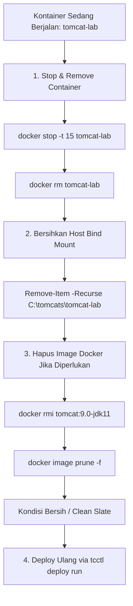

# Panduan Lengkap Siklus Hidup Deployment, Operasi, dan Pembersihan Kontainer Tomcat dengan tcctl

---
**Kategori:** Apache Tomcat Operations & DevOps Engineering  
**Target Platform:** Windows Server 2022 (NanoServer Container), Docker Engine  
**Tooling:** `tcctl` (Universal CLI), PowerShell, Docker CLI, Gitea Container Registry  
**Audience:** Platform Engineer, DevOps Engineer, System Administrator  
---

## 1. Ikhtisar Arsitektur Siklus Hidup

Panduan ini mendokumentasikan seluruh siklus hidup operasional (*end-to-end operational lifecycle*) kontainer Apache Tomcat Enterprise pada Windows Server 2022, mulai dari perakitan citra (*build image*), publikasi ke container registry, deployment terisolasi berbasis host bind-mount melalui `tcctl`, pengujian audit keamanan CIS, inspeksi sertifikat TLS PKCS#12, hingga prosedur detail **penghapusan, pembersihan resource (`docker rm`, `docker rmi`), dan pengulangan dari awal (*reset & repeat*)**.

```mermaid
flowchart TD
    subgraph Fase 1: Build & Registri
        A[Unduh Tomcat 9.0.98 & Setenv.bat] --> B[Docker Build Multi-Java NanoServer]
        B --> C[Push ke Gitea Registry via SSH Tunnel]
    end

    subgraph Fase 2: Provisioning & Deploy via tcctl
        C --> D["tcctl deploy run (Interaktif)"]
        D --> E["Buat Host Bind-Mount C:\tomcats\<instance> [bin, conf, webapps, logs]"]
        E --> F["Auto-seed setenv.bat, Seed XML & Bootstrap PKCS#12"]
        F --> G["Pre-flight CATALINA_OPTS Ingestion & CIS Static Audit"]
        G --> H["Launch Container & HTTP/HTTPS Health Probe"]
        H --> I["Display Runtime Environment (Tomcat & JDK Version)"]
    end

    subgraph Fase 3: Operasi, JVM Tuning & Rollout
        I --> J["Kustomisasi JVM Heap di setenv.bat (Host)"]
        J --> K["Zero-Downtime Rollout (tcctl deploy rollout)"]
        K --> L["tcctl hardening audit (9/9 CIS Rules)"]
        K --> M["tcctl ssl check (Keystore Expiry & SANs)"]
    end

    subgraph Fase 4: Teardown, Cleanup & Reset
        L & M --> N{"Ingin Ulang / Reset?"}
        N -->|Hapus Kontainer| O["docker stop & docker rm"]
        N -->|Hapus Direktori Host| P["Remove-Item C:\tomcats\<instance>"]
        N -->|Hapus Citra Docker| Q["docker rmi & docker image prune"]
        O & P & Q --> R["Clean Slate: Siap Deploy Ulang dari Nol"]
        R --> D
    end
```

---

## 2. Fase 1: Perakitan Citra Kontainer Multi-Java (Build Image)

Sebelum melakukan deployment, citra kontainer Apache Tomcat berbasis Windows NanoServer harus dibangun terlebih dahulu.

### 2.1 Persiapan Binary dan Konfigurasi JRE
Tomcat memerlukan konfigurasi `setenv.bat` agar mengenali direktori JRE Temurin (`C:\openjdk-<versi>`):

```powershell
# Buat direktori build
New-Item -ItemType Directory -Force -Path "C:\build"
Set-Location "C:\build"

# Pastikan folder tomcat hasil ekstraksi Apache Tomcat 9.0.98 tersedia di C:\build\tomcat
# Buat setenv.bat di C:\build\tomcat\bin\setenv.bat
@'
rem Set JRE_HOME to JAVA_HOME for Temurin JRE compatibility
if not "%JAVA_HOME%" == "" set "JRE_HOME=%JAVA_HOME%"
set "JAVA_HOME="
'@ | Out-File -FilePath "C:\build\tomcat\bin\setenv.bat" -Encoding ascii
```

### 2.2 Dockerfile Multi-Java
Gunakan sintaks path garis miring (*forward slash*) `WORKDIR C:/usr/local/tomcat` untuk menghindari isu escape backslash pada Windows NanoServer:

```dockerfile
# C:\build\Dockerfile
ARG JAVA_TAG=11-jre-nanoserver-ltsc2022
FROM eclipse-temurin:${JAVA_TAG}

ENV CATALINA_HOME="C:\usr\local\tomcat"
WORKDIR C:/usr/local/tomcat

# Salin direktori tomcat yang telah disiapkan
COPY tomcat .

EXPOSE 8080 8443
CMD ["bin\\catalina.bat", "run"]
```

### 2.3 Membangun Citra Kontainer
Jalankan kompilasi untuk Java 11, 17, dan 21:

```powershell
# Build varian Java 11
docker build --build-arg JAVA_TAG=11-jre-nanoserver-ltsc2022 -t tomcat:9.0-jdk11 .

# Build varian Java 17
docker build --build-arg JAVA_TAG=17-jre-nanoserver-ltsc2022 -t tomcat:9.0-jdk17 .

# Build varian Java 21
docker build --build-arg JAVA_TAG=21-jre-nanoserver-ltsc2022 -t tomcat:9.0-jdk21 .
```

### 2.4 Verifikasi Versi Citra secara Offline
Pastikan citra dapat berjalan dan mengeluarkan versi Tomcat dan JDK:

```powershell
docker run --rm tomcat:9.0-jdk11 cmd /c "bin\catalina.bat version"
```

---

## 3. Fase 2: Publikasi ke OCI Registry Gitea

Jika menggunakan Gitea OCI Registry privat di jaringan lab via SSH Reverse Tunnel (`localhost:3000`):

```powershell
# 1. Login ke registri
docker login localhost:3000 -u gitadm -p "PasswordGitadm"

# 2. Tag citra untuk Gitea
docker tag tomcat:9.0-jdk11 localhost:3000/gitadm/tomcat:9.0-jdk11
docker tag tomcat:9.0-jdk17 localhost:3000/gitadm/tomcat:9.0-jdk17
docker tag tomcat:9.0-jdk21 localhost:3000/gitadm/tomcat:9.0-jdk21

# 3. Push ke registri
docker push localhost:3000/gitadm/tomcat:9.0-jdk11
docker push localhost:3000/gitadm/tomcat:9.0-jdk17
docker push localhost:3000/gitadm/tomcat:9.0-jdk21
```

---

## 4. Fase 3: Deployment Otomatis dengan `tcctl`

Deployment dilakukan menggunakan operator CLI `tcctl.exe` yang menerapkan standar arsitektur **TC-ADR-0009** (Pemisahan Drive & Host Bind-Mount).

### 4.1 Menjalankan Deployment Interaktif
Jalankan perintah berikut:

```powershell
C:\Users\Administrator\tcctl.exe deploy run --name tomcat-lab --port 8080 --https-port 8443
```

Operator akan disuguhkan menu pemilihan citra otomatis dari registri lokal:
```text
ℹ Discovered available Tomcat / Java images in local container repository:
   [1] tomcat:9.0-jdk11
   [2] eclipse-temurin:21-jre-nanoserver-ltsc2022
   [3] localhost/tomcat:9.0-jdk21
   [4] eclipse-temurin:17-jre-nanoserver-ltsc2022
   [5] localhost/tomcat:9.0-jdk17
   [6] eclipse-temurin:11-jre-nanoserver-ltsc2022
 Select image to deploy [1-6] (default: 1): 1
✔ Selected image: tomcat:9.0-jdk11
```

### 4.2 Alur Otomatis yang Dilakukan `tcctl`
1. **Host Bind-Mount Provisioning (TC-ADR-0009 / TC-ADR-0010)**:
   - Mempersiapkan hierarki folder di `C:\tomcats\tomcat-lab\[bin, conf, webapps, logs, conf\ssl]`.
2. **Auto-Seeding `setenv.bat` & Pre-Flight Ingestion `CATALINA_OPTS` (TC-ADR-0010)**:
   - Otomatis men-generate template `C:\tomcats\tomcat-lab\bin\setenv.bat` (dan `setenv.sh`) dengan opsi container-aware:
     ```cmd
     set "CATALINA_OPTS=-XX:MaxRAMPercentage=75.0 -XX:InitialRAMPercentage=50.0 -XX:+UseG1GC -XX:+UseStringDeduplication -Dfile.encoding=UTF-8 -Duser.timezone=Asia/Jakarta -Djava.awt.headless=true"
     ```
   - `tcctl` mengekstrak opsi `CATALINA_OPTS` dari file host sebelum kontainer diluncurkan dan menginjeksikannya via variabel lingkungan (`-e CATALINA_OPTS=...`), serta me-mount `bin/` ke `C:\usr\local\tomcat\bin\custom:ro` untuk menjaga biner internal Tomcat dari *directory shadowing*.
3. **Bootstrapping Keystore PKCS#12**:
   - Otomatis men-generate self-signed keystore `C:\tomcats\tomcat-lab\conf\ssl\keystore.p12` (password default: `changeit`).
   - Mengekspor format PEM ganda (`cert.pem`, `server.crt`) untuk kemudahan inspeksi tooling eksternal.
4. **Hardened XML Seeding & Auto-Detection**:
   - Menyuntikkan template XML hardened CIS Benchmark ke `C:\tomcats\tomcat-lab\conf\`.
   - Mengonfigurasi `server.xml` untuk membaca `conf/ssl/keystore.p12` dengan protokol TLSv1.2 dan TLSv1.3.
5. **Pre-flight Static CIS XML Audit**:
   - Memindai konfigurasi XML di host sebelum kontainer diluncurkan (harus 100% compliant).
6. **Peluncuran Kontainer Docker**:
   - Menjalankan kontainer dengan user `ContainerUser`.
   - Melakukan bind-mount `conf/` sebagai **Read-Only (`:ro`)** demi mencegah perubahan konfigurasi tak sah saat runtime.
7. **Healthcheck & Runtime Environment Reporting**:
   - Memverifikasi HTTP endpoint `http://localhost:8080/`.
   - Mengekstrak versi Tomcat dan JDK/JVM langsung dari log kontainer (`VersionLoggerListener`).

**Tampilan Deploy Result Summary:**
```text
========================================================
 Deploying Hardened Tomcat Container: tomcat-lab
========================================================
ℹ Detected Container Engine: docker
ℹ Step 1: Preparing Host Bind-Mount Directory Structure in C:/tomcats/tomcat-lab...
✔ Environment configuration templates (setenv) verified in 'C:/tomcats/tomcat-lab/bin'.
ℹ Step 2: Auditing XML in Host Directory (C:/tomcats/tomcat-lab/conf)...
✔ Pre-flight XML audit on Host Directory passed (100% compliant).
ℹ Loaded JVM options from host setenv (C:/tomcats/tomcat-lab/bin): -XX:MaxRAMPercentage=75.0 -XX:InitialRAMPercentage=50.0 -XX:+UseG1GC -XX:+UseStringDeduplication -Dfile.encoding=UTF-8 -Duser.timezone=Asia/Jakarta -Djava.awt.headless=true
ℹ Step 3: Launching container 'tomcat-lab' (image: tomcat:9.0-jdk11) via docker...
✔ Container started successfully (ID: 2041af9c8135)
ℹ Step 4: Probing HTTP healthcheck endpoint: http://localhost:8080/
✔ Tomcat HTTP Server is HEALTHY (Response status: 404)
✔ HTTP healthcheck probe passed.
✔ Tomcat instance 'tomcat-lab' is up, running, and fully hardened!

 Runtime Environment:
   - Container Image : tomcat:9.0-jdk11
   - Tomcat Version  : Apache Tomcat/9.0.98
   - Java / JDK      : 11.0.32+9 (Eclipse Adoptium)

 Endpoints:
   - HTTP    : http://localhost:8080/
   - HTTPS   : https://localhost:8443/

 Host Bind Mounts (TC-ADR-0009):
   - Base Dir : C:/tomcats
   - Bin      : C:/tomcats/tomcat-lab/bin (Environment & setenv)
   - Conf     : C:/tomcats/tomcat-lab/conf (Read-Only :ro)
   - Webapps  : C:/tomcats/tomcat-lab/webapps
   - Logs     : C:/tomcats/tomcat-lab/logs
```

---

## 5. Fase 4: Tata Kelola Memori Java (JVM Tuning) & Zero-Downtime Rollout

Bagian ini menjelaskan cara administrator mengubah konfigurasi memori Java (Heap Size, GC, Timezone) dan menerapkannya ke produksi tanpa *downtime* menggunakan `tcctl deploy rollout`.

### 5.1 Menyesuaikan Parameter Java pada Host (`setenv.bat`)
Administrator tidak perlu masuk ke dalam kontainer atau me-rebuild citra Docker. Cukup buka dan edit berkas `setenv.bat` pada host:

```powershell
# Lokasi berkas konfigurasi environment di host:
C:\tomcats\tomcat-lab\bin\setenv.bat
```

**Contoh Modifikasi Kustom (Menambah Heap & Custom Properties):**
```cmd
@echo off
rem ==============================================================================
rem Apache Tomcat Environment Configuration (Auto-generated by tcctl)
rem ==============================================================================

if not "%JAVA_HOME%" == "" set "JRE_HOME=%JAVA_HOME%"
set "JAVA_HOME="

if "%CATALINA_OPTS%" == "" (
    set "CATALINA_OPTS=-XX:MaxRAMPercentage=80.0 -XX:InitialRAMPercentage=50.0 -XX:+UseG1GC -XX:+UseStringDeduplication -Dcustom.property=prod-value -Dfile.encoding=UTF-8 -Duser.timezone=Asia/Jakarta -Djava.awt.headless=true"
)
```

> [!TIP]
> **Mengapa `-XX:MaxRAMPercentage` Sangat Direkomendasikan?**  
> Pada kontainer, penggunaan nilai tetap seperti `-Xmx2g` berisiko memicu *Out Of Memory Killer (OOM)* jika batas memori kontainer diubah. Dengan `-XX:MaxRAMPercentage=75.0` atau `80.0`, JVM secara cerdas menyesuaikan ukuran heap secara proporsional terhadap batas memori Docker container (`--memory`).

### 5.2 Menerapkan Perubahan melalui Zero-Downtime Rollout (`tcctl deploy rollout`)
Untuk menerapkan opsi JVM baru atau memperbarui versi citra Tomcat/Java tanpa downtime:

```powershell
C:\Users\Administrator\tcctl.exe deploy rollout `
  --name tomcat-lab `
  --image tomcat:9.0-jdk21 `
  --port 8080 `
  --staging-port 9080 `
  --base-dir C:/tomcats
```

**Alur Otomatis yang Terjadi:**
1. **Host Configuration Cloned**: `tcctl` menyalin seluruh isi `bin/` (termasuk `setenv.bat` yang sudah Anda edit) dan `conf/` ke direktori sementara `C:\tomcats\tomcat-lab-staging\`.
2. **Launch Staging Container**: Menjalankan kontainer sementara `tomcat-lab-staging` pada port 9080 dengan citra baru (`tomcat:9.0-jdk21`) dan memuat `CATALINA_OPTS` kustom.
3. **Health Probe Verification**: Memastikan kontainer staging merespons HTTP probe port 9080 secara sehat (*200 OK / 404 Healthy*).
4. **Atomic Promotion & Drain**: Menghentikan kontainer lama pada port 8080 dan mempromosikan versi baru ke nama kanonikal `tomcat-lab` di port primer 8080.
5. **Ephemeral Staging Cleanup**: Direktori sementara `C:\tomcats\tomcat-lab-staging` otomatis dihapus dari host sehingga filesystem tetap bersih.

**Verifikasi Hasil di dalam Container:**
```powershell
docker exec tomcat-lab cmd /c "echo %CATALINA_OPTS%"
```

---

## 6. Fase 5: Verifikasi Operasional & Audit Keamanan


### 5.1 Audit Hardening CIS Benchmark
Untuk memverifikasi kepatuhan seluruh aturan keamanan XML Tomcat kapan saja:

```powershell
C:\Users\Administrator\tcctl.exe hardening audit --conf C:\tomcats\tomcat-lab\conf
```

**Hasil Pengujian:**
- 9 Passed, 0 Failed (100% Lolos CIS Apache Tomcat Benchmark).
- Memastikan shutdown port TCP nonaktif (`-1`), banner server disamarkan, HTTP TRACE dinonaktifkan, proteksi CSRF SameSite aktif, dan HttpOnly aktif.

### 5.2 Inspeksi Masa Berlaku Keystore PKCS#12
Periksa status sertifikat TLS yang terpasang pada instance:

```powershell
C:\Users\Administrator\tcctl.exe ssl check --cert C:\tomcats\tomcat-lab\conf\ssl\keystore.p12
```

Atau dalam format JSON untuk integrasi monitoring:
```powershell
C:\Users\Administrator\tcctl.exe ssl check --cert C:\tomcats\tomcat-lab\conf\ssl\keystore.p12 --json
```

### 5.3 Memasang Sertifikat Sendiri (Commercial / Corporate CA)
Jika memiliki sertifikat PKCS#12 (`.p12` / `.pfx`) resmi dari CA perusahaan:

```powershell
C:\Users\Administrator\tcctl.exe ssl setup `
  --keystore "C:\certs\production.p12" `
  --password "PasswordKeystore" `
  --out-dir "C:\tomcats\tomcat-lab\conf\ssl" `
  --server-xml "C:\tomcats\tomcat-lab\conf\server.xml"

# Restart container agar sertifikat baru aktif
docker restart tomcat-lab
```

---

## 7. Fase 6: Prosedur Lengkap Teardown, Pembersihan (Cleanup), Reset & Mengulang

Bagian ini menjelaskan secara rinci cara menghentikan kontainer, membersihkan direktori data host, menghapus citra Docker (`docker rmi`), serta mengulang deployment dari awal secara bersih (*clean slate*).



### 7.1 Menghentikan dan Menghapus Kontainer (`docker stop` & `docker rm`)

Sebelum menghapus file bind-mount di host, **kontainer wajib dihentikan dan dihapus terlebih dahulu** agar proses kontainer melepaskan kunci file (*file lock*) pada Windows NTFS.

#### Langkah 1: Menghentikan Kontainer secara Graceful
Beri waktu toleransi 15 detik bagi Tomcat untuk menyelesaikan request aktif dan shutdown secara rapi:

```powershell
docker stop -t 15 tomcat-lab
```

#### Langkah 2: Menghapus Kontainer
Setelah kontainer berstatus `Exited`:

```powershell
docker rm tomcat-lab
```

> [!TIP]
> **Cara Cepat (Force Stop & Remove):**  
> Jika ingin langsung mematikan dan menghapus kontainer dalam satu perintah:
> ```powershell
> docker rm -f tomcat-lab
> ```

#### Langkah 3: Verifikasi Penghapusan Kontainer
Pastikan kontainer sudah tidak terdaftar di sistem:

```powershell
docker ps -a --filter "name=tomcat-lab"
# Output harus kosong (hanya menyisakan baris header)
```

---

### 7.2 Membersihkan Direktori Host Bind-Mount (`C:\tomcats\<instance>`)

Setelah kontainer terhapus, direktori data pada host dapat dibersihkan.

#### Opsi 1: Menghapus Seluruh Instance (Total Reset)
Gunakan opsi ini jika ingin menghapus seluruh data termasuk konfigurasi, sertifikat SSL, aplikasi webapps, file log, dan pengaturan JVM `bin/`:

```powershell
Remove-Item -Recurse -Force "C:\tomcats\tomcat-lab"
```

#### Opsi 2: Mereset Konfigurasi & SSL Saja (Mempertahankan Log dan Webapps)
Jika Anda hanya ingin memperbarui konfigurasi XML dan me-regenerate keystore PKCS#12 tanpa menghapus log dan webapps yang sudah ada:

```powershell
Remove-Item -Recurse -Force "C:\tomcats\tomcat-lab\conf"
```
*(Saat `tcctl deploy run` dijalankan kembali, folder `conf/` dan `conf/ssl/` akan di-seed ulang secara otomatis).*

---

### 7.3 Menghapus Citra Kontainer Docker (`docker rmi`)

Menghapus citra kontainer diperlukan saat Anda memperbarui Dockerfile, mengganti versi Java dasar, atau ingin menghemat kapasitas disk pada drive Windows.

#### Langkah 1: Melihat Daftar Citra Tomcat Lokal
```powershell
docker images "tomcat*"
docker images "*temurin*"
```

#### Langkah 2: Menghapus Citra Tertentu
Hapus citra lokal berdasarkan nama tag atau Image ID:

```powershell
# Menghapus citra lokal
docker rmi tomcat:9.0-jdk11

# Menghapus citra yang memiliki tag registri Gitea
docker rmi localhost:3000/gitadm/tomcat:9.0-jdk11
```

> [!WARNING]
> Jika muncul error:
> `Error response from daemon: conflict: unable to remove repository reference ... (must be forced) - container <id> is using its referenced image`  
> Artinya masih ada kontainer (baik berjalan maupun mati) yang menggunakan citra tersebut. Hapus kontainer terlebih dahulu menggunakan `docker rm -f <container_name>` sebelum menjalankan `docker rmi`.

#### Langkah 3: Menghapus Seluruh Citra Tomcat Sekaligus
Jika ingin menghapus seluruh varian Tomcat lokal dalam satu baris PowerShell:

```powershell
Get-ChildItem -Path Env: | Out-Null # Refresh env
docker images "tomcat*" -q | ForEach-Object { docker rmi -f $_ }
```

#### Langkah 4: Membersihkan Lapisan Builder & Dangling Layers (`docker image prune`)
Saat melakukan `docker build` berulang kali, terbentuk lapisan intermediate (*dangling images* bertanda `<none>`):

```powershell
# Hapus semua dangling images
docker image prune -f

# Hapus build cache yang memakan ruang disk
docker builder prune -f
```

---

### 7.4 Skrip Otomasi Reset Penuh & Uji Ulang (All-in-One Reset Script)

Salin dan jalankan skrip PowerShell berikut jika Anda ingin mereset lingkungan lab secara total dan mengulang deployment dari kondisi nol (*clean slate*):

```powershell
# ========================================================
# Script: Reset-TomcatLab.ps1
# Deskripsi: Membersihkan container, data bind-mount, dan redeploy
# ========================================================

$InstanceName = "tomcat-lab"
$BasePath     = "C:\tomcats\$InstanceName"

Write-Host "--- 1. Menghentikan dan Menghapus Container: $InstanceName ---" -ForegroundColor Yellow
docker rm -f $InstanceName 2>$null

Write-Host "--- 2. Membersihkan Direktori Bind-Mount: $BasePath ---" -ForegroundColor Yellow
if (Test-Path $BasePath) {
    Remove-Item -Recurse -Force $BasePath
    Write-Host "Direktori $BasePath berhasil dihapus." -ForegroundColor Green
} else {
    Write-Host "Direktori $BasePath sudah bersih." -ForegroundColor Cyan
}

Write-Host "--- 3. Memverifikasi Status Bersih ---" -ForegroundColor Yellow
docker ps -a --filter "name=$InstanceName"

Write-Host "--- 4. Melakukan Deploy Ulang Bersih via tcctl ---" -ForegroundColor Yellow
C:\Users\Administrator\tcctl.exe deploy run `
  --name $InstanceName `
  --port 8080 `
  --https-port 8443 `
  --image "tomcat:9.0-jdk11"

Write-Host "--- Siklus Reset & Re-deploy Selesai! ---" -ForegroundColor Green
```

---

## 8. Troubleshooting & Kendala Umum (FAQ)

### 1. Error: `port is already allocated` saat Deploy Ulang
- **Penyebab**: Kontainer sebelumnya belum dihapus atau port 8080/8443 masih digunakan oleh proses Windows lain.
- **Solusi**:
  ```powershell
  # Cek kontainer lama yang masih menahan port
  docker ps --filter "publish=8080"
  docker rm -f <container_id>

  # Cek proses lokal host yang mendengarkan di port 8080
  Get-NetTCPConnection -LocalPort 8080 -ErrorAction SilentlyContinue
  ```

### 2. Error: `the working directory 'C:usrlocaltomcat' is invalid` saat Build
- **Penyebab**: Dockerfile Windows menginterpretasikan backslash `\u` sebagai escape sequence.
- **Solusi**: Gunakan garis miring forward slash pada Dockerfile: `WORKDIR C:/usr/local/tomcat`.

### 3. Error: `The specified JRE_HOME could not be found` saat Kontainer Start
- **Penyebab**: Apache Tomcat script `catalina.bat` mencari variabel `JRE_HOME`, sedangkan image Temurin mendefinisikan `JAVA_HOME`.
- **Solusi**: Tambahkan `C:\build\tomcat\bin\setenv.bat` yang menyalin nilai `JAVA_HOME` ke `JRE_HOME` sebelum kontainer di-build.

### 4. File Lock saat Menghapus Direktori `C:\tomcats\tomcat-lab`
- **Penyebab**: Mencoba menjalankan `Remove-Item` ketika kontainer masih berstatus running.
- **Solusi**: Pastikan selalu mengeksekusi `docker rm -f tomcat-lab` sebelum menghapus folder di host.

---

## 9. Ringkasan Perintah Penting (Cheat Sheet)

| Kebutuhan Operasional | Perintah PowerShell / Docker |
|---|---|
| **Deploy Instance** | `tcctl.exe deploy run --name tomcat-lab --port 8080 --https-port 8443` |
| **Edit JVM Heap / Options** | `notepad C:\tomcats\tomcat-lab\bin\setenv.bat` |
| **Zero-Downtime Rollout** | `tcctl.exe deploy rollout --name tomcat-lab --image tomcat:9.0-jdk21 --port 8080 --staging-port 9080` |
| **Cek Active CATALINA_OPTS** | `docker exec tomcat-lab cmd /c "echo %CATALINA_OPTS%"` |
| **Audit Hardening (CIS)** | `tcctl.exe hardening audit --conf C:\tomcats\tomcat-lab\conf` |
| **Audit Compliance (JSON)** | `tcctl.exe va audit --conf C:\tomcats\tomcat-lab\conf --json report.json` |
| **Cek Sertifikat (PKCS#12)** | `tcctl.exe ssl check --cert C:\tomcats\tomcat-lab\conf\ssl\keystore.p12` |
| **Stop Kontainer** | `docker stop -t 15 tomcat-lab` |
| **Hapus Kontainer (Force)** | `docker rm -f tomcat-lab` |
| **Hapus Host Data** | `Remove-Item -Recurse -Force C:\tomcats\tomcat-lab` |
| **Hapus Image Tertentu** | `docker rmi tomcat:9.0-jdk11` |
| **Prune Dangling Images** | `docker image prune -f` |
| **Prune Build Cache** | `docker builder prune -f` |
| **Lihat Log Kontainer** | `docker logs -f tomcat-lab` |
| **Lihat Log Versi Tomcat** | `docker logs tomcat-lab \| Select-String "Server version", "JVM Version"` |

