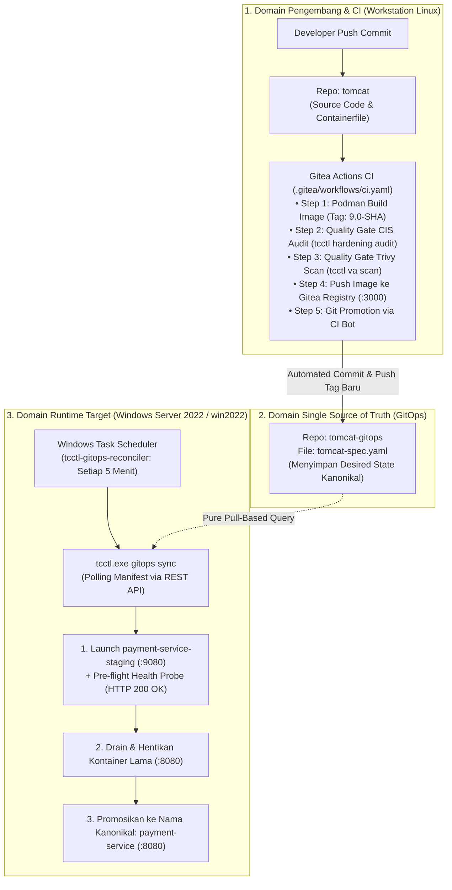
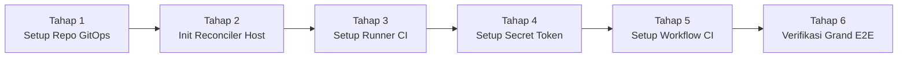

# Panduan Implementasi Pure Pull-Based GitOps dan Otomasi CI Promotion Apache Tomcat Enterprise

---
**Kategori:** Apache Tomcat GitOps & CI/CD Automation  
**Target Pembaca:** DevOps Engineer, Platform Engineer, System Administrator, Site Reliability Engineer (SRE)  
**Tools:** `tcctl` (Universal CLI Operator), Gitea Server, Gitea Actions (`act_runner`), Podman/Docker, Windows Task Scheduler / systemd  
**Lingkungan Target:** Workstation Linux (`edkas-pc1`), Target Node Windows Server 2022 (`win2022`), Gitea OCI Registry  
**Dokumen Desain Rujukan:** [TN-004](../../projects/tomcat/engineering-journal/platform-foundation-and-hardening/TN-004-design-pure-pull-based-gitops-temporary-staging-rollout-and-self-destructing-bootstrap.md), [TC-ADR-0006](../../adr/tomcat/adr-records/TC-ADR-0006.md), [TC-ADR-0007](../../adr/tomcat/adr-records/TC-ADR-0007.md), [TC-ADR-0010](../../adr/tomcat/adr-records/TC-ADR-0010.md)  
---

## 1. Pendahuluan & Gambaran Arsitektur

### 1.1 Masalah pada Model CI/CD Tradisional (Push-Based via SSH / Ansible)
Pada model deployment konvensional, server CI (seperti Jenkins) atau Ansible Controller memegang kendali penuh dengan melakukan push langsung ke server target:
1. **Risiko Keamanan Kredensial (*Broad Blast Radius*)**: Server CI harus menyimpan kunci SSH / Administrator ke seluruh server target produksi. Jika server CI diretas, seluruh armada VM dapat dikuasai seketika.
2. **Kewajiban Membuka Port Inbound**: Setiap server produksi wajib membuka port SSH (22) atau WinRM (5985/5986) ke arah server CI, memperluas bidang serangan jaringan (*inbound attack surface*).
3. **Ketiadaan Pemulihan Mandiri (*No Continuous Self-Healing*)**: Model push hanya berjalan saat ada trigger rilis. Jika kontainer mati atau konfigurasi dirusak di luar jam rilis, tidak ada sistem yang memperbaikinya secara otomatis.

### 1.2 Solusi: Pure Pull-Based GitOps & Closed-Loop CI
Arsitektur **Pure Pull-Based GitOps** membalik pola tersebut sesuai standar CNCF OpenGitOps:
* **Zero Inbound Network Footprint**: Server target tidak membuka port SSH inbound sama sekali. Seluruh komunikasi bersifat *outbound HTTPS pull* ke repositori Git dan Container Registry.
* **Continuous Self-Healing**: Target host menjalankan reconciler lokal (`tcctl gitops sync`) secara berkala. Jika ada perbedaan antara status kontainer fisik dengan manifes Git (*drift*), kontainer diperbaiki secara mandiri.
* **Temporary Staging Rollout**: Pembaruan kontainer menggunakan kontainer sementara (`<name>-staging` di port 9080) dengan validasi *health probe* sebelum dipromosikan ke nama kanonikal (`<name>` di port 8080), menjamin rilis tanpa downtime (*zero-downtime*).
* **Automated CI Promotion**: Pipeline CI (Gitea Actions) mengotomasi tahapan build, audit kepatuhan CIS Benchmark, pemindaian kerentanan Trivy, dan meng-update tag versi pada repositori GitOps secara otomatis.



---

## 2. Struktur dan Pemisahan Peran 3 Repositori

Untuk menghindari percampuran tanggung jawab, arsitektur ini membagi sistem ke dalam 3 repositori terpisah:

| Nama Repositori | URL Gitea | Peran & Tanggung Jawab | Pemilik / Aktor |
|---|---|---|---|
| **`tomcat`** | `http://localhost:3000/gitadm/tomcat.git` | Menyimpan `Containerfile`, konfigurasi XML Tomcat (`conf/`), dependency JMX agent, dan workflow CI. | Tim Pengembang Aplikasi & Middleware |
| **`tomcat-gitops`** | `http://localhost:3000/gitadm/tomcat-gitops.git` | Menyimpan spesifikasi deklaratif kanonikal [`tomcat-spec.yaml`](file:///home/eddywiyatno/git/tomcat-gitops/tomcat-spec.yaml). Menjadi satu-satunya acuan kondisi sistem (*Single Source of Truth*). | Diupdate otomatis oleh **Gitea CI Bot**, dikontrol oleh SRE |
| **`tcctl`** | `http://localhost:3000/gitadm/tcctl.git` | Menyimpan kode biner perkakas operator Go (`tcctl`). Digunakan oleh CI (audit & scan) dan server target (reconciler). | Platform Core / DevOps Tools Team |

---

## 3. Langkah Implementasi

Berikut tahapan implementasi dari awal hingga sistem berjalan secara penuh:



---

### Tahap 1: Menyiapkan Repositori Deklaratif (`tomcat-gitops`)

1. Buat repositori baru bernama `tomcat-gitops` di Gitea (akun `gitadm`).
2. Susun file spesifikasi deklaratif kanonikal bernama `tomcat-spec.yaml`:

```yaml
version: "1.0"
metadata:
  application: "payment-service"
  environment: "production"
  tier: "backend"

spec:
  image:
    repository: "tomcat"
    tag: "9.0-jdk21"
    pullPolicy: "IfNotPresent"

  runtime:
    containerName: "payment-service"
    httpPort: 8080
    stagingPort: 9080
    httpsPort: 8443

  healthCheck:
    path: "/"
    expectedStatus: 200
    timeoutSeconds: 60

  autoRollback: true
```

3. Lakukan commit dan push ke remote Gitea:
```bash
git init
git add tomcat-spec.yaml
git commit -m "feat(gitops): initial declarative specification for payment-service"
git branch -M main
git remote add origin http://localhost:3000/gitadm/tomcat-gitops.git
git push -u origin main
```

---

### Tahap 2: Menyiapkan Reconciler Otonom di Server Target (Windows Server)

Langkah ini dilakukan di target host (Windows Server 2019/2022) yang sudah terpasang Docker Container Engine:

1. **Pastikan Biner `tcctl.exe` Terpasang**:
   Letakkan biner pada path standar `C:\Program Files\tcctl\tcctl.exe` dan daftarkan ke System PATH.
   ```powershell
   # Verifikasi biner
   & "C:\Program Files\tcctl\tcctl.exe" version
   ```

2. **Inisialisasi Lingkungan GitOps (`gitops init`)**:
   Jalankan perintah inisialisasi dengan flag `--timer` untuk mendaftarkan jadwal otomatisasi:
   ```powershell
   tcctl.exe gitops init --repo http://localhost:3000/gitadm/tomcat-gitops.git --branch main --timer
   ```
   *Perintah ini secara otomatis:*
   - Membuat direktori kerja standar `C:\Program Files\tcctl\gitops\`.
   - Mengunduh manifes `tomcat-spec.yaml` via Gitea REST API.
   - Mendaftarkan Windows Scheduled Task bernama `tcctl-gitops-reconciler` dengan interval eksekusi setiap 5 menit.

3. **Verifikasi Scheduled Task di Windows**:
   ```powershell
   Get-ScheduledTask -TaskName 'tcctl-gitops-reconciler'
   # Status harus menampilkan: Ready
   ```

4. **Jalankan Sinkronisasi Perdana (Initial Declarative Sync)**:
   ```powershell
   tcctl.exe gitops sync --work-dir 'C:/Program Files/tcctl/gitops'
   ```
   *Hasil:* Kontainer `payment-service` aktif pada port 8080 (HTTP) dan 8443 (HTTPS), template XML CIS hardened terinjeksi, dan sertifikat self-signed PKCS#12 SSL terbentuk di `C:\tomcats\payment-service\conf\ssl`.

---

### Tahap 3: Menyiapkan Runner Gitea Actions (`act_runner`) di Workstation Linux

1. **Aktifkan Fitur Actions di Konfigurasi Gitea**:
   Buka file konfigurasi Gitea (`app.ini`) pada host server Gitea:
   ```ini
   [actions]
   ENABLED = true
   ```
   Restart kontainer Gitea: `podman restart gitea`.

2. **Unduh Biner `act_runner`**:
   ```bash
   mkdir -p /home/eddywiyatno/devops-lab/act-runner
   cd /home/eddywiyatno/devops-lab/act-runner

   curl -L -o act_runner https://dl.gitea.com/gitea-runner/4.0.0/gitea-runner-4.0.0-linux-amd64
   chmod +x act_runner
   ```

3. **Konfigurasikan Runner dalam Host Execution Mode**:
   Buat file `/home/eddywiyatno/devops-lab/act-runner/config.yaml`:
   ```yaml
   log:
     level: info

   runner:
     file: .runner
     capacity: 1
     timeout: 3h
     shutdown_timeout: 0s
     labels:
       - "ubuntu-latest:host"
       - "linux-amd64:host"

   host:
     workdir_parent: /home/eddywiyatno/devops-lab/act-runner/workdir
   ```
   > **Alasan Memilih Host Mode (`:host`)**: Menghilangkan kebutuhan Docker-in-Docker (DinD). Runner dapat langsung menggunakan biner `tcctl`, `podman`, `git`, dan `trivy` yang sudah terpasang di host Linux lokal.

4. **Daftarkan Runner ke Gitea**:
   Ambil token registrasi runner dari container Gitea:
   ```bash
   TOKEN=$(podman exec -u git gitea gitea actions generate-runner-token)

   ./act_runner register \
     --instance http://localhost:3000 \
     --token "${TOKEN}" \
     --no-interactive \
     --name edkas-runner \
     --config config.yaml
   ```

5. **Jalankan Runner sebagai Background Service (`systemd --user`)**:
   Buat file `~/.config/systemd/user/act_runner.service`:
   ```ini
   [Unit]
   Description=Gitea Actions Runner
   After=network.target

   [Service]
   Type=simple
   WorkingDirectory=/home/eddywiyatno/devops-lab/act-runner
   ExecStart=/home/eddywiyatno/devops-lab/act-runner/act_runner daemon -c /home/eddywiyatno/devops-lab/act-runner/config.yaml
   Restart=always
   RestartSec=5
   Environment=PATH=/home/eddywiyatno/bin:/home/eddywiyatno/.local/bin:/usr/local/sbin:/usr/local/bin:/usr/sbin:/usr/bin:/sbin:/bin

   [Install]
   WantedBy=default.target
   ```
   Aktifkan dan nyalakan service:
   ```bash
   systemctl --user daemon-reload
   systemctl --user enable --now act_runner.service
   systemctl --user status act_runner.service
   ```

---

### Tahap 4: Mengonfigurasi Secret Promosi Lintas Repositori

Default token bawaan pipeline (`${{ secrets.GITHUB_TOKEN }}`) hanya memiliki izin tulis ke repositori yang sedang menjalankan workflow (`tomcat`). Agar pipeline dapat melakukan push commit ke repositori `tomcat-gitops`, kita memerlukan Personal Access Token (PAT):

1. Buat token akses pada akun Gitea `gitadm`:
   * Masuk ke Gitea Web UI $\rightarrow$ **Settings** $\rightarrow$ **Applications** $\rightarrow$ **Generate New Token**.
   * Beri nama: `gitops-ci-promotion-token` dengan cakupan hak akses repository `write`.
2. Daftarkan token tersebut sebagai Secret di repositori **`tomcat`**:
   * Buka repositori `tomcat` $\rightarrow$ **Settings** $\rightarrow$ **Actions** $\rightarrow$ **Secrets**.
   * Tambahkan Secret baru:
     - **Name**: `GITOPS_PUSH_TOKEN`
     - **Value**: *(masukkan string token yang dihasilkan)*

---

### Tahap 5: Menyusun Pipeline CI Otomatis (`.gitea/workflows/ci.yaml`)

Buat file alur kerja CI pada repositori `tomcat` di lokasi `.gitea/workflows/ci.yaml`:

```yaml
name: Apache Tomcat CI & Automated GitOps Promotion

on:
  push:
    branches:
      - main
      - lab
    paths-ignore:
      - '**.md'
      - '.gitignore'

jobs:
  build-and-promote:
    runs-on: ubuntu-latest
    steps:
      - name: Checkout Source Code
        uses: actions/checkout@v4

      - name: Set Image Metadata
        id: meta
        run: |
          SHORT_SHA=$(echo "${{ github.sha }}" | cut -c1-7)
          echo "tag=9.0-${SHORT_SHA}" >> "$GITHUB_OUTPUT"
          echo "image=localhost:3000/gitadm/tomcat:9.0-${SHORT_SHA}" >> "$GITHUB_OUTPUT"

      - name: Prepare Artifacts & Dependencies
        run: |
          mkdir -p .artifacts
          if [ ! -f .artifacts/jmx_prometheus_javaagent.jar ]; then
            if [ -f /home/eddywiyatno/git/tomcat/.artifacts/jmx_prometheus_javaagent.jar ]; then
              cp /home/eddywiyatno/git/tomcat/.artifacts/jmx_prometheus_javaagent.jar .artifacts/
            else
              curl -sL -o .artifacts/jmx_prometheus_javaagent.jar https://repo1.maven.org/maven2/io/prometheus/jmx/jmx_prometheus_javaagent/1.6.0/jmx_prometheus_javaagent-1.6.0.jar
            fi
          fi

      - name: Build Hardened Container Image
        run: |
          echo "Building container image: ${{ steps.meta.outputs.image }}"
          podman build \
            --build-arg PROJECT=tomcat \
            --build-arg VERSION=9.0 \
            -t "${{ steps.meta.outputs.image }}" \
            -f Containerfile .

      - name: "Quality Gate 1: CIS Hardening Audit"
        run: |
          echo "Executing CIS Benchmark 9 rules compliance audit via tcctl..."
          tcctl hardening audit --conf conf/

      - name: "Quality Gate 2: Vulnerability Assessment Scan"
        run: |
          echo "Scanning container image for High/Critical vulnerabilities via tcctl..."
          tcctl va scan \
            -image "${{ steps.meta.outputs.image }}" \
            -severity HIGH,CRITICAL \
            -report-only

      - name: Push Container Image to Internal Gitea Registry
        run: |
          echo "Pushing verified image to Gitea OCI Registry..."
          podman login --tls-verify=false -u gitadm -p "${{ secrets.GITOPS_PUSH_TOKEN }}" localhost:3000
          podman push --tls-verify=false "${{ steps.meta.outputs.image }}"

      - name: "Stage 5: Automated GitOps Promotion"
        run: |
          echo "Promoting new tag ${{ steps.meta.outputs.tag }} to tomcat-gitops..."
          git config --global user.name "Gitea CI Bot"
          git config --global user.email "ci-bot@localhost"

          git clone http://gitadm:${{ secrets.GITOPS_PUSH_TOKEN }}@localhost:3000/gitadm/tomcat-gitops.git gitops-workdir
          cd gitops-workdir

          # Update image tag di tomcat-spec.yaml
          sed -i -E 's/(tag: *")[^"]+(")/\1${{ steps.meta.outputs.tag }}\2/' tomcat-spec.yaml
          
          git diff tomcat-spec.yaml
          git commit -am "chore(deploy): promote payment-service to ${{ steps.meta.outputs.tag }} [skip ci]"
          git push origin main
```

Lakukan commit dan push file workflow ini ke repositori `tomcat`.

---

## 4. Skenario Operasional Sehari-hari

### Skenario 1: Rilis Aplikasi Baru (Otomasi Penuh)
1. Developer mengubah file konfigurasi atau kode di repositori `tomcat`, lalu melakukan push:
   ```bash
   git commit -am "feat: update tomcat application configuration"
   git push origin lab
   ```
2. **Apa yang Terjadi Otomatis?**:
   - Gitea Actions runner mengeksekusi pipeline.
   - Quality Gate 1 (`tcctl hardening audit`) memastikan konfigurasi XML tetap 100% compliant dengan CIS Benchmark.
   - Quality Gate 2 (`tcctl va scan`) memverifikasi citra bebas dari celah `HIGH` dan `CRITICAL`.
   - Citra di-push ke internal OCI Registry.
   - Gitea CI Bot melakukan commit dan push pembaruan tag baru ke repositori `tomcat-gitops`.
3. Reconciler di target host Windows Server mendeteksi commit baru tersebut pada siklus berikutnya, menjalankan temporary staging container di port 9080, mengetes health probe, dan mempromosikannya ke port 8080 tanpa downtime.

---

### Skenario 2: Simulasi Kegagalan & Pemulihan Mandiri (*Self-Healing*)
Jika kontainer produksi tiba-tiba mati atau tidak sengaja dihapus oleh operator:
1. Simulasikan insiden pada Windows Server:
   ```powershell
   docker stop payment-service
   ```
2. Reconciler pada siklus berikutnya (atau saat dijalankan `tcctl.exe gitops sync`) akan mencatat:
   ```text
   ⚠ Drift or Update Detected: Container is not running (stopped or missing)
   ```
3. Reconciler secara mandiri meluncurkan kembali kontainer sesuai spesifikasi di GitOps, memvalidasi health probe, dan mengembalikan status ke `SYNCED` dan `HEALTHY` tanpa campur tangan manusia.

---

### Skenario 3: Rollback Instan (Manual Override di GitOps)
Jika versi terbaru yang dirilis menimbulkan bug fungsional aplikasi:
1. Operator tidak perlu SSH ke server produksi.
2. Cukup buka repositori **`tomcat-gitops`**, edit [`tomcat-spec.yaml`](file:///home/eddywiyatno/git/tomcat-gitops/tomcat-spec.yaml), dan kembalikan tag image ke versi sebelumnya:
   ```yaml
   spec:
     image:
       tag: "9.0-jdk21"  # Tag versi stabil sebelumnya
   ```
3. Lakukan commit dan push ke branch `main`.
4. Target host otomatis mendeteksi perubahan tag dan melakukan rollback zero-downtime kembali ke versi stabil.

---

### Skenario 4: Memeriksa Status Reconciler & Ekspor Monitoring
Untuk melihat status terkini atau mengintegrasikannya dengan sistem monitoring eksternal (Prometheus/Telegraf/Zabbix):
```powershell
tcctl.exe gitops status --dir 'C:/Program Files/tcctl/gitops' --json-out 'C:/temp/gitops-status.json'
```
* **Konsol Terminal**: Menampilkan dashboard status Git, spesifikasi manifes, kondisi live kontainer, dan status Task Scheduler.
* **Berkas JSON**: Menghasilkan data terstruktur murni pada `C:/temp/gitops-status.json` yang siap dibaca oleh parser otomatis.

---

## 5. Panduan Pemecahan Masalah (Troubleshooting)

| Gejala Masalah | Kemungkinan Penyebab | Langkah Solusi |
|---|---|---|
| `http: server gave HTTP response to HTTPS client` saat push image di CI | Podman mencoba menghubungi Gitea Registry via HTTPS padahal registry berjalan di HTTP biasa (`:3000`). | Tambahkan flag `--tls-verify=false` pada perintah `podman login` dan `podman push` di file workflow. |
| Job Gitea Actions berstatus `Waiting` dan tidak pernah berjalan | Runner `act_runner` tidak aktif atau label di workflow tidak cocok dengan label registrasi runner. | Jalankan `systemctl --user status act_runner.service`. Pastikan label di runner config memuat `ubuntu-latest:host`. |
| Push promosi ke `tomcat-gitops` gagal (`Authentication failed` / `Permission denied`) | Token `GITOPS_PUSH_TOKEN` salah, kadaluarsa, atau tidak memiliki izin akses tulis (*write*). | Buat Personal Access Token baru di Gitea dengan cakupan repository `write`, lalu update Secret di repo `tomcat`. |
| Rollout di target host gagal pada fase staging (`healthcheck timeout`) | Aplikasi di port 9080 tidak merespons HTTP 200/404 dalam batas `timeoutSeconds`. | Periksa log kontainer staging: `docker logs payment-service-staging`. Periksa apakah ada error Java OutOfMemory atau error koneksi database. |
| Reconciler di Windows tidak berjalan otomatis setiap 5 menit | Windows Scheduled Task tidak memiliki izin yang cukup atau dinonaktifkan. | Buka Task Scheduler (`taskschd.msc`), pastikan task `tcctl-gitops-reconciler` berstatus `Ready` dan berjalan di bawah akun `SYSTEM` atau `Administrator`. |

---

## 6. Dokumen Terkait

* [TN-004: Pure Pull-Based GitOps, Temporary Staging Rollout, and Self-Destructing Bootstrap](../../projects/tomcat/engineering-journal/platform-foundation-and-hardening/TN-004-design-pure-pull-based-gitops-temporary-staging-rollout-and-self-destructing-bootstrap.md)
* [TC-ADR-0006: Refactor Zero-Downtime Rollout to Temporary Staging Containers](../../adr/tomcat/adr-records/TC-ADR-0006.md)
* [TC-ADR-0007: Adoption of Pure Pull-Based GitOps via Autonomous Host Reconciler](../../adr/tomcat/adr-records/TC-ADR-0007.md)
* [TC-ADR-0010: Host bin Bind-Mount and Dynamic JVM Tuning](../../adr/tomcat/adr-records/TC-ADR-0010.md)
* [Panduan Siklus Hidup dan Deployment Lengkap Tomcat Container](complete-lifecycle-deployment-and-cleanup-guide.md)
* [Panduan REST API Daemon dan Output JSON tcctl](tcctl-rest-api-and-json-self-service-guide.md)
