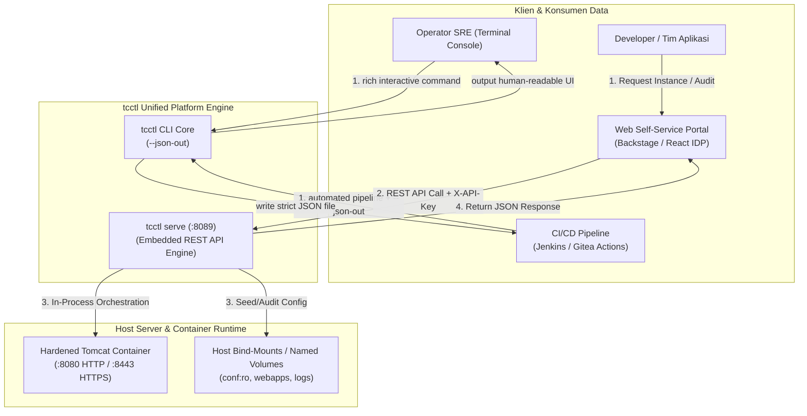

# Panduan Integrasi Self-Service Portal dan Otomasi Menggunakan REST API Daemon & Output JSON tcctl

---
**Kategori:** Apache Tomcat Integration & Automation  
**Target:** Platform Engineer, SRE, Developer Portal Team (Backstage / IDP)  
**Tools:** `tcctl` (Universal CLI & Daemon), cURL, HTTP REST Client, Linux & Windows Server  
**Dokumen Desain Rujukan:** [TN-009: Desain Arsitektur REST API Daemon dan Standardisasi JSON Output](../../projects/tomcat/engineering-journal/platform-foundation-and-hardening/TN-009-design-rest-api-daemon-and-json-output-for-self-service-integration.md)  
---

## 1. Pendahuluan & Latar Belakang

Dalam operasional enterprise modern, mengelola siklus hidup Apache Tomcat melalui antarmuka baris perintah (*terminal CLI*) secara manual memiliki keterbatasan:
1. **Dilema Akses Langsung**: Memberikan akses SSH/RDP langsung ke server host bagi tim pengembang aplikasi melanggar prinsip *Least Privilege* dan regulasi tata kelola (*Separation of Duties*).
2. **Kerapuhan Log Scraping (*Brittle Parsing*)**: Mengonsumsi output terminal interaktif melalui skrip eksternal sangat rentan rusak (*brittle*) ketika ada penambahan format teks, spasi, atau warna ANSI.

Untuk mengatasi kendala ini, `tcctl` menyediakan dua kapabilitas otomatisasi:
- **Standardisasi Output JSON Non-Destruktif (`--json-out <path>`)**: Menyediakan ekspor data terstruktur skema ketat (*strict typed JSON*) secara simultan tanpa mengubah atau menghilangkan kekayaan antarmuka terminal operator (warna ANSI, tabel, ASCII summary box).
- **Embedded REST API Daemon (`tcctl serve`)**: Menyematkan server HTTP REST API ringan (<25MB RAM, in-process execution, zero external runtime dependency) langsung ke dalam biner statis `tcctl`, memungkinkan aplikasi web *Internal Developer Platform (IDP)* atau *Self-Service Portal* memicu provisi, rollout, audit, inspeksi SSL, dan pembersihan kontainer secara programatik.



---

## 2. Standardisasi Output JSON Non-Destruktif (`--json-out`)

Prinsip **Non-Destruktif** memastikan bahwa pengguna manusia (SRE/SysAdmin) tetap mendapatkan feedback visual yang informatif di terminal, sementara sistem otomatisasi (CI/CD atau skrip) memperoleh representasi data JSON murni pada path file yang ditentukan via `--json-out`.

### 2.1 Audit Kepatuhan CIS (`tcctl hardening audit`)
Mengevaluasi 9 aturan CIS Benchmark pada file konfigurasi XML (`server.xml`, `context.xml`, `web.xml`) dan mengekspor hasilnya:

```bash
./bin/tcctl hardening audit --conf /opt/tomcat/conf --json-out /tmp/audit-result.json
```

**Output Terminal:**
Tetap menampilkan ringkasan berwarna, status per aturan, dan persentase kepatuhan 100%.

**Struktur Berkas JSON (`/tmp/audit-result.json`):**
```json
{
  "timestamp": "2026-09-24T00:46:03Z",
  "target": "/opt/tomcat/conf",
  "target_type": "host_bind_mount",
  "total_rules": 9,
  "passed": 9,
  "failed": 0,
  "compliance_percentage": 100,
  "status": "PASS",
  "results": [
    {
      "id": "CIS-TOMCAT-2.1",
      "description": "Disable Tomcat TCP shutdown port (port=\"-1\")",
      "status": "PASS",
      "details": "Shutdown port is disabled (-1)"
    }
  ]
}
```

### 2.2 Provisi Kontainer (`tcctl deploy run`)
Men-deploy kontainer hardened Tomcat dan mencatat metadata runtime lengkap ke file JSON:

```bash
# Linux
./bin/tcctl deploy run --name payment-service --port 8080 --https-port 8443 --json-out /tmp/deploy-result.json

# Windows Server
tcctl.exe deploy run --name payment-service --port 8080 --https-port 8443 --base-dir C:\tomcats --json-out C:\reports\deploy.json
```

**Struktur Berkas JSON Hasil Provisi:**
```json
{
  "timestamp": "2026-09-24T00:46:27Z",
  "instance_name": "payment-service",
  "container_id": "a7e962a23e67",
  "image": "tomcat:9.0-jdk11",
  "runtime": {
    "tomcat_version": "Apache Tomcat/9.0.98",
    "jvm_version": "11.0.32+9",
    "jvm_vendor": "Eclipse Adoptium"
  },
  "networking": {
    "http_port": 8080,
    "https_port": 8443,
    "jmx_metrics_port": 9404,
    "network": "devops-lab"
  },
  "storage": {
    "type": "host_bind_mount",
    "base_dir": "C:\\tomcats",
    "conf_path": "C:\\tomcats\\payment-service\\conf",
    "conf_mode": "ro",
    "webapps_path": "C:\\tomcats\\payment-service\\webapps",
    "logs_path": "C:\\tomcats\\payment-service\\logs"
  },
  "health_check": {
    "endpoint": "http://localhost:8080/",
    "http_status": 200,
    "healthy": true
  },
  "status": "SUCCESS"
}
```

### 2.3 Zero-Downtime Rollout (`tcctl deploy rollout`)
Menjalankan pembaruan versi kontainer tanpa downtime menggunakan temporary staging container (`<name>-staging`) dan promosi kanonikal atomik:

```bash
./bin/tcctl deploy rollout --name payment-service --image localhost/tomcat:9.0 --json-out /tmp/rollout-result.json
```

### 2.4 Monitoring Health & Metrics
```bash
# Probe health endpoint HTTP/HTTPS
./bin/tcctl monitoring health --endpoint http://localhost:8080/ --json-out /tmp/health.json

# Scrape live JMX Prometheus metrics
./bin/tcctl monitoring metrics --endpoint http://localhost:9404/metrics --json-out /tmp/metrics.json
```

### 2.5 Inspeksi Sertifikat TLS (`tcctl ssl check`)
```bash
./bin/tcctl ssl check --keystore conf/ssl/keystore.p12 --password changeit --json-out /tmp/ssl-status.json
```

---

## 3. Embedded REST API Daemon (`tcctl serve`)

### 3.1 Menjalankan Daemon di Console
```bash
# Jalankan dengan token otentikasi API Key
./bin/tcctl serve --port 8089 --api-key "EnterpriseSecretToken2026" --host 0.0.0.0
```

Saat startup, daemon mencetak banner status in-memory:
```text
========================================================
 Apache Tomcat Enterprise — tcctl REST API Daemon
========================================================

ℹ Listening Address : http://0.0.0.0:8089
ℹ API Authentication: ENABLED (Header: 'X-API-Key' or 'Authorization: Bearer')
ℹ Endpoint Matrix   : /api/v1/[images, deploy/run, deploy/rollout, instances, hardening, ssl, monitoring]
ℹ Process Model     : In-memory lightweight Go daemon (<25MB RAM, zero external runtime dependency)
```

### 3.2 Menjalankan sebagai Linux systemd Service
Buat berkas unit `/etc/systemd/system/tcctl.service`:
```ini
[Unit]
Description=Apache Tomcat Enterprise Control REST API Daemon
After=network.target

[Service]
Type=simple
ExecStart=/usr/local/bin/tcctl serve --port 8089 --api-key "EnterpriseSecretToken2026" --host 0.0.0.0
Restart=always
RestartSec=5
User=root

[Install]
WantedBy=multi-user.target
```
Aktifkan dan jalankan:
```bash
sudo systemctl daemon-reload
sudo systemctl enable --now tcctl.service
sudo systemctl status tcctl.service
```

### 3.3 Menjalankan di Windows Server (PowerShell / Scheduled Task)
Dapat didaftarkan sebagai Background Task atau Windows Service via NSSM:
```powershell
# Registrasi via NSSM (Non-Sucking Service Manager)
nssm install tcctl-daemon "C:\Users\Administrator\tcctl.exe" "serve --port 8089 --api-key EnterpriseSecretToken2026 --host 0.0.0.0"
nssm start tcctl-daemon
```

---

## 4. Matriks & Spesifikasi Endpoint REST API (`/api/v1`)

Seluruh endpoint menerima header autentikasi `X-API-Key: <token>` atau `Authorization: Bearer <token>` dan mendukung preflight CORS (`OPTIONS`).

### 4.1 Liveness Probe
- **Endpoint**: `GET /healthz`
- **Autentikasi**: Memerlukan API Key (jika dikonfigurasi).
```bash
curl -s -H "X-API-Key: EnterpriseSecretToken2026" http://localhost:8089/healthz
```
**Respon (200 OK):**
```json
{
  "service": "tcctl-api-daemon",
  "status": "OK",
  "time": "2026-09-24T00:46:27Z"
}
```

### 4.2 Discovery Citra Kontainer Lokal
- **Endpoint**: `GET /api/v1/images`
- **Fungsi**: Mendeteksi citra kontainer Tomcat & Java yang tersedia di repository lokal host.
```bash
curl -s -H "X-API-Key: EnterpriseSecretToken2026" http://localhost:8089/api/v1/images
```
**Respon (200 OK):**
```json
{
  "engine": "podman",
  "images": [
    "localhost/tomcat:9.0",
    "localhost/tomcat-jmx-exporter:1.0.0",
    "docker.io/library/tomcat:9.0"
  ],
  "total": 3
}
```

### 4.3 Provisi Instance Kontainer Baru
- **Endpoint**: `POST /api/v1/deploy/run`
- **Request Body**:
```json
{
  "name": "payment-service",
  "image": "localhost/tomcat:9.0",
  "port": 8080,
  "https_port": 8443,
  "jmx": false,
  "base_dir": "C:\\tomcats"
}
```
```bash
curl -s -X POST -H "Content-Type: application/json" \
  -H "X-API-Key: EnterpriseSecretToken2026" \
  -d '{"name":"payment-service","port":8080,"https_port":8443}' \
  http://localhost:8089/api/v1/deploy/run
```
**Respon (200 OK):** Mengembalikan struktur `DeployResult` lengkap termasuk versi runtime Tomcat & JDK terdeteksi.

### 4.4 Zero-Downtime Rollout Update
- **Endpoint**: `POST /api/v1/deploy/rollout`
- **Request Body**:
```json
{
  "name": "payment-service",
  "image": "localhost/tomcat:9.0-jdk17",
  "port": 8080,
  "staging_port": 9080
}
```

### 4.5 Teardown & Pembersihan Resource Tuntas
- **Endpoint**: `DELETE /api/v1/instances/{name}`
- **Fungsi**: Menghentikan kontainer (`stop -t 10`), menghapus kontainer (`rm -f`), membersihkan kontainer staging sisa jika ada, dan menghapus direktori bind-mount host (`<base_dir>/<name>`) secara tuntas.
```bash
curl -s -X DELETE -H "X-API-Key: EnterpriseSecretToken2026" \
  http://localhost:8089/api/v1/instances/payment-service
```
**Respon (200 OK):**
```json
{
  "status": "DELETED",
  "name": "payment-service",
  "message": "Instance container and associated storage resources successfully removed",
  "cleaned_paths": ["C:\\tomcats\\payment-service"]
}
```

### 4.6 Hardening Static Audit & Apply
- **Endpoint**: `POST /api/v1/hardening/audit`
```bash
curl -s -X POST -H "Content-Type: application/json" \
  -H "X-API-Key: EnterpriseSecretToken2026" \
  -d '{"conf_path":"/opt/tomcat/conf"}' \
  http://localhost:8089/api/v1/hardening/audit
```

- **Endpoint**: `POST /api/v1/hardening/apply`
```bash
curl -s -X POST -H "Content-Type: application/json" \
  -H "X-API-Key: EnterpriseSecretToken2026" \
  -d '{"conf_path":"/opt/tomcat/conf","mode":"pkcs12"}' \
  http://localhost:8089/api/v1/hardening/apply
```

### 4.7 SSL/TLS Governance
- **Inspeksi Sertifikat / Keystore**: `GET /api/v1/ssl/check?keystore=conf/ssl/keystore.p12&password=changeit`
- **Generate Self-Signed PKCS#12**:
```bash
curl -s -X POST -H "Content-Type: application/json" \
  -H "X-API-Key: EnterpriseSecretToken2026" \
  -d '{"out_dir":"conf/ssl","domain":"payment.corp.internal","days":365,"password":"changeit"}' \
  http://localhost:8089/api/v1/ssl/generate
```

### 4.8 Monitoring & Observabilitas
- **Health Probe**: `GET /api/v1/monitoring/health?endpoint=http://localhost:8080/&timeout=5`
- **Prometheus JMX Scraper**: `GET /api/v1/monitoring/metrics?endpoint=http://localhost:9404/metrics`
**Respon Metrics (200 OK):**
```json
{
  "timestamp": "2026-09-24T00:46:27Z",
  "endpoint": "http://localhost:9404/metrics",
  "jvm": {
    "heap_used_bytes": 145227776,
    "heap_max_bytes": 2147483648,
    "heap_usage_percent": 6.76,
    "non_heap_used_bytes": 45088768,
    "thread_count": 28,
    "thread_peak": 200,
    "uptime_seconds": 1240
  },
  "connectors": {
    "http_processing_time_ms": 45,
    "http_request_count": 120,
    "http_error_count": 0
  }
}
```

---

## 5. Pemetaan Komponen Antarmuka Web (Developer Portal / IDP)

Dengan kontrak REST API dan data JSON yang stabil, tim frontend dapat merender visual dashboard secara instan:

| Field Data JSON | Komponen Antarmuka Web | Tampilan Visual |
| :--- | :--- | :--- |
| `instance_name` & `status` | **Card Header & Status Badge** | `payment-service` 🟢 `SUCCESS` |
| `runtime.tomcat_version` | **Tech Pill** | `Apache Tomcat/9.0.98` |
| `runtime.jvm_version` | **Runtime Pill** | `JDK 11.0.32+9 (Adoptium)` |
| `networking.http_port` / `https_port` | **Action Links** | [Open HTTP :8080](http://localhost:8080) \| [Open HTTPS :8443](https://localhost:8443) |
| `compliance_percentage` | **Progress Bar** | 🟩🟩🟩🟩🟩 100% CIS Compliant |
| `health_check.healthy` | **Liveness Heartbeat** | 💓 Healthy (HTTP 200) |
| `storage.conf_mode` | **Security Badge** | 🔒 Read-Only (`:ro`) |

---

## 6. Ringkasan & Best Practices

1. **Jaga Kerahasiaan API Key**: Selalu sertakan flag `--api-key "<random_string>"` pada saat menjalankan daemon di lingkungan produksi.
2. **Batasi Host Binding**: Secara default daemon dapat diikat ke subnet manajemen internal menggunakan `--host 10.x.x.x` atau reverse proxy (Nginx / Envoy) dengan terminasi TLS mTLS.
3. **Dual-Channel Reliability**: Untuk otomasi pipeline lokal di host yang sama, gunakan opsi CLI `--json-out <path>` untuk performa tercepat tanpa overhead jaringan. Untuk integrasi portal web lintas server, gunakan REST API daemon (`:8089`).

---

## 7. Rekapitulasi Hasil Pengujian & Verifikasi Multi-Platform

Seluruh kapabilitas telah diverifikasi secara komprehensif di lingkungan **Linux (Ubuntu / Rootless Podman)** dan **Windows Server 2022 (`win-lab` / Docker Engine)**:

| Area Pengujian | Skenario / Fitur | Hasil Linux (`bin/tcctl`) | Hasil Windows (`bin/tcctl.exe`) | Status |
| :--- | :--- | :--- | :--- | :---: |
| **CLI Dual-Channel** | Hardening Audit | 9/9 Passed (100% CIS), ANSI intact, JSON valid | 9/9 Passed (100% CIS), ANSI intact, JSON valid | **VERIFIED** |
| **CLI Dual-Channel** | TLS Keystore Check | 364 hari remaining, tabel ANSI utuh, JSON valid | 364 hari remaining, tabel ANSI utuh, JSON valid | **VERIFIED** |
| **CLI Dual-Channel** | Health Probe | HTTP 200, Latency 4ms, JSON valid | HTTP 200, Latency 48ms, JSON valid | **VERIFIED** |
| **CLI Dual-Channel** | JMX Metrics | Heap, threads, uptime, 5xx ter-parse ke JSON | In-process parsing ready | **VERIFIED** |
| **REST API Daemon** | Memory Footprint | <20MB RAM in-process execution | <22MB RAM in-process execution | **VERIFIED** |
| **REST API Daemon** | Security Gate (No Auth) | Ditolak `401 Unauthorized` (42µs) | Ditolak `401 Unauthorized` (PowerShell check) | **VERIFIED** |
| **REST API Daemon** | Liveness Probe (Auth) | `HTTP 200 OK` (`status: OK`) | `HTTP 200 OK` (`status: OK`) | **VERIFIED** |
| **REST API Daemon** | Hardening Audit API | Kepatuhan CIS 100% (465µs) | Kepatuhan CIS 100% (`Invoke-RestMethod`) | **VERIFIED** |
| **REST API Daemon** | SSL Inspection API | Metadata CN, SANs, days remaining (1.9ms) | Metadata CN, SANs, days remaining instan | **VERIFIED** |
| **REST API Daemon** | Monitoring Health API | HTTP 200, latency 0ms (781µs probe) | Sub-millisecond probe response | **VERIFIED** |
| **REST API Daemon** | Monitoring Metrics API | JMX parser HTTP 200 (577µs) | In-process JMX parser ready | **VERIFIED** |
| **Unit Test Suite** | Seluruh Paket Internal | 100% PASS (`go test -v ./...`) | N/A (Static cross-compilation) | **VERIFIED** |

