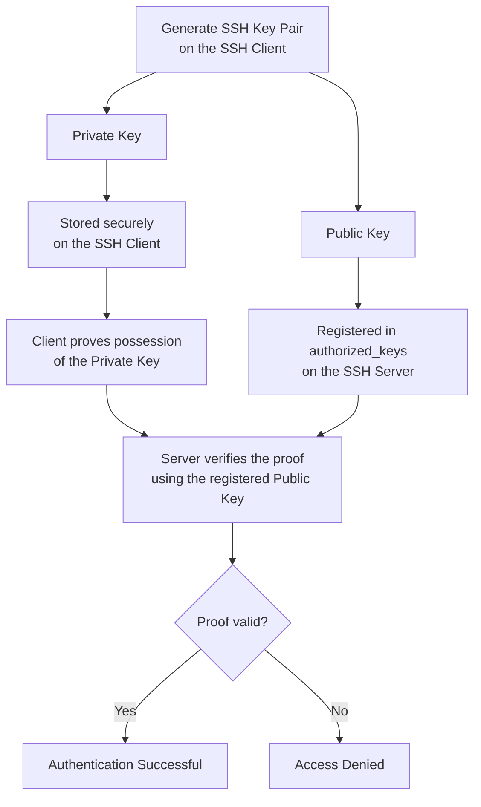

# SSH Key Authentication

## Overview

SSH (*Secure Shell*) digunakan untuk membuat koneksi terenkripsi dari sebuah
client menuju server. Autentikasi dapat menggunakan password, tetapi key pair
lebih sesuai untuk automation karena tidak membutuhkan password interaktif dan
aksesnya dapat dikelola per-client.

Dokumen ini menjelaskan konsep SSH key authentication, cara membuat dan
memasang key pair, verifikasi host, serta pemeriksaan masalah yang umum terjadi.

## Client and Server Roles

Dalam setiap koneksi SSH terdapat dua peran:

| Role | Description | Example |
| --- | --- | --- |
| SSH client | Sistem yang memulai koneksi. | Jenkins Controller atau workstation administrator. |
| SSH server | Sistem yang menerima koneksi melalui service `sshd`. | Jenkins agent atau remote host. |

```text
SSH Client  ───────── encrypted connection ────────>  SSH Server
```

Peran ditentukan oleh arah koneksi, bukan oleh nama mesin. Sebuah host dapat
menjadi client pada satu koneksi dan menjadi server pada koneksi lain.

## Private Key and Public Key

SSH key authentication menggunakan sepasang kunci yang dibuat bersama:

| Key | Stored on | Purpose | May be shared? |
| --- | --- | --- | --- |
| Private key | SSH client | Membuktikan identitas client tanpa mengirimkan private key ke server. | Tidak. |
| Public key | SSH server | Memverifikasi bukti yang dibuat menggunakan private key pasangannya. | Ya. |

Keduanya memiliki fungsi yang berbeda:

- **Private key** tetap berada pada client dan harus dianggap sebagai secret.
- **Public key** disalin ke akun tujuan pada server.
- Public key tidak dapat digunakan untuk memperoleh private key pasangannya.
- Server tidak membutuhkan salinan private key untuk melakukan verifikasi.

!!! danger "Protect the Private Key"

    Jangan menampilkan private key ke terminal yang direkam, memasukkannya ke
    repository, mengirimkannya melalui chat, atau menyalinnya ke SSH server.
    Siapa pun yang mendapatkan private key dapat mencoba menggunakannya sebagai
    identitas pemilik key tersebut.

## Authentication Model



Secara ringkas, proses autentikasi berlangsung sebagai berikut:

1. Client meminta koneksi kepada SSH server.
2. Server memeriksa public key yang terdaftar untuk user tujuan.
3. Client membuktikan bahwa ia memiliki private key pasangannya.
4. Server memverifikasi bukti tersebut menggunakan public key.
5. Koneksi diizinkan jika verifikasi dan kebijakan akses berhasil.

Private key tidak dikirimkan dalam proses tersebut.

## Generate an SSH Key Pair

Gunakan Ed25519 sebagai pilihan umum untuk key baru:

```bash
ssh-keygen \
    -t ed25519 \
    -C "<key-purpose>" \
    -f ~/.ssh/<key-name>
```

Contoh untuk Jenkins agent:

```bash
ssh-keygen \
    -t ed25519 \
    -C "jenkins-agent" \
    -f ~/.ssh/id_ed25519_jenkins_agent
```

Perintah tersebut menghasilkan dua file:

```text
~/.ssh/id_ed25519_jenkins_agent       # private key
~/.ssh/id_ed25519_jenkins_agent.pub   # public key
```

Gunakan passphrase jika key dipakai secara interaktif. Untuk automation tanpa
interaksi, keputusan menggunakan key tanpa passphrase harus disertai pembatasan
akses file, user khusus, scope akses minimum, dan mekanisme rotasi.

RSA 4096 dapat digunakan jika sistem lama belum mendukung Ed25519:

```bash
ssh-keygen -t rsa -b 4096 -C "<key-purpose>" -f ~/.ssh/<key-name>
```

## Inspect the Generated Key Pair

Periksa keberadaan dan permission file tanpa menampilkan private key:

```bash
ls -l ~/.ssh/<key-name> ~/.ssh/<key-name>.pub
```

Tampilkan public key ketika perlu disalin ke server:

```bash
cat ~/.ssh/<key-name>.pub
```

Tampilkan fingerprint untuk mengidentifikasi key tanpa membuka isinya:

```bash
ssh-keygen -lf ~/.ssh/<key-name>.pub
```

Permission yang disarankan:

```bash
chmod 700 ~/.ssh
chmod 600 ~/.ssh/<key-name>
chmod 644 ~/.ssh/<key-name>.pub
```

!!! warning

    Jangan menggunakan `cat ~/.ssh/<key-name>` untuk memeriksa private key.
    Gunakan nama file, permission, dan fingerprint public key sebagai bukti
    keberadaan serta identitas key pair.

## Install the Public Key on the SSH Server

Cara yang disarankan adalah menggunakan `ssh-copy-id`:

```bash
ssh-copy-id \
    -i ~/.ssh/<key-name>.pub \
    <remote-user>@<remote-host>
```

Jika `ssh-copy-id` tidak tersedia, public key dapat didaftarkan secara manual
pada akun tujuan:

```bash
mkdir -p ~/.ssh
chmod 700 ~/.ssh
printf '%s\n' '<public-key-content>' >> ~/.ssh/authorized_keys
chmod 600 ~/.ssh/authorized_keys
```

Perintah manual tersebut dijalankan sebagai user tujuan pada SSH server.
Pastikan satu public key ditulis sebagai satu baris utuh dalam
`~/.ssh/authorized_keys`.

## Connect Using a Specific Private Key

Gunakan opsi `-i` jika nama private key tidak menggunakan nama default:

```bash
ssh -i ~/.ssh/<key-name> <remote-user>@<remote-host>
```

Untuk menguji koneksi tanpa membuka sesi interaktif:

```bash
ssh -i ~/.ssh/<key-name> <remote-user>@<remote-host> hostname
```

Tambahkan `-v` saat membutuhkan informasi diagnosis:

```bash
ssh -v -i ~/.ssh/<key-name> <remote-user>@<remote-host>
```

## First Connection and Host Key Verification

Key pair milik user dan host key milik server mempunyai fungsi berbeda:

- **User key pair** membuktikan identitas client kepada server.
- **Host key** membuktikan identitas server kepada client.

Pada koneksi pertama, client dapat menampilkan fingerprint host:

```text
The authenticity of host '<hostname>' can't be established.
ED25519 key fingerprint is SHA256:<fingerprint>.
Are you sure you want to continue connecting (yes/no/[fingerprint])?
```

Verifikasi fingerprint melalui sumber tepercaya sebelum menjawab `yes`. Setelah
diterima, identitas host disimpan pada:

```text
~/.ssh/known_hosts
```

Jika host key berubah, jangan langsung menghapus peringatannya. Pastikan dahulu
apakah server memang dibangun ulang atau key dirotasi. Perubahan yang tidak
dikenal dapat mengindikasikan salah alamat atau serangan *man-in-the-middle*.

## Common SSH Files

| File | Location | Purpose |
| --- | --- | --- |
| Private key | SSH client | Identitas rahasia milik client. |
| `<key-name>.pub` | SSH client | Public key yang boleh didistribusikan. |
| `authorized_keys` | SSH server | Daftar public key yang diizinkan untuk suatu user. |
| `known_hosts` | SSH client | Daftar identitas host SSH yang telah diverifikasi. |
| `config` | SSH client | Alias dan konfigurasi koneksi per-host. |

## Optional Client Configuration

Konfigurasi pada `~/.ssh/config` dapat menyederhanakan perintah koneksi, mengaktifkan heartbeat anti-putus (*KeepAlive*), dan tunneling:

```sshconfig
Host builder-01
    HostName <remote-host>
    User <remote-user>
    IdentityFile ~/.ssh/id_ed25519_jenkins_agent
    IdentitiesOnly yes
    ServerAliveInterval 30
    ServerAliveCountMax 5
    TCPKeepAlive yes
```

Setelah itu, koneksi dapat dijalankan dengan:

```bash
ssh builder-01
```

Gunakan permission berikut:

```bash
chmod 600 ~/.ssh/config
```

!!! tip "Panduan Lengkap Tips & Trik SSH"
    Untuk panduan detail mengenai cara kerja KeepAlive, trik restart SSHD di Windows, dan Reverse Port Forwarding, baca [SSH KeepAlive Anti-Putus dan Reverse Port Forwarding](../configure-ssh-keepalive-and-reverse-tunnel.md).

## Troubleshooting

### Permission denied (publickey)

Periksa secara berurutan:

1. Username dan hostname tujuan sudah benar.
2. Private key yang dipilih merupakan pasangan public key pada server.
3. Public key tersimpan sebagai satu baris utuh dalam `authorized_keys`.
4. Permission direktori dan file sudah benar.
5. User pemilik `~/.ssh` dan `authorized_keys` sesuai dengan user tujuan.
6. Log verbose `ssh -v` menunjukkan key yang benar sedang ditawarkan.

### Private key permission is too open

Batasi permission private key:

```bash
chmod 600 ~/.ssh/<key-name>
```

### Host identification has changed

Verifikasi fingerprint baru melalui sumber tepercaya. Setelah perubahan server
terkonfirmasi, hapus hanya entri host yang tepat:

```bash
ssh-keygen -R <remote-host>
```

Lakukan koneksi ulang dan cocokkan fingerprint sebelum menerima host key baru.

## Verification Checklist

- Private key hanya tersedia pada SSH client.
- Public key terdaftar pada akun user yang benar di SSH server.
- Permission `~/.ssh`, private key, dan `authorized_keys` sudah sesuai.
- Fingerprint host telah diverifikasi.
- Koneksi dengan private key berhasil tanpa meminta password akun tujuan.
- Private key tidak tercatat dalam repository, log, atau media komunikasi.
