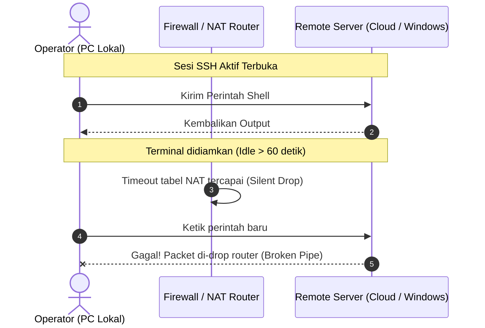
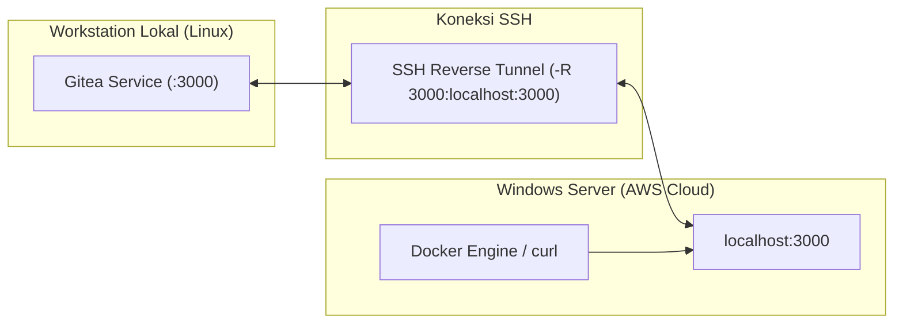

# Tips & Trik: SSH KeepAlive Anti-Putus dan Reverse Port Forwarding

## 🔍 Overview

Saat mengelola server remote di cloud (seperti AWS EC2, Azure VM, atau server *on-premise* Windows/Linux), salah satu masalah yang paling sering dihadapi operator adalah **koneksi SSH yang tiba-tiba terputus (*broken pipe* atau *connection reset*)** saat sesi terminal ditinggal diam selama beberapa menit.

Selain masalah timeout, sering kali terdapat kebutuhan untuk menghubungkan layanan internal di workstation lokal (seperti Gitea, Webhook listener, atau registry lokal) ke server remote tanpa harus membuka IP publik atau firewall router.

Panduan ini merangkum tips dan trik praktis untuk:
1. Mencegah koneksi SSH terputus dengan konfigurasi **KeepAlive** (di sisi client maupun server).
2. Memanfaatkan **SSH Reverse Port Forwarding** untuk menghubungkan port lokal ke server remote secara aman melalui tunnel terenkripsi.
3. Menyederhanakan alur kerja menggunakan **alias host** pada `~/.ssh/config`.

---

## ❓ Mengapa Sesi SSH Sering Terputus?



1. **Firewall / NAT Timeout (*State Dropping*)**:
   Perangkat router, NAT gateway, atau AWS Security Group melacak setiap koneksi TCP aktif dalam tabel *state*. Jika tidak ada paket data yang lewat selama batas waktu tertentu (biasanya 60–120 detik), tabel state tersebut akan ditutup secara sepihak (*silent drop*).
2. **Server/Client Tidak Mengirim Heartbeat**:
   Secara default, OpenSSH tidak selalu mengirim paket deteksi keaktifan (*heartbeat probe*) jika tidak dikonfigurasi secara eksplisit.

---

## 🛠️ Solusi 1: Konfigurasi Client Linux / macOS (`~/.ssh/config`) — *Paling Efektif*

Menangani masalah dari sisi **SSH Client** adalah metode paling direkomendasikan karena:
- Tidak memerlukan perubahan konfigurasi di server.
- Tidak memerlukan hak akses administrator/root di server.
- Bekerja untuk semua server tujuan secara universal.

Tambahkan konfigurasi berikut ke file `~/.ssh/config` di workstation Anda:

```sshconfig
Host *
    ServerAliveInterval 30
    ServerAliveCountMax 5
    TCPKeepAlive yes
```

Pastikan hak akses file dibatasi (*permissions*):
```bash
chmod 600 ~/.ssh/config
```

### Penjelasan Parameter:
- **`ServerAliveInterval 30`**: Client akan mengirim sinyal paket kosong (*null packet*) ke server setiap **30 detik** saat sesi dalam keadaan diam. Sinyal ini memperbarui tabel NAT router sehingga koneksi tidak pernah dianggap idle.
- **`ServerAliveCountMax 5`**: Jika client mengirim paket *alive* 5 kali berturut-turut tanpa respons dari server (total $30 \times 5 = 150$ detik), barulah client menganggap koneksi benar-benar terputus.
- **`TCPKeepAlive yes`**: Mengaktifkan keepalive pada lapisan transport socket TCP sistem operasi.

---

## 🛠️ Solusi 2: Konfigurasi Server (`sshd_config`)

Jika Anda memiliki akses administratif ke server remote dan ingin memastikan seluruh client yang terhubung mendapatkan keepalive dari server:

### A. Pada Linux Server (`/etc/ssh/sshd_config`)
```text
ClientAliveInterval 30
ClientAliveCountMax 10
TCPKeepAlive yes
```
Lalu restart service OpenSSH:
```bash
sudo systemctl restart sshd
```

### B. Pada Windows Server (`C:\ProgramData\ssh\sshd_config`)
Jalankan di PowerShell:
```powershell
Add-Content -Path "C:\ProgramData\ssh\sshd_config" -Value @(
    "",
    "# KeepAlive settings to prevent idle disconnects",
    "ClientAliveInterval 30",
    "ClientAliveCountMax 10",
    "TCPKeepAlive yes"
)
```

!!! warning "Trik Restart SSHD di Windows dari dalam Sesi SSH"
    Jika Anda menjalankan `Restart-Service sshd` langsung di PowerShell saat sedang terhubung via SSH, Windows Service Controller akan menolak dengan error:
    `Cannot stop sshd service on computer '.'`
    
    Hal ini karena service `sshd` menaungi proses sesi Anda sendiri. Untuk mengatasinya, jalankan restart sebagai proses background terpisah:
    ```powershell
    Start-Process powershell -ArgumentList "-Command Start-Sleep -Seconds 1; Restart-Service sshd -Force"
    ```
    Sesi SSH akan terputus sekejap dan konfigurasi baru langsung aktif saat Anda login ulang.

---

## 🔄 Solusi 3: SSH Reverse Port Forwarding (`RemoteForward`)

Reverse port forwarding memungkinkan server remote mengakses port lokal yang berjalan di workstation Anda.

### Contoh Skenario Nyata:
Anda menjalankan **Gitea** di PC lokal pada port `3000` (`http://localhost:3000`). Anda sedang mengonfigurasi Docker di Windows Server remote (AWS) dan ingin Docker di Windows Server bisa melakukan `docker pull` atau `curl` ke Gitea lokal Anda.



### Cara Eksekusi via Perintah Terminal:
```bash
ssh -R 3000:localhost:3000 -i ~/Downloads/my-key.pem Administrator@184.194.25.77
```

### Cara Otomatis di `~/.ssh/config`:
Anda bisa menggabungkan KeepAlive dan Reverse Forwarding ke dalam alias host di `~/.ssh/config`:

```sshconfig
Host win-lab
    HostName 184.194.25.77
    User Administrator
    IdentityFile ~/Downloads/tomcat-monitoring-aws-key.pem
    IdentitiesOnly yes
    ServerAliveInterval 30
    ServerAliveCountMax 5
    TCPKeepAlive yes
    RemoteForward 3000 localhost:3000
```

Dengan konfigurasi di atas, Anda cukup mengetik satu perintah:
```bash
ssh win-lab
```
Dan otomatis:
1. Terhubung dengan user dan private key yang tepat.
2. Koneksi anti-putus aktif.
3. Port `3000` Gitea langsung tersambung di server tujuan.

---

## 📋 Ringkasan Tips & Trik

| Kebutuhan | Tempat Konfigurasi | Pengaturan Utama |
| --- | --- | --- |
| Mencegah SSH timeout (rekomendasi) | Client (`~/.ssh/config`) | `ServerAliveInterval 30`<br/>`ServerAliveCountMax 5` |
| Mencegah timeout dari sisi server | Server (`sshd_config`) | `ClientAliveInterval 30`<br/>`ClientAliveCountMax 10` |
| Restart SSHD Windows tanpa gagal | Server (PowerShell) | `Start-Process powershell -ArgumentList "-Command Start-Sleep 1; Restart-Service sshd -Force"` |
| Buka port lokal ke server remote | Client (`~/.ssh/config` atau flag CLI) | `RemoteForward <remote_port> localhost:<local_port>`<br/>`-R <remote_port>:localhost:<local_port>` |
| Mengamankan file config | Client (Linux/macOS) | `chmod 600 ~/.ssh/config` |

---

## 📚 References

- [OpenSSH Official ssh_config Manual](https://man.openbsd.org/ssh_config)
- [OpenSSH Official sshd_config Manual](https://man.openbsd.org/sshd_config)
- [Microsoft OpenSSH for Windows Overview](https://learn.microsoft.com/en-us/windows-server/administration/openssh/openssh_overview)
