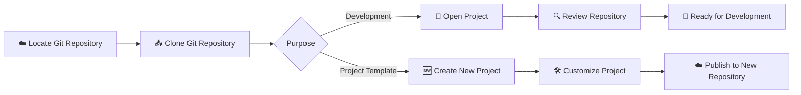

# Clone Git Repository

## 🚀 Get Started

Panduan ini menjelaskan cara mengambil project dari Git repository ke komputer lokal menggunakan Git.

Dokumen ini juga menjelaskan cara menggunakan repository yang sudah ada sebagai **Project Template** untuk membuat project baru dengan struktur yang sama.

Setelah repository berhasil di-*clone*, Anda dapat mulai mengembangkan source code, membuat project baru, melakukan commit, dan mempublikasikan perubahan kembali ke Git repository.

---

## 🎯 Learning Objectives

Setelah mengikuti panduan ini, Anda diharapkan mampu:

- Meng-clone Git repository.
- Membuka project pada komputer lokal.
- Meninjau konfigurasi repository.
- Menggunakan repository sebagai **Project Template**.
- Memastikan repository siap digunakan.

---

## 🔄 Workflow



---

## 📋 Prerequisites

Pastikan:

- Git telah terinstal.
- Git repository telah tersedia.
- Memiliki hak akses ke Git repository.

---

## ▶️ Procedure

### Clone Existing Repository

Clone repository.

```bash
git clone https://github.com/<username>/<repository>.git
```

Contoh output.

```text
Cloning into 'repository'...
Receiving objects: 100%
Resolving deltas: 100%
```

---

### Clone Repository as Project Template

Gunakan repository yang sudah ada sebagai **Project Template** apabila ingin membuat project baru dengan struktur yang sama.

Clone repository menggunakan nama direktori baru.

Contoh:

```bash
git clone http://localhost:3000/gitadm/jenkins-podman.git minio-server
```

Keterangan:

- `jenkins-podman` merupakan repository template.
- `minio-server` merupakan nama project baru.

Masuk ke direktori project.

```bash
cd minio-server
```

Hapus metadata Git dari repository template.

```bash
rm -rf .git
```

Inisialisasi repository Git baru.

```bash
git init
```

Perbarui informasi project.

Contoh:

- PROJECT
- VERSION
- README.md
- CHANGELOG.md
- Containerfile
- CONFIG
- scripts/
- entrypoint.sh

Hubungkan project dengan repository baru.

Contoh:

```bash
git remote add origin http://localhost:3000/gitadm/minio-server.git
```

Publikasikan project.

```bash
git add .

git commit -m "Initialize minio-server project"

git branch -M main

git push -u origin main
```

!!! tip "Best Practice"

    Gunakan repository yang paling mendekati kebutuhan project baru sebagai **Project Template**.

    Contoh:

    - `jenkins-podman` → `minio-server`
    - `minio-server` → `redis-server`
    - `nginx-image` → `apache-image`

    Pendekatan ini membantu mempertahankan struktur repository yang konsisten pada seluruh project.

!!! info "Why remove the .git directory?"

    Direktori `.git` menyimpan seluruh histori Git, branch, tag, dan konfigurasi remote repository.

    Menghapus direktori tersebut memastikan project baru memiliki histori Git yang independen sehingga tidak mewarisi riwayat repository template.

---

### Open Project

Masuk ke direktori project.

```bash
cd repository
```

Review direktori kerja.

```bash
pwd
```

Contoh output.

```text
/home/user/repository
```

---

### Review Repository

Periksa status repository.

```bash
git status
```

Contoh output.

```text
On branch main

Your branch is up to date with 'origin/main'.

nothing to commit, working tree clean
```

---

### Review Remote Repository

Tampilkan remote repository.

```bash
git remote -v
```

Contoh output.

```text
origin https://github.com/<username>/<repository>.git (fetch)
origin https://github.com/<username>/<repository>.git (push)
```

---

### Review Branch

Periksa branch yang tersedia.

```bash
git branch -a
```

Contoh output.

```text
* main
  remotes/origin/main
```

---

## ✅ Verification

Pastikan:

- Repository berhasil di-clone.
- Project berhasil dibuka.
- Remote repository telah dikonfigurasi.
- Branch berhasil dikenali.
- Repository siap digunakan.

!!! success "Verification"

    Git repository berhasil di-clone dan siap digunakan.

---

## 💡 Technology Notes

Perintah `git clone` membuat salinan lengkap Git repository ke komputer lokal, termasuk histori commit, branch, dan konfigurasi remote repository.

Apabila repository digunakan sebagai **Project Template**, hapus direktori `.git` sebelum melakukan inisialisasi repository baru agar project memiliki histori Git yang independen.

---

## ▶️ Next Steps

Setelah repository berhasil di-clone, Anda dapat:

- Mulai mengembangkan source code.
- Menggunakan repository sebagai **Project Template**.
- Mengelola branch.
- Melakukan commit dan push perubahan.

---

## 🔗 Related Documents

| Document | Description |
|----------|-------------|
| **Publish Project to Git Repository** | Mempublikasikan project ke Git repository. |
| **Manage Branches** | Mengelola branch selama proses pengembangan. |

---

## 📝 Summary

Pada halaman ini telah dijelaskan:

- Clone Git repository.
- Menggunakan repository sebagai **Project Template**.
- Membuka project.
- Meninjau status repository.
- Meninjau remote repository.
- Meninjau branch.

Selanjutnya Anda dapat mulai mengembangkan project, membuat project baru, atau mengelola branch menggunakan Git.