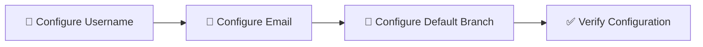

# Configure Git

## 🚀 Get Started

Panduan ini menjelaskan cara melakukan konfigurasi awal Git sebelum digunakan untuk mengelola source code.

Konfigurasi ini diperlukan agar setiap perubahan (*commit*) memiliki informasi identitas pembuat dan Git dapat bekerja sesuai dengan preferensi yang diinginkan.

---

## 🎯 Learning Objectives

Setelah mengikuti panduan ini, Anda diharapkan mampu:

- Mengonfigurasi username Git.
- Mengonfigurasi email Git.
- Menentukan nama branch default.
- Memverifikasi konfigurasi Git.

---

## 🔄 Workflow



---

## 📋 Prerequisites

Pastikan:

- Git telah terinstal.

---

## ▶️ Procedure


<div class="procedure" markdown>

<div class="procedure-step" markdown>

### Configure Username

Konfigurasikan username yang akan digunakan pada setiap commit.

```bash
git config --global user.name "John Doe"
```

Verifikasi konfigurasi.

```bash
git config --global user.name
```

Contoh output.

```text
John Doe
```

</div>

<div class="procedure-step" markdown>

### Configure Email

Konfigurasikan email yang akan digunakan pada setiap commit.

```bash
git config --global user.email "john.doe@example.com"
```

Verifikasi konfigurasi.

```bash
git config --global user.email
```

Contoh output.

```text
john.doe@example.com
```

</div>

<div class="procedure-step" markdown>

### Configure Default Branch

Konfigurasikan nama branch default.

```bash
git config --global init.defaultBranch main
```

Verifikasi konfigurasi.

```bash
git config --global init.defaultBranch
```

Contoh output.

```text
main
```

</div>

<div class="procedure-step" markdown>

### Review Configuration

Tampilkan seluruh konfigurasi Git.

```bash
git config --list
```

Contoh output.

```text
user.name=John Doe
user.email=john.doe@example.com
init.defaultbranch=main
```

---


</div>

</div>

## ✅ Verification

Pastikan:

- Username berhasil dikonfigurasi.
- Email berhasil dikonfigurasi.
- Default branch berhasil dikonfigurasi.
- Seluruh konfigurasi dapat ditampilkan menggunakan `git config --list`.

!!! success "Verification"

    Git berhasil dikonfigurasi dan siap digunakan.

---

## 💡 Technology Notes

Git menyediakan dua jenis konfigurasi yang umum digunakan.

| Scope | Description |
|-------|-------------|
| **Global** | Berlaku untuk seluruh repository pada komputer pengguna. |
| **Local** | Berlaku hanya untuk repository tertentu. |

Contoh konfigurasi lokal.

```bash
git config user.name "John Doe"
git config user.email "john.doe@example.com"
```

Konfigurasi lokal akan menggantikan konfigurasi global pada repository tersebut.

---

## ▶️ Next Steps

Setelah Git berhasil dikonfigurasi, tahap berikutnya adalah **Publish Project to Git Repository** untuk membuat repository lokal dan mempublikasikan project ke Git repository.

---

## 🔗 Related Documents

| Document | Description |
|----------|-------------|
| **Install Git** | Menginstal Git. |
| **Publish Project to Git Repository** | Mempublikasikan project ke Git repository. |

---

## 📝 Summary

Pada halaman ini telah dijelaskan:

- Konfigurasi username.
- Konfigurasi email.
- Konfigurasi default branch.
- Verifikasi konfigurasi Git.

Selanjutnya Anda akan mempelajari cara **mempublikasikan project ke Git repository**.