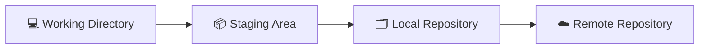

# Git

## 🚀 Get Started

Git adalah **Distributed Version Control System (DVCS)** yang digunakan untuk mengelola perubahan source code selama proses pengembangan perangkat lunak.

Dengan Git, setiap perubahan dapat dicatat sebagai histori (*commit*), sehingga memudahkan kolaborasi, pelacakan perubahan, dan pemulihan versi sebelumnya apabila diperlukan.

Panduan pada bagian ini menjelaskan penggunaan Git mulai dari instalasi, konfigurasi, hingga pengelolaan source code menggunakan Git repository.

---

## 🎯 Learning Objectives

Setelah mempelajari dokumentasi ini, Anda diharapkan mampu:

- Memahami konsep dasar Git.
- Menginstal Git pada sistem operasi.
- Melakukan konfigurasi awal Git.
- Mempublikasikan project ke Git repository.
- Mengelola branch selama proses pengembangan.
- Mengatasi permasalahan umum yang sering ditemui saat menggunakan Git.

---

## 📚 Documentation Structure

Dokumentasi Git terdiri dari beberapa panduan berikut.

| Document | Description |
|----------|-------------|
| **Install Git** | Menginstal Git pada sistem operasi. |
| **Configure Git** | Melakukan konfigurasi awal Git. |
| **Publish Project to Git Repository** | Mempublikasikan project lokal ke Git repository. |
| **Clone Git Repository** | Mengambil project dari Git repository. |
| **Manage Branches** | Mengelola branch selama proses pengembangan. |
| **Troubleshooting** | Mengatasi permasalahan umum saat menggunakan Git. |

---

## 🏗 Git at a Glance

Git mengelola perubahan source code melalui beberapa area kerja berikut.

Penjelasan singkat:

| Component | Description |
|-----------|-------------|
| **Working Directory** | Lokasi tempat file project dikerjakan. |
| **Staging Area** | Area sementara sebelum perubahan disimpan sebagai commit. |
| **Local Repository** | Repository Git yang berada pada komputer lokal. |
| **Remote Repository** | Repository Git yang berada pada server seperti GitHub, GitLab, Bitbucket, atau Gitea. |

---

## 💡 Key Concepts

Beberapa istilah penting yang digunakan pada dokumentasi ini.

| Term | Description |
|------|-------------|
| **Repository** | Tempat penyimpanan source code beserta histori perubahan. |
| **Commit** | Catatan perubahan source code pada suatu waktu. |
| **Branch** | Jalur pengembangan yang terpisah dari branch utama. |
| **Clone** | Mengunduh project dari remote repository. |
| **Push** | Mengirim commit dari local repository ke remote repository. |
| **Pull** | Mengambil perubahan terbaru dari remote repository. |

---

## 🔧 Technology Notes

Git dapat digunakan bersama berbagai layanan Git repository, baik cloud-hosted maupun self-hosted.

Contoh layanan cloud-hosted:

- GitHub
- GitLab
- Bitbucket
- Azure Repos

Contoh layanan self-hosted:

- Gitea
- GitLab Community Edition

Dokumentasi ini menggunakan Git secara umum sehingga dapat diterapkan pada berbagai layanan Git repository.

---

## ▶️ Next Steps

Tahap berikutnya adalah **Install Git** untuk memasang Git pada sistem operasi.

---

## 🔗 Related Documents

| Document | Description |
|----------|-------------|
| **Install Git** | Menginstal Git. |
| **Configure Git** | Melakukan konfigurasi awal Git. |
| **Install Gitea** | Membangun Git repository secara self-hosted. |

---

## 📝 Summary

Pada halaman ini telah dijelaskan:

- Pengertian Git.
- Konsep dasar Git.
- Struktur dokumentasi Git.
- Komponen utama Git.
- Istilah penting yang digunakan pada dokumentasi.

Selanjutnya Anda akan mempelajari cara **menginstal Git** sebelum mulai mengelola source code menggunakan Git.