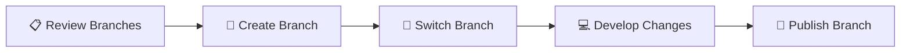

# Manage Branches

## 🚀 Get Started

Panduan ini menjelaskan cara mengelola branch pada Git selama proses pengembangan.

Branch memungkinkan pengembangan dilakukan secara terpisah tanpa memengaruhi branch utama, sehingga beberapa pekerjaan dapat dilakukan secara paralel dengan aman.

---

## 🎯 Learning Objectives

Setelah mengikuti panduan ini, Anda diharapkan mampu:

- Melihat daftar branch.
- Membuat branch baru.
- Berpindah branch.
- Mempublikasikan branch.
- Menghapus branch yang tidak lagi digunakan.

---

## 🔄 Workflow



---

## 📋 Prerequisites

Pastikan:

- Git telah terinstal.
- Project telah di-clone atau dipublikasikan ke Git repository.

---

## ▶️ Procedure


<div class="procedure" markdown>

<div class="procedure-step" markdown>

### Review Branches

Tampilkan branch yang tersedia.

```bash
git branch
```

Contoh output.

```text
* main
```

Untuk melihat branch lokal dan remote.

```bash
git branch -a
```

Contoh output.

```text
* main
  remotes/origin/main
```

</div>

<div class="procedure-step" markdown>

### Create Branch

Buat branch baru.

```bash
git branch feature-homepage
```

Review branch.

```bash
git branch
```

Contoh output.

```text
* main
  feature-homepage
```

</div>

<div class="procedure-step" markdown>

### Switch Branch

Pindah ke branch baru.

```bash
git switch feature-homepage
```

Apabila menggunakan Git versi lama.

```bash
git checkout feature-homepage
```

Review branch aktif.

```bash
git branch
```

Contoh output.

```text
  main
* feature-homepage
```

</div>

<div class="procedure-step" markdown>

### Publish Branch

Publikasikan branch ke Git repository.

```bash
git push -u origin feature-homepage
```

Review branch pada Git repository menggunakan web browser.

</div>

<div class="procedure-step" markdown>

### Delete Branch

Kembali ke branch utama.

```bash
git switch main
```

Hapus branch lokal.

```bash
git branch -d feature-homepage
```

Apabila branch belum di-merge.

```bash
git branch -D feature-homepage
```

Untuk menghapus branch pada remote repository.

```bash
git push origin --delete feature-homepage
```

---


</div>

</div>

## ✅ Verification

Pastikan:

- Branch berhasil dibuat.
- Branch berhasil dipilih.
- Branch berhasil dipublikasikan.
- Branch berhasil dihapus apabila sudah tidak digunakan.

!!! success "Verification"

    Branch berhasil dikelola menggunakan Git.

---

## 💡 Technology Notes

Branch memungkinkan beberapa pekerjaan dilakukan secara bersamaan tanpa mengganggu branch utama.

Contoh penggunaan branch.

| Branch | Purpose |
|---------|---------|
| **main** | Branch utama yang siap digunakan. |
| **develop** | Branch untuk pengembangan. |
| **feature-\*** | Pengembangan fitur baru. |
| **hotfix-\*** | Perbaikan masalah pada production. |

Penamaan branch dapat disesuaikan dengan standar pengembangan yang digunakan oleh organisasi.

---

## ▶️ Next Steps

Setelah memahami pengelolaan branch, Anda dapat mulai menerapkan workflow kolaborasi menggunakan Git sesuai kebutuhan project.

---

## 🔗 Related Documents

| Document | Description |
|----------|-------------|
| **Clone Git Repository** | Mengambil project dari Git repository. |
| **Publish Project to Git Repository** | Mempublikasikan project ke Git repository. |

---

## 📝 Summary

Pada halaman ini telah dijelaskan:

- Melihat daftar branch.
- Membuat branch baru.
- Berpindah branch.
- Mempublikasikan branch.
- Menghapus branch.

Dengan memahami pengelolaan branch, proses pengembangan dapat dilakukan secara lebih terstruktur dan aman.