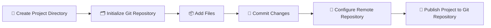
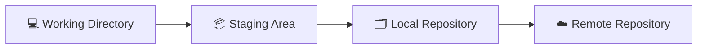

# Publish Project to Git Repository

## 🚀 Get Started

Panduan ini menjelaskan cara mempublikasikan project ke Git repository menggunakan Git.

Pada panduan ini, Anda akan membuat Git repository pada project, menyimpan perubahan menggunakan commit, menghubungkan project ke remote repository, kemudian mempublikasikan source code ke Git repository.

---

## 🎯 Learning Objectives

Setelah mengikuti panduan ini, Anda diharapkan mampu:

- Membuat Git repository.
- Menambahkan file ke staging area.
- Membuat commit.
- Menghubungkan project ke remote repository.
- Mempublikasikan project ke Git repository.

---

## 🔄 Workflow



---

## 📋 Prerequisites

Pastikan:

- Git telah terinstal.
- Git telah dikonfigurasi.
- Git repository telah tersedia.

---

## ▶️ Procedure

### Create Project Directory

Buat direktori project.

```bash
mkdir my-project
```

Masuk ke direktori project.

```bash
cd my-project
```

Review direktori kerja.

```bash
pwd
```

Contoh output.

```text
/home/user/my-project
```

---

### Initialize Git Repository

Inisialisasi Git repository.

```bash
git init
```

Contoh output.

```text
Initialized empty Git repository in /home/user/my-project/.git/
```

Review repository.

```bash
ls -la
```

Contoh output.

```text
.git
```

---

### Add Files

Buat file sebagai contoh.

```bash
touch README.md
```

Tambahkan seluruh perubahan ke staging area.

```bash
git add .
```

Review status repository.

```bash
git status
```

Contoh output.

```text
Changes to be committed:

    new file: README.md
```

---

### Commit Changes

Simpan perubahan ke repository.

```bash
git commit -m "Initial commit"
```

Contoh output.

```text
[main (root-commit)] Initial commit
```

Review histori commit.

```bash
git log --oneline
```

Contoh output.

```text
a1b2c3d Initial commit
```

---

### Configure Remote Repository

Hubungkan project dengan Git repository.

```bash
git remote add origin https://github.com/<username>/<repository>.git
```

Review remote repository.

```bash
git remote -v
```

Contoh output.

```text
origin  https://github.com/<username>/<repository>.git (fetch)
origin  https://github.com/<username>/<repository>.git (push)
```

---

### Publish Project to Git Repository

Publikasikan project.

```bash
git push -u origin main
```

Apabila branch utama menggunakan nama `master`, sesuaikan nama branch yang digunakan.

Review repository menggunakan web browser untuk memastikan seluruh source code telah berhasil dipublikasikan.

---

## ✅ Verification

Pastikan:

- Git repository berhasil dibuat.
- Seluruh file berhasil ditambahkan ke staging area.
- Commit berhasil dibuat.
- Remote repository berhasil dikonfigurasi.
- Project berhasil dipublikasikan.

!!! success "Verification"

    Project berhasil dipublikasikan ke Git repository.

---

## 💡 Technology Notes

Git menggunakan empat area kerja selama proses pengelolaan source code.



Penjelasan singkat.

| Area | Description |
|------|-------------|
| **Working Directory** | Lokasi tempat file dibuat atau diubah. |
| **Staging Area** | Area sementara sebelum perubahan disimpan sebagai commit. |
| **Local Repository** | Repository Git pada komputer lokal. |
| **Remote Repository** | Repository Git pada server. |

---

## ▶️ Next Steps

Setelah project berhasil dipublikasikan, Anda dapat mengambil project dari repository menggunakan **Clone Git Repository** atau mulai mengelola branch selama proses pengembangan.

---

## 🔗 Related Documents

| Document | Description |
|----------|-------------|
| **Configure Git** | Melakukan konfigurasi awal Git. |
| **Clone Git Repository** | Mengambil project dari Git repository. |
| **Manage Branches** | Mengelola branch selama proses pengembangan. |

---

## 📝 Summary

Pada halaman ini telah dijelaskan:

- Membuat Git repository.
- Menambahkan file ke staging area.
- Membuat commit.
- Menghubungkan project ke remote repository.
- Mempublikasikan project ke Git repository.

Selanjutnya Anda dapat mengambil project dari Git repository atau mulai mengelola branch sesuai kebutuhan pengembangan.