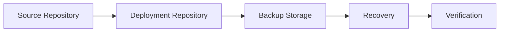

# Backup and Recovery

## 🚀 Get Started

Setelah website statis berhasil dipublikasikan, langkah berikutnya adalah memastikan dokumentasi dapat dipulihkan apabila terjadi kehilangan data, kerusakan sistem, atau migrasi server.

Strategi backup dan recovery yang baik membantu menjaga ketersediaan dokumentasi sekaligus mempercepat proses pemulihan ketika terjadi gangguan.

Pada panduan ini akan dijelaskan komponen yang perlu dibackup, proses recovery, serta cara memverifikasi hasil pemulihan.

---

## 🎯 Learning Objectives

Setelah menyelesaikan panduan ini, Anda akan mampu:

- Memahami strategi backup website dokumentasi.
- Mengidentifikasi komponen yang perlu dibackup.
- Melakukan proses recovery website.
- Memverifikasi hasil recovery.

---

## 🔄 Workflow



---

## 📋 Prerequisites

Pastikan:

| Component | Description |
|-----------|-------------|
| Source Repository | Available |
| Deployment Repository | Available |
| Static Website | Successfully Deployed |
| Backup Storage | Available |

---

## ▶️ Procedure


<div class="procedure" markdown>

<div class="procedure-step" markdown>

### Review the Backup Strategy

Identifikasi komponen yang perlu dibackup.

| Component | Description |
|-----------|-------------|
| Source Repository | Seluruh dokumentasi Markdown dan konfigurasi MkDocs |
| Deployment Repository | Website statis yang telah dipublikasikan |
| Deployment Scripts | Script deployment dan konfigurasi runtime |
| Configuration Files | Konfigurasi yang diperlukan untuk deployment |

Backup sebaiknya dilakukan secara berkala sesuai kebutuhan organisasi.

</div>

<div class="procedure-step" markdown>

### Backup the Source Repository

Lakukan backup terhadap source repository menggunakan Git.

Contoh:

```bash
git push origin main
```

Pastikan seluruh perubahan telah tersimpan pada remote repository.

</div>

<div class="procedure-step" markdown>

### Backup the Deployment Repository

Lakukan backup terhadap deployment repository.

Contoh menggunakan `tar`.

```bash
tar -czf devops-handbook-site-backup.tar.gz devops-handbook-site/
```

Contoh menggunakan `rsync`.

```bash
rsync -av devops-handbook-site/ /backup/devops-handbook-site/
```

Pilih metode backup yang sesuai dengan lingkungan yang digunakan.

</div>

<div class="procedure-step" markdown>

### Recover the Website

Apabila terjadi kehilangan data atau migrasi server, lakukan proses recovery.

Pulihkan source repository.

```bash
git clone https://<repository-url>
```

Pulihkan deployment repository.

```bash
tar -xzf devops-handbook-site-backup.tar.gz
```

Apabila diperlukan, jalankan kembali proses:

1. Build Static Website
2. Deploy Static Website

</div>

<div class="procedure-step" markdown>

### Verify the Recovery

Pastikan seluruh file telah berhasil dipulihkan.

Periksa struktur deployment.

```text
devops-handbook-site/
├── site/
├── run.sh
├── stop.sh
├── PROJECT
├── VERSION
└── CONFIG
```

Jalankan website.

```bash
./run.sh
```

Akses website menggunakan browser.

```text
http://localhost:8080
```

Pastikan seluruh halaman dapat diakses dengan normal.

---


</div>

</div>

## ✅ Verification

Pastikan:

- Source repository berhasil dipulihkan.
- Deployment repository berhasil dipulihkan.
- Website berhasil dijalankan.
- Seluruh halaman dapat diakses.
- Gambar, CSS, JavaScript, dan aset lainnya ditampilkan dengan benar.

!!! success "Verification"

    Backup dan recovery dinyatakan berhasil apabila website dapat dijalankan kembali tanpa kehilangan konten maupun konfigurasi.

---

## 💡 Technology Notes

- Simpan backup pada lokasi yang berbeda dari server utama.
- Lakukan backup secara berkala sesuai kebijakan organisasi.
- Uji proses recovery secara rutin untuk memastikan backup dapat digunakan.
- Dokumentasikan prosedur recovery agar dapat dilakukan dengan cepat saat terjadi gangguan.
- Repository Git bukan pengganti backup penuh untuk deployment apabila terdapat script, konfigurasi, atau aset tambahan di luar repository.

---

## ▶️ Next Steps

Website dokumentasi sekarang telah memiliki mekanisme backup dan recovery.

Langkah berikutnya adalah mempelajari penyelesaian masalah umum yang mungkin terjadi selama pengembangan, build, maupun deployment.

---

## 🔗 Related Documents

| Document | Description |
|----------|-------------|
| Build Static Website | Generate the static website |
| Deploy Static Website | Publish the static website |
| Troubleshooting | Resolve common issues |

---

## 🌐 External References

- [Git Documentation](https://git-scm.com/doc){: target="_blank" rel="noopener noreferrer" }
- [rsync Documentation](https://download.samba.org/pub/rsync/rsync.html){: target="_blank" rel="noopener noreferrer" }
- [GNU tar Manual](https://www.gnu.org/software/tar/manual/){: target="_blank" rel="noopener noreferrer" }

---

## 📝 Summary

Pada panduan ini Anda telah mempelajari cara:

- Menentukan strategi backup website dokumentasi.
- Melakukan backup source repository dan deployment repository.
- Melakukan recovery website apabila terjadi kehilangan data atau migrasi server.
- Memverifikasi hasil recovery untuk memastikan website kembali berfungsi dengan baik.