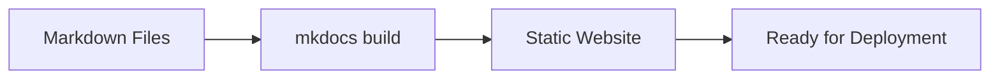

# Build Static Website

## 🚀 Get Started

Setelah dokumentasi selesai ditulis, langkah berikutnya adalah membangun (*build*) website statis menggunakan MkDocs.

Pada proses ini, seluruh file Markdown diproses berdasarkan konfigurasi pada `mkdocs.yml` untuk menghasilkan website statis yang siap dipublikasikan.

---

## 🎯 Learning Objectives

Setelah menyelesaikan panduan ini, Anda akan mampu:

- Memahami proses build MkDocs.
- Menghasilkan website statis.
- Memahami struktur direktori hasil build.
- Memverifikasi hasil build.

---

## 🔄 Workflow



---

## 📋 Prerequisites

Pastikan:

| Component | Description |
|-----------|-------------|
| MkDocs Project | Created |
| Documentation | Completed |
| Configuration | Completed |

---

## ▶️ Procedure

### Step 1 — Review the Source Documentation

Pastikan seluruh dokumentasi berada pada direktori `docs/`.

Contoh.

```text
my-project/
├── docs/
├── mkdocs.yml
```

MkDocs akan menggunakan seluruh file Markdown pada direktori tersebut sebagai sumber website.

---

### Step 2 — Build the Website

Jalankan proses build.

```bash
mkdocs build
```

Contoh output.

```text
INFO    - Cleaning site directory
INFO    - Building documentation...
INFO    - Documentation built successfully
```

---

### Step 3 — Review the Build Output

Apabila proses build berhasil, MkDocs akan membuat direktori berikut.

```text
my-project/
├── docs/
├── site/
└── mkdocs.yml
```

---

### Step 4 — Review the Static Website

Direktori `site/` berisi seluruh website statis.

Contoh.

```text
site/
├── index.html
├── 404.html
├── assets/
├── css/
├── images/
├── js/
└── search/
```

Direktori ini siap dipublikasikan ke web server.

---

### Step 5 — Rebuild After Changes

Setiap kali dokumentasi berubah, jalankan kembali proses build.

```bash
mkdocs build
```

Direktori `site/` akan diperbarui secara otomatis sesuai perubahan dokumentasi.

---

## ✅ Verification

Pastikan proses build berhasil.

```bash
mkdocs build
```

Pastikan direktori berikut tersedia.

```text
site/
```

Pastikan file utama tersedia.

```text
site/index.html
```

Buka website secara lokal menggunakan development server apabila diperlukan.

```bash
mkdocs serve
```

!!! success "Verification"

    Website dinyatakan berhasil dibangun apabila:

    - Proses build selesai tanpa error.
    - Direktori `site/` berhasil dibuat.
    - File HTML berhasil dihasilkan.
    - Website dapat ditampilkan menggunakan browser.

---

## 💡 Technology Notes

- Direktori `site/` merupakan hasil proses build.
- Jangan melakukan perubahan secara langsung pada isi direktori `site/` karena seluruh file akan dibuat ulang pada proses build berikutnya.
- Seluruh perubahan sebaiknya dilakukan pada source documentation di direktori `docs/`.

---

## ▶️ Next Steps

Website statis sekarang telah siap dipublikasikan.

Tahap berikutnya adalah melakukan deployment ke web server.

---

## 🔗 Related Documents

| Document | Description |
|----------|-------------|
| Deploy Website | Publish the static website |
| Troubleshooting | Resolve common build issues |

---

## 🌐 External References

- [MkDocs – Building Your Site](https://www.mkdocs.org/user-guide/deploying-your-docs/){: target="_blank" rel="noopener noreferrer" }

---

## 📝 Summary

Pada panduan ini Anda telah mempelajari cara:

- Menjalankan proses build.
- Menghasilkan website statis.
- Memahami isi direktori `site/`.
- Memverifikasi hasil build.

Website sekarang siap untuk dipublikasikan ke web server.