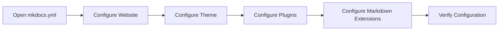

# Configuration

## 🚀 Get Started

Setelah memahami struktur project, langkah berikutnya adalah mengonfigurasi website menggunakan file `mkdocs.yml`.

File ini merupakan pusat konfigurasi MkDocs yang mengatur identitas website, navigasi, tema, plugin, ekstensi Markdown, serta berbagai pengaturan lainnya yang digunakan selama proses build.

---

## 🎯 Learning Objectives

Setelah menyelesaikan panduan ini, Anda akan mampu:

- Memahami fungsi file `mkdocs.yml`.
- Mengonfigurasi identitas website.
- Mengatur struktur navigasi.
- Mengonfigurasi Material for MkDocs.
- Menambahkan plugin.
- Mengaktifkan Markdown Extensions.
- Memvalidasi konfigurasi.

---

## 🔄 Workflow



---

## 📋 Prerequisites

Pastikan:

| Component | Description |
|-----------|-------------|
| MkDocs | Installed |
| Project MkDocs | Created |
| Text Editor | Visual Studio Code (Recommended) |

---

## ▶️ Procedure


<div class="procedure" markdown>

<div class="procedure-step" markdown>

### Open the Configuration File

Seluruh konfigurasi MkDocs disimpan pada file berikut.

```text
mkdocs.yml
```

File ini akan dibaca setiap kali menjalankan:

```bash
mkdocs serve
```

atau

```bash
mkdocs build
```

</div>

<div class="procedure-step" markdown>

### Configure Website Information

Tambahkan identitas website.

```yaml
site_name: DevOps Engineering Handbook
site_description: Personal DevOps Documentation
site_author: John Doe
site_url: https://example.com
```

| Parameter | Description |
|-----------|-------------|
| `site_name` | Nama website. |
| `site_description` | Deskripsi singkat website. |
| `site_author` | Penulis dokumentasi. |
| `site_url` | URL website setelah dipublikasikan. |

</div>

<div class="procedure-step" markdown>

### Configure Navigation

Atur struktur navigasi website.

```yaml
nav:
  - Home: index.md

  - How-To:
      - MkDocs:
          - Overview: how-to/mkdocs/index.md
          - Installation: how-to/mkdocs/installation.md
          - Create Project: how-to/mkdocs/create-project.md
```

Navigation menentukan urutan halaman yang ditampilkan pada sidebar.

</div>

<div class="procedure-step" markdown>

### Configure Theme

Aktifkan Material for MkDocs.

```yaml
theme:
  name: material
```

Material Theme menyediakan berbagai fitur seperti:

- Responsive Layout
- Navigation
- Search
- Table of Contents
- Dark Mode
- Icons

</div>

<div class="procedure-step" markdown>

### Configure Plugins

Tambahkan plugin sesuai kebutuhan.

```yaml
plugins:
  - search
```

Contoh plugin yang umum digunakan.

| Plugin | Description |
|---------|-------------|
| `search` | Menambahkan fitur pencarian. |
| `git-revision-date-localized` | Menampilkan tanggal perubahan halaman. |
| `minify` | Mengurangi ukuran file HTML hasil build. |

</div>

<div class="procedure-step" markdown>

### Configure Markdown Extensions

Aktifkan fitur Markdown tambahan.

```yaml
markdown_extensions:
  - admonition
  - attr_list
  - tables
  - toc
  - pymdownx.details
  - pymdownx.superfences
```

Extension tersebut memungkinkan penggunaan:

- Admonition
- Tables
- Attribute List
- Table of Contents
- Collapsible Content
- Mermaid Diagram

</div>

<div class="procedure-step" markdown>

### Configure Additional Resources

Apabila menggunakan CSS atau JavaScript tambahan.

```yaml
extra_css:
  - stylesheets/extra.css

extra_javascript:
  - javascripts/extra.js
```

Konfigurasi ini memungkinkan website menggunakan stylesheet maupun JavaScript buatan sendiri tanpa mengubah source Material Theme.

---


</div>

</div>

## ✅ Verification

Jalankan development server.

```bash
mkdocs serve
```

Pastikan website dapat diakses.

```text
http://127.0.0.1:8000
```

Apabila terdapat kesalahan konfigurasi, MkDocs akan menampilkan pesan error pada terminal.

!!! success "Verification"

    Konfigurasi dinyatakan berhasil apabila:

    - File `mkdocs.yml` dapat dibaca.
    - Development server berjalan tanpa error.
    - Navigation ditampilkan dengan benar.
    - Theme berhasil diterapkan.
    - Plugin berhasil dimuat.
    - Markdown Extensions berfungsi.

---

## 💡 Technology Notes

- Seluruh konfigurasi MkDocs dikelola melalui satu file, yaitu `mkdocs.yml`.
- Simpan konfigurasi dalam source repository agar perubahan dapat dilacak menggunakan Git.
- Tambahkan hanya plugin dan extension yang benar-benar diperlukan untuk menjaga konfigurasi tetap sederhana dan mudah dipelihara.

---

## ▶️ Next Steps

Website sekarang telah dikonfigurasi.

Tahap berikutnya adalah mulai menulis dokumentasi menggunakan Markdown dan berbagai komponen yang disediakan oleh Material for MkDocs.

---

## 🔗 Related Documents

| Document | Description |
|----------|-------------|
| **Writing Documentation** | Menulis dokumentasi menggunakan Markdown. |
| **Build Website** | Membangun website statis. |

---

## 📝 Summary

Pada panduan ini Anda telah mempelajari cara:

- Mengonfigurasi file `mkdocs.yml`.
- Mengatur identitas website.
- Mengelola navigasi.
- Mengaktifkan Material Theme.
- Menambahkan plugin.
- Mengaktifkan Markdown Extensions.
- Menambahkan CSS dan JavaScript tambahan.

Website sekarang siap digunakan untuk menulis dokumentasi.