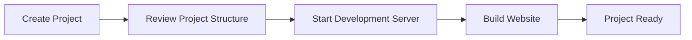

# Create Project

## 🚀 Get Started

Setelah MkDocs berhasil diinstal, langkah berikutnya adalah membuat project dokumentasi baru. Pada panduan ini, Anda akan membuat project MkDocs, menjalankan development server, serta membangun website statis pertama menggunakan MkDocs.

---

## 🎯 Learning Objectives

Setelah menyelesaikan panduan ini, Anda akan mampu:

- Membuat project MkDocs baru.
- Memahami struktur project awal.
- Menjalankan development server.
- Menggunakan fitur Live Reload.
- Membangun website statis.

---

## 🔄 Workflow



---

## 📋 Prerequisites

Pastikan beberapa kebutuhan berikut telah tersedia.

| Component | Description |
|-----------|-------------|
| MkDocs | Telah terinstal |
| Material for MkDocs | Telah terinstal |
| Python Virtual Environment | Sudah diaktifkan |
| Terminal | Bash atau shell lainnya |

---

## ▶️ Procedure


<div class="procedure" markdown>

<div class="procedure-step" markdown>

### Create a New Project

Pindah ke direktori kerja.

```bash
cd ~/git
```

Buat project baru.

```bash
mkdocs new my-project
```

Contoh output.

```text
INFO    - Creating project directory: my-project
INFO    - Writing config file: my-project/mkdocs.yml
INFO    - Writing initial docs: my-project/docs/index.md
```

</div>

<div class="procedure-step" markdown>

### Review Project Structure

Masuk ke direktori project.

```bash
cd my-project
```

Lihat struktur project.

```bash
tree
```

Contoh output.

```text
my-project/
├── docs/
│   └── index.md
└── mkdocs.yml
```

Keterangan.

| File / Directory | Description |
|------------------|-------------|
| `docs/` | Menyimpan seluruh dokumentasi Markdown. |
| `docs/index.md` | Halaman utama website. |
| `mkdocs.yml` | File konfigurasi MkDocs. |

</div>

<div class="procedure-step" markdown>

### Start the Development Server

Jalankan development server.

```bash
mkdocs serve
```

Secara default website tersedia pada.

```text
http://127.0.0.1:8000
```

Apabila ingin dapat diakses dari perangkat lain dalam jaringan yang sama.

```bash
mkdocs serve --dev-addr 0.0.0.0:8000
```

</div>

<div class="procedure-step" markdown>

### Test Live Reload

Buka file berikut.

```text
docs/index.md
```

Tambahkan beberapa perubahan.

Simpan file kemudian refresh browser.

MkDocs akan secara otomatis melakukan rebuild tanpa perlu menjalankan ulang development server.

</div>

<div class="procedure-step" markdown>

### Build the Website

Bangun website statis.

```bash
mkdocs build
```

Direktori baru akan dibuat.

```text
my-project/
├── docs/
├── site/
└── mkdocs.yml
```

Direktori `site/` berisi website statis yang siap dipublikasikan.

---


</div>

</div>

## ✅ Verification

Pastikan struktur project telah dibuat.

```bash
tree
```

Pastikan development server berjalan.

```bash
mkdocs serve
```

Akses website.

```text
http://127.0.0.1:8000
```

Selanjutnya lakukan build.

```bash
mkdocs build
```

Pastikan direktori berikut tersedia.

```text
site/
```

!!! success "Verification"

    Project dinyatakan berhasil apabila:

    - Project berhasil dibuat.
    - Development server berjalan tanpa error.
    - Website dapat diakses melalui browser.
    - Live Reload berfungsi.
    - Direktori `site/` berhasil dibuat.

---

## 💡 Technology Notes

- MkDocs secara otomatis membuat struktur project minimal yang siap digunakan.
- Development server mendukung **Live Reload**, sehingga perubahan dokumentasi langsung terlihat tanpa perlu menjalankan ulang server.
- Direktori `site/` merupakan hasil proses build dan akan dibuat ulang setiap kali menjalankan `mkdocs build`.

---

## ▶️ Next Steps

Project MkDocs sekarang telah siap digunakan.

Tahap berikutnya adalah mempelajari struktur direktori dan fungsi setiap file yang digunakan selama pengembangan dokumentasi.

---

## 🔗 Related Documents

| Document | Description |
|-----------|-------------|
| **Project Structure** | Memahami struktur project MkDocs. |
| **Configuration** | Mengonfigurasi website menggunakan `mkdocs.yml`. |

---

## 📝 Summary

Pada panduan ini Anda telah mempelajari cara:

- Membuat project MkDocs baru.
- Memahami struktur project awal.
- Menjalankan development server.
- Menggunakan fitur Live Reload.
- Membangun website statis menggunakan `mkdocs build`.

Project sekarang siap digunakan untuk menulis dokumentasi.