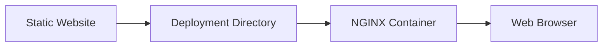

# Deploy Static Website

## 🚀 Get Started

Setelah website statis berhasil dibangun, langkah berikutnya adalah mempublikasikannya agar dapat diakses oleh pengguna.

Pada panduan ini, website dijalankan menggunakan **NGINX Container** sebagai runtime. Konten website dipisahkan dari container image sehingga perubahan dokumentasi tidak memerlukan proses build image kembali.

Pendekatan ini membuat deployment lebih sederhana, fleksibel, dan mudah diotomatisasi.

---

## 🎯 Learning Objectives

Setelah menyelesaikan panduan ini, Anda akan mampu:

- Memahami arsitektur deployment website statis.
- Menyiapkan website untuk deployment.
- Menjalankan website menggunakan NGINX Container.
- Memverifikasi hasil deployment.

---

## 🔄 Workflow



---

## 📋 Prerequisites

Pastikan:

| Component | Description |
|-----------|-------------|
| Static Website | Successfully built |
| Deployment Repository | Available |
| nginx-image | Available |
| Podman | Installed |

---

## ▶️ Procedure


<div class="procedure" markdown>

<div class="procedure-step" markdown>

### Review the Static Website

Pastikan proses build telah menghasilkan direktori berikut.

```text
site/
```

Direktori tersebut berisi seluruh file website yang akan dipublikasikan.

</div>

<div class="procedure-step" markdown>

### Synchronize the Deployment Directory

Salin hasil build ke deployment repository.

```bash
rsync -av --delete site/ ~/git/devops-handbook-site/site/
```

Contoh struktur deployment.

```text
devops-handbook-site/
├── CONFIG
├── PROJECT
├── VERSION
├── run.sh
├── stop.sh
└── site/
```

</div>

<div class="procedure-step" markdown>

### Review the Deployment Configuration

Pastikan lokasi website telah dikonfigurasi.

```bash
IMAGE_NAME=localhost/nginx-image:1.0

WEB_ROOT="$HOME/git/devops-handbook-site/site"
```

Parameter:

| Parameter | Description |
|-----------|-------------|
| IMAGE_NAME | Runtime image |
| WEB_ROOT | Static website location |

</div>

<div class="procedure-step" markdown>

### Start the Container

Jalankan deployment.

```bash
./run.sh
```

Container akan melakukan bind mount.

```text
Host
-------------------------
site/
        │
        ▼
Container
-------------------------
/var/www/html
```

NGINX akan menyajikan seluruh file pada direktori tersebut.

</div>

<div class="procedure-step" markdown>

### Access the Website

Buka browser.

```text
http://localhost:8080
```

Pastikan halaman utama berhasil ditampilkan.

---


</div>

</div>

## ✅ Verification

Pastikan container berjalan.

```bash
podman ps
```

Pastikan bind mount berhasil.

```bash
podman inspect devops-handbook-site
```

Pastikan document root berisi website.

```bash
podman exec -it devops-handbook-site ls /var/www/html
```

Akses website.

```text
http://localhost:8080
```

!!! success "Verification"

    Deployment dinyatakan berhasil apabila:

    - Container berhasil dijalankan.
    - Static website berhasil di-mount.
    - File `index.html` tersedia.
    - Website dapat diakses melalui browser.

---

## 💡 Technology Notes

- Pisahkan source documentation dan deployment.
- Gunakan runtime image yang bersifat generik.
- Jangan menyimpan source Markdown pada deployment repository.
- Website yang dipublikasikan hanya berasal dari hasil proses build.

---

## ▶️ Next Steps

Website sekarang telah berhasil dipublikasikan.

Pada bab berikutnya akan dibahas berbagai permasalahan umum beserta langkah penyelesaiannya.

---

## 🔗 Related Documents

| Document | Description |
|----------|-------------|
| Build Website | Generate the static website |
| Troubleshooting | Resolve common deployment issues |

---

## 🌐 External References

- [MkDocs – Deploying Your Docs](https://www.mkdocs.org/user-guide/deploying-your-docs/){: target="_blank" rel="noopener noreferrer" }
- [Podman Documentation](https://docs.podman.io/){: target="_blank" rel="noopener noreferrer" }
- [NGINX Documentation](https://nginx.org/en/docs/){: target="_blank" rel="noopener noreferrer" }

---

## 📝 Summary

Pada panduan ini Anda telah mempelajari cara:

- Menyiapkan website untuk deployment.
- Menyalin hasil build ke deployment repository.
- Menjalankan website menggunakan NGINX Container.
- Memverifikasi hasil deployment.

Website sekarang telah berhasil dipublikasikan dan siap diakses melalui web browser.