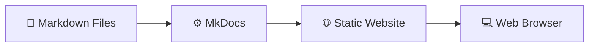

# MkDocs

## 🚀 Get Started

MkDocs adalah **Static Site Generator** yang dirancang untuk membangun dokumentasi teknis menggunakan file **Markdown**. Seluruh dokumentasi ditulis dalam format teks sederhana, kemudian dibangun menjadi website statis yang cepat, ringan, dan mudah dipublikasikan.

Pada panduan ini, MkDocs digunakan bersama **Material for MkDocs** untuk membangun website dokumentasi yang modern, responsif, dan mudah dipelihara.

---

## 🎯 Learning Objectives

Setelah mengikuti dokumentasi ini, Anda diharapkan mampu:

- Memahami konsep dasar MkDocs.
- Menginstal dan mengonfigurasi MkDocs.
- Membuat project dokumentasi baru.
- Menulis dokumentasi menggunakan Markdown.
- Membangun website statis.
- Mempublikasikan website ke web server.

---

## 📚 Documentation Structure

Dokumentasi MkDocs terdiri dari beberapa panduan berikut.

| Document | Description |
|----------|-------------|
| **Installation** | Menginstal MkDocs dan seluruh dependency yang diperlukan. |
| **Create Project** | Membuat project MkDocs baru. |
| **Project Structure** | Memahami struktur direktori dan file pada project MkDocs. |
| **Configuration** | Mengonfigurasi website menggunakan `mkdocs.yml`. |
| **Writing Documentation** | Menulis dokumentasi menggunakan Markdown dan Material for MkDocs. |
| **Build Website** | Menghasilkan static website dari source dokumentasi. |
| **Deploy Website** | Mempublikasikan static website ke web server. |
| **Troubleshooting** | Mengatasi permasalahan umum saat menggunakan MkDocs. |

---

## 🏗 MkDocs at a Glance

MkDocs mengubah kumpulan file Markdown menjadi website statis melalui proses berikut.

---

## 💡 Key Concepts

Beberapa istilah penting yang digunakan pada dokumentasi ini.

| Term | Description |
|------|-------------|
| **Markdown** | Format penulisan dokumentasi berbasis teks. |
| **MkDocs** | Static Site Generator untuk membangun website dokumentasi. |
| **Material for MkDocs** | Theme yang menyediakan tampilan modern dan berbagai fitur tambahan. |
| **Build** | Proses menghasilkan website statis dari source dokumentasi. |
| **Deploy** | Proses mempublikasikan website statis ke web server. |

---

## 🔧 Technology Notes

MkDocs hanya bertanggung jawab membangun website statis dari source dokumentasi. Website yang dihasilkan dapat dipublikasikan menggunakan berbagai web server maupun platform hosting.

Contoh platform deployment:

- NGINX
- Apache HTTP Server
- GitHub Pages
- GitLab Pages
- Amazon S3
- Object Storage

---

## ▶️ Next Steps

Tahap berikutnya adalah **Installation** untuk menyiapkan lingkungan pengembangan dan menginstal MkDocs beserta seluruh dependency yang diperlukan.

---

## 🔗 Related Documents

| Document | Description |
|----------|-------------|
| **Installation** | Menginstal MkDocs. |
| **Writing Documentation** | Menulis dokumentasi menggunakan Markdown. |

---

## 📝 Summary

Pada halaman ini telah dijelaskan:

- Pengertian MkDocs.
- Tujuan penggunaan MkDocs.
- Struktur dokumentasi MkDocs.
- Konsep dasar proses build website statis.

Selanjutnya Anda akan mempelajari cara **menginstal MkDocs** sebelum membuat project dokumentasi pertama.