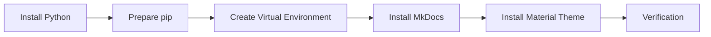

# Installation

## 🚀 Get Started

Sebelum membuat proyek MkDocs, pastikan lingkungan pengembangan telah disiapkan dengan benar.

MkDocs merupakan aplikasi Python yang didistribusikan melalui **pip**. Oleh karena itu, instalasi dimulai dengan menyiapkan Python, pip, dan virtual environment sebelum menginstal MkDocs beserta dependensinya.

Menggunakan virtual environment direkomendasikan untuk mengisolasi package proyek sehingga tidak memengaruhi instalasi Python pada sistem operasi.

---

## 🎯 Learning Objectives

Setelah menyelesaikan panduan ini, Anda akan mampu:

- Menyiapkan lingkungan pengembangan MkDocs.
- Memverifikasi instalasi Python dan pip.
- Membuat Python Virtual Environment.
- Menginstal MkDocs dan Material for MkDocs.
- Memverifikasi hasil instalasi.

---

## 🔄 Workflow



---

## 📋 Prerequisites

Pastikan:

| Component | Description |
|-----------|-------------|
| Operating System | Linux (Ubuntu/Debian Recommended) |
| Internet Connection | Required |
| Terminal | Available |

---

## ▶️ Procedure

### Step 1 — Install Python

Periksa apakah Python telah tersedia.

```bash
python3 --version
```

Contoh output.

```text
Python 3.12.3
```

Apabila Python belum tersedia, instal menggunakan package manager.

Ubuntu / Debian

```bash
sudo apt update
sudo apt install python3 python3-pip python3-venv python3-full -y
```

---

### Step 2 — Prepare pip

Pastikan pip tersedia dan siap digunakan.

Periksa versi pip.

```bash
pip --version
```

Apabila pip belum tersedia atau ingin memastikan menggunakan versi terbaru yang kompatibel, jalankan:

```bash
python3 -m pip install --upgrade pip
```

Perintah tersebut memastikan pip siap digunakan untuk menginstal package Python lainnya.

Verifikasi.

```bash
pip --version
```

---

### Step 3 — Create Virtual Environment

Buat virtual environment.

```bash
python3 -m venv .venv
```

Aktifkan virtual environment.

Linux

```bash
source .venv/bin/activate
```

Prompt terminal akan berubah.

```text
(.venv) user@hostname:~$
```

---

### Step 4 — Install MkDocs

Instal MkDocs.

```bash
pip install mkdocs
```

Verifikasi.

```bash
mkdocs --version
```

Contoh output.

```text
mkdocs, version 1.x.x
```

---

### Step 5 — Install Material for MkDocs

Instal Material Theme.

```bash
pip install mkdocs-material
```

Apabila proyek menggunakan plugin tambahan, instal sesuai kebutuhan.

Contoh.

```bash
pip install mkdocs-awesome-pages-plugin
```

Verifikasi.

```bash
pip show mkdocs-material
```

---

### Step 6 — Verify the Installation

Pastikan seluruh komponen telah tersedia.

```bash
python3 --version
```

```bash
pip --version
```

```bash
mkdocs --version
```

```bash
pip show mkdocs-material
```

---

## ✅ Verification

Pastikan:

- Python berhasil diinstal.
- pip tersedia dan dapat digunakan.
- Virtual Environment berhasil dibuat.
- MkDocs berhasil diinstal.
- Material for MkDocs berhasil diinstal.

!!! success "Verification"

    Instalasi dinyatakan berhasil apabila seluruh komponen dapat dijalankan tanpa error dan siap digunakan untuk membuat proyek MkDocs.

---

## 💡 Technology Notes

- Gunakan Python Virtual Environment untuk setiap proyek.
- Hindari menginstal package Python secara global kecuali benar-benar diperlukan.
- Selalu aktifkan virtual environment sebelum menjalankan perintah MkDocs.
- Pastikan pip berada dalam kondisi siap sebelum menginstal package tambahan.

---

## ▶️ Next Steps

Setelah lingkungan pengembangan selesai disiapkan, lanjutkan dengan membuat proyek MkDocs pertama.

---

## 🔗 Related Documents

| Document | Description |
|----------|-------------|
| Create Project | Create a new MkDocs project |
| Project Structure | Understand the generated project structure |

---

## 🌐 External References

- [Python Documentation](https://docs.python.org/3/){: target="_blank" rel="noopener noreferrer" }
- [pip Documentation](https://pip.pypa.io/){: target="_blank" rel="noopener noreferrer" }
- [MkDocs Installation Guide](https://www.mkdocs.org/user-guide/installation/){: target="_blank" rel="noopener noreferrer" }
- [Material for MkDocs](https://squidfunk.github.io/mkdocs-material/){: target="_blank" rel="noopener noreferrer" }

---

## 📝 Summary

Pada panduan ini Anda telah mempelajari cara:

- Menyiapkan Python dan pip.
- Membuat Python Virtual Environment.
- Menginstal MkDocs.
- Menginstal Material for MkDocs.
- Memverifikasi hasil instalasi.

Lingkungan pengembangan sekarang siap digunakan untuk membuat proyek MkDocs.